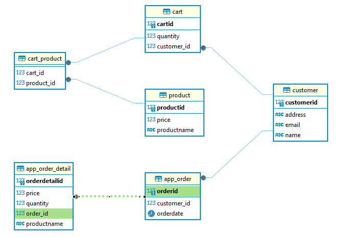

- Reference
  - all topics: https://www.baeldung.com/learn-jpa-hibernate
  - inheritance : https://www.baeldung.com/hibernate-inheritance
---
# JPA
## Intro
- JPA Specification --> **ORM** layer (focus)
- interact with a **relational** database without any SQL.
- eg: Hibernate framework
- first/Second level Cache. :small_red_triangle:
- **Entity**
  - lifecycle state : New/Transient > managed > detached > removed/Deleted(markedForDelete).
  - Transient - POJO which has no representation in the PC.
- **relationships** 
- **inheritance** 
- (**EntityManager** / EntityManagerFactory) or  (**Session** / sessionFactory in Hibernate)
  - heap(object) <==> **PC**(managed entity) <==> Database
  - provide API to interact with PC. more on PC [02_presistence-context.md](02_presistence-context.md)
    - session.persist : mark for save
    - session.merge : move to pc
    - session.refresh : sync with DB
    - session.remove : marked for delete
    - session.detach : remove from pc
    - session.flush
---    
## A. key components/bean to build for develop:
  - **SessionFactory**
    - heavy, Created at startup in SB project
    - rename bean : @Bean(name = "entityManagerFactory") LocalSessionFactoryBean m(){...}
  - **TransactionManager**  
    - `PlatformTransactionManager` --impl--> HibernateTransactionManager, JpaTransactionManager
  - **TransactionTemplate** 
    - [HibernatePostgresConfig.java](../../src/main/java/com/lekhraj/java/spring/database/HibernatePostgresConfig.java)
    - can set global ISOLATION LEVEL here :point_left:
  - **Datasource** 
    - database connections pool
    - eg: hikari, javax.sql.DataSource, etc
    - use DataSourceBuilder
  - **repositories**
    - way-1: @Repository public interface ProductRepository extends **JpaRepository**<Product, Long> { ... }
      - has @PersistenceContext(type = PersistenceContextType.**TRANSACTIONAL**)
    - way-2: https://chat.deepseek.com/a/chat/s/8e1072c2-9522-4d97-8c6b-d6cdc8ef7c97
```java
@Repository
public class ExtendedPersistenceContextRepository 
{
    @PersistenceContext(type = PersistenceContextType.EXTENDED)
    //@PersistenceContext(type = PersistenceContextType.TRANSACTIONAL)
    private EntityManager entityManager;

    public void addToPersistenceContext(User user) {        entityManager.persist(user);     }

    @Transactional
    public void saveChanges() {        entityManager.flush();     }  // explicit flush  <<<
    ...
}
```
---
## B JPA Entity - Lifecycle Events
- create **MyListener.class**
- add method/s and annotate with :
  - @PrePersist m(), @PostPersist m(),
  - @PreRemove m(), @PostRemove m(),
  - @PreUpdate m(), @PostUpdate m(),
  - @PostLoad m()
- go to @Entity MyEntity
  - annotate entity class with `@EntityListeners`(**MyListener.class**) 
- fact : 
  - @GeneratedValue - expect key to available in @PostPersist.
---
## C Relationship
- owner owns the foreign key and defines @JoinColumn(name="newName")
- uni-directional or bi-directional : both has references of each other.
- project : [entities](../../src/main/java/com/lekhraj/java/spring/database/entities)
- 

### `1-2-1`
- any class can be owner
- other class : mapperBy=propertyName mentioned in owner-class.

### `C1:1-2-M and C2:M-2-1(owner : many side)`
- C1:mapperBy=propertyName mentioned in owner-class
- more anno:
  - `@order` + `@BatchSize` + @OneToMany
  - `@fetch(FetchMode.SELECT/JOIN/SUBSELECT)` + @OneToMany(fetch = **FetchType.LAZY/EAGER**)
  - **@fetch()** : from Hibernate :point_left:
    - defines `how` the associated entities are fetched from the database. meaning `SQS queries`.
    - @Fetch(FetchMode.XXXXXX)
      - **SELECT**: Specifies that associated entities should be fetched lazily, using a separate SELECT statement.
      - **JOIN**: Specifies that associated entities should be fetched eagerly using a single JOIN query.
      - **SUBSELECT**: Specifies that associated entities should be fetched lazily using a single SELECT query with a subselect.
      
### `C1:M-2-M and C2:M-2-M`
- no one is owner.
- create @JoinTable.
- use this to filter data : `@WhereJoinTable` 
- can check: https://www.baeldung.com/hibernate-wherejointable
- use @order, @BatchSize, @fetch here as well
```
    @WhereJoinTable(clause = "col of join table" = "value-1")   <<<
    
    @ManyToMany
    @JoinTable(
      name = "student_course",
      joinColumns = @JoinColumn(name = "student_id"),
      inverseJoinColumns = @JoinColumn(name = "course_id")
    )
```
- **Cascade operation** in relationship : ALL ,PERSIST, MERGE, REMOVE, REFRESH, DETACH
  - https://www.baeldung.com/jpa-cascade-types
  - @OneToMany( Cascade operation )
---
## D Inheritance
- let's have 
  - parent-Entity (2 col,2 record) 
  - Child-1-Entity(2 col, 2 record)
  - Child-2-Entity (2 col, 2 record)`
- Strategies:
  1. `Single table` (6 col) 
     - for all 3 entities with `discrminator` column / lots of null /
  2. `table per class` :
     - parent class table1 - 2 col - won't be used, will be having 0 record
     - Child-1 class table2 - 4 col
     - Child-2 class table3 - 4 col
  3. `Joined` :
     - meaning Joined subclass. child joined to parent
     - Like table per class, but child table will have only prop defined in entity, not from parent.
       - parent class table1 - 2 col
       - Child-1 class table2 - 2+1 col (additional 1 FK to parent table)
       - Child-2 class table3 - 2+1 col (additional 1 FK to parent table)
  4. `MappedSuperclass` – the parent classes, can’t be entities.
     - Child-1 class table2 - 2+2 col
     - Child-2 class table3 - 2+2 col

