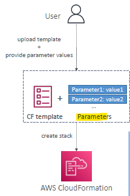
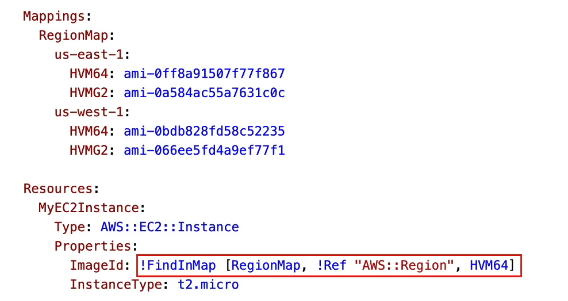
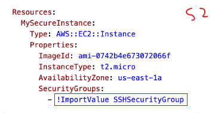
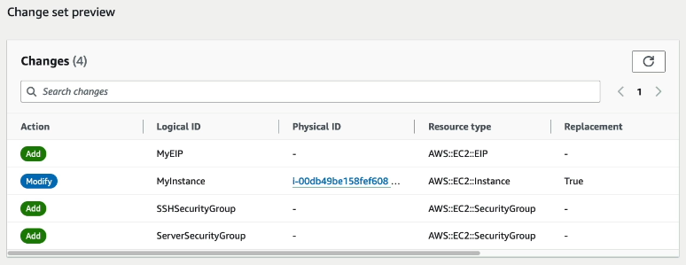

# Cloud Formation (IAC)
## A. Intro
- **declarative way** of provisioning AWS Infrastructure
- **IAC** 
  - **stack**-1 (for vpc)
    - **reource**-1 (**tags** - stackid(arn), logicalId, physicalId,etc)
    - rsource-2
    - ...
    - resolves order / dependency
    - 
  - stack-2 (app stack)
  - ...
  - versioned in git
- **app composer** to visualize
- **cost**
  - Each resources within the stack is tagged with an identifier so you can easily see how much a stack costs you
  - estimate the costs of your resources
  - schedule to destroy and re-create, to save cost.


---
## B. Template
### 1. overview
```json5
• AWSTemplateFormatVersion  – identifies the capabilities of the template “2010-09-09”
• Description               – comments about the template
• Resources (MANDATORY)     – your AWS resources declared in the template
• Parameters                – the dynamic inputs for your template
• Mappings                  – the static variables for your template
• Outputs                   – references to what has been created
• Conditionals              – list of conditions to perform resource creation
```
### 2. resource
- check : https://docs.aws.amazon.com/AWSCloudFormation/latest/UserGuide/aws-template-resource-type-ref.html :point_left:
- 700+ resource with example and doc.
- will use CDK anyway.
- certain resources not support
    - use **CF custom resource** :point_left:

### 3. parameter (dynamic input)
- 
- refer/use them
  - **!Ref** parameter1
  - **Fn::Ref** parameter1, or resource1

```json5
- Type
    • String • Number • CommaDelimitedList
    • List<Number>
    • AWS-Specific Parameter + List<AWS-Specific Parameter>
    • SSM Parameter (get parameter value from SSM Parameter store)
        
- Default | Description
        
- Constarint
    • Min/MaxLength
    • Min/MaxValue
    • AllowedValues (array)
    • AllowedPattern (regex)
    • NoEcho (Boolean) : for passowrd feild, so wont be logged/dispalyed anywhere
```
- **Pseudo parameter**
```json5
AWS::AccountId 123456789012
AWS::Region us-east-1
AWS::StackId arn:aws:cloudformation:us-east-1:123456789012:stack/MyStack/1c2fa620-982a-11e3-aff7-50e2416294e0
AWS::StackName MyStack
AWS::NotificationARNs [arn:aws:sns:us-east-1:123456789012:MyTopic]
AWS::NoValue Doesn’t return a value
```

---
### 4. mapping : map(string,object)
- static variable, fixed hardcoded value
- use/refer
  - !FindInMap [ map-1, key, object-attribute-1]
  - 

---
### 5. output (optional)
- **print** for console
- IAC-1 (**collaboration**)
  - stack-1(vpc-1) : output **export** `vpc-id`
  - stack-2(app-1) : refer `vpc-id` in this stack
- eg:
  - 
  - 

---
### 6. Conditional
- conditionally create resource. 
- eg based on env type.
```yaml
Parameters:
  envType:
    Description: "The environment type (prd or dev)"
    Type: "String"
    AllowedValues:
      - prd
      - dev
    Default: "dev"
              
Conditions: 
    IsProd: !Equals [!Ref envType, "prd"]  # True if envType is 'prd'
    IsDev: !Equals [!Ref envType, "dev"]  # True if envType is 'dev'
    IsNotProd: !Not [!Equals [!Ref envType, "prd"]]  # True if envType is not 'prd'
    IsProdOrDev: !Or
      - !Equals [!Ref envType, "prd"]
      - !Equals [!Ref envType, "dev"]  # True if envType is 'prd' or 'dev'
    IsNotDev: !Not [!Equals [!Ref envType, "dev"]]  # True if envType is not 'dev'
    IsProdAndNotDev: !And
      - !Equals [!Ref envType, "prd"]
      - !Not [!Equals [!Ref envType, "dev"]]  # True if envType is 'prd' and not 'dev'

Resources:
  Resource1:
    Type: "AWS::S3::Bucket"
    Condition: IsProd 
    ...

  Resource2:
    Type: "AWS::DynamoDB::Table"
    Condition: !Not [IsProd]
    ...

  Resource3:
    Type: "AWS::Lambda::Function"
    Condition: IsProdOrDev 
    ...

  Resource4:
    Type: "AWS::SNS::Topic"
    Condition: IsProdAndNotDev  
    ...
```
---
### 6. Intrinsic function
- `!Ref`  resource | parameter
  - resource-1 : returns resource-1.id 
  - parameter-1 : returns value
- `!GetAtt`  resource.attributename
  - !GetAtt ec2-i1.`id`
  - !GetAtt ec2-i1.`AvialabilityZone`
  - ...
- !FindInMap
- !ImportValue
- !Base64
- **conditions** :: !Equals. !And !If !Not !Or
- ...
- ...

---
### 99. change set
- change in template - add, modify (replacemnet=true/false), etc
- 

---
## Z. Example
### 1. EC2 example with short desc.

```yaml

AWSTemplateFormatVersion: "2010-09-09"  # Identifies the capabilities of the template.

Description: "Sample CloudFormation template for deploying a web server." # Comments about the template.

Parameters:  # Dynamic inputs for your template.
  InstanceType:  # Logical name for the parameter.
    Description: "EC2 instance type"  # Description of the parameter.
    Type: "String"  # Type of the parameter (e.g., String, Number).
    Default: "t2.micro"  # Default value for the parameter.
    AllowedValues:  # Allowed values for the parameter.
      - "t2.micro"
      - "t2.small"
    ConstraintDescription: "Must be a valid EC2 instance type."

Mappings:  # Static variables for your template.
  RegionMap:
    us-east-1:
      AMI: "ami-0abcdef1234567890"  # AMI for US East (N. Virginia).
    us-west-1:
      AMI: "ami-0fedcba9876543210"  # AMI for US West (N. California).

Resources:  # Contains definitions of AWS resources to be created (MANDATORY).
  MyEC2Instance:  # Logical name for the EC2 instance.
    Type: "AWS::EC2::Instance"  # Specifies the resource type (an EC2 instance in this case). # service-provider::service-name::data-type-name
    Properties:  # Contains properties to configure the resource.
      InstanceType: !Ref InstanceType  # Uses the parameter for instance type.
      KeyName: "MyKeyPair"  # Name of the key pair for SSH access.
      ImageId: !FindInMap [RegionMap, !Ref "AWS::Region", AMI]  # Uses mappings to select the AMI.
      SecurityGroupIds:  # Specifies security groups for the instance.
        - !Ref MySecurityGroup  # References the security group defined below.
      Tags:  # Adds metadata to the instance.
        - Key: "Name"
          Value: "WebServer"

  MySecurityGroup:  # Logical name for the security group.
    Type: "AWS::EC2::SecurityGroup"  # Specifies the resource type (a security group in this case).
    Properties:  # Contains properties to configure the security group.
      GroupDescription: "Allow HTTP and SSH access"  # Description of the security group.
      SecurityGroupIngress:  # Rules for inbound traffic.
        - IpProtocol: "tcp"  # Protocol type (TCP).
          FromPort: 22  # Allows SSH traffic.
          ToPort: 22
          CidrIp: "0.0.0.0/0"  # Allows traffic from all IP addresses.
        - IpProtocol: "tcp"
          FromPort: 80  # Allows HTTP traffic.
          ToPort: 80
          CidrIp: "0.0.0.0/0"

Conditions:  # List of conditions to perform resource creation.
  CreateProdResources: !Equals [!Ref "AWS::Region", "us-east-1"]  # Example condition based on region.

Outputs:  # References to what has been created.
  InstanceId:  # Logical name for the output.
    Description: "ID of the EC2 instance"  # Description of the output.
    Value: !Ref MyEC2Instance  # References the EC2 instance to get its ID.

  PublicIP:  # Logical name for the output.
    Description: "Public IP address of the EC2 instance"  # Description of the output.
    Value: !GetAtt MyEC2Instance.PublicIp  # Retrieves the public IP address of the EC2 instance.

```