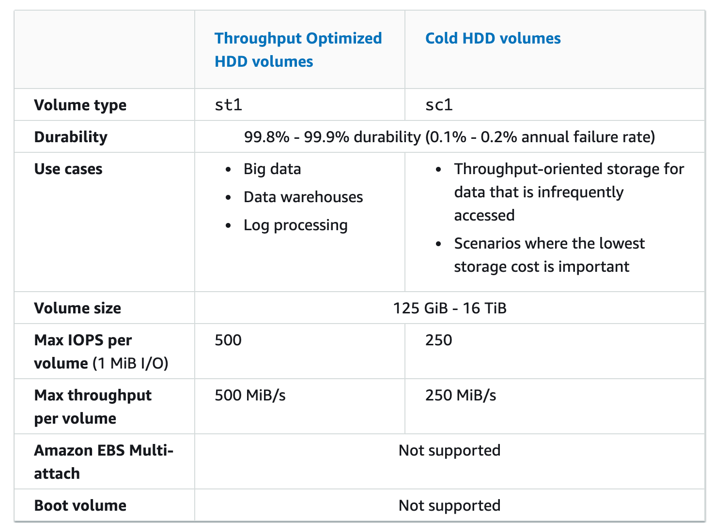

- EC2_01: https://chatgpt.com/c/7ddee1bf-7240-4789-913a-72dae8438d00
- EC2_02 : https://chatgpt.com/c/636011e3-1ce6-4268-8089-47ca3b12c9b9
--- 
# EC2 (elastic compute)
## 1. Intro
- IaaS
- connect from terminal:
  - **SSH** (OS : linux,mac,W10+) 
    - generate SSH key-Pair
  - **Putty** ( OS: W7,8,9) 
  - **EC2 instance Connect** (any instance) - browser session.
```
- aws cli installed in ec2
- run any commnd, provided IAM permission added on ec2-role
- don't run "aws configure" 
```
- get Instance **metadata**
  - http://169.254.169.254/latest/meta-data/ 
  - instance ID,
  - public IP, private IP, elastic IP, etc
  - ...
  - Retrieve runtime information dynamically

---
## 2. ec2: Instance type
- https://ec2instances.github.io/ 
  - check `family,version`.`size`
- **general purpose** : 
  - balanced, 
  - eg: t2.micro
- **compute optimized**, 
  - c** 
  - gaming server, batch, ML
- **memory optimized**
  - r**, X** 
  - real-time system, large dataset processing, BI
- **storage optimized**
  - D**, H1, I3 
  - File System, data-ware house, cache server, OLTP etc

---
## 3. Purchase options

### 3.1 On-Demand  
- use case: short workload, predictable pricing, 
- pay by second (Window and Linux) 
- pay by hour (other OS)

### 3.2 Reserved 
- (1 & 3 years)
- 72% discount
- use case: long workloads, fixed instance type,OS.

#### Convertible Reserved 
- 66%  discount
- use case: long workloads with flexible instances types

### 3.3 Savings Plans 
- (1 & 3 years) 
- commitment to an amount of usage. 
- always Flexible : switch OS, inst type, etc

### 3.4 Spot Instances 
- 90% 
- short workloads
- can lose instances (less reliable), 
- `2 min` **grace period.**
```
select 
    duration/expiry            <<<
    type: one-time/persistent 
    count
    max price                   <<< 
    instance Types, 
    cpu (min.max),
``` 

#### spot block  
- (1-6 hr), no interruption.
- Stop request and terminate instance manually then. :point_left:
- one time vs persistent.

### 3.5 Spot fleet 
- Spot Instances + optional(On demand)

### 3.6. Dedicated Instances
- underlying h/w not shared with other aws account.

### 3.7 Dedicated Hosts
- most expensive $$
- book an entire physical **server/racks/building**. 
- control over **instance placement**
- pay by : 
  - physical cores
  - underlying network socket visibility.

---
## 4. hibernate
- RAM state ( < `150 GB`), gets preserved in EBS root volume ( with/without **Encryption**).
- hence boot up fast. 
- supported family instances 
  - `C**` 
  - `M**` 
  - `T**`
- max for `60 days`

---
## 5. Placement group
- **cluster** 
  - same AZ, close-proximity. hence high n/w througput
- **spread**
  - different AZ, max 7 instance in each AZ.
- **partition**
  - partition/racks in different AZ, max 100
  
---
## 6. provision instance :books:
- **Tenancy**
  - host 
  - Dedicated 
  - default
- **OS / AMI** 
  - can create AMI on ec2-i. 
  - OS boot volume : `gp* / io*` :point_left:
- **memory/RAM** 
- **cpu architecture**
  - `ARM` 
  - `AMD`
- **user-data script** 
  - bootstrap  - (install, update, etc task)
  - run only once
  - run with **root user** permission.

- **Storage** : [02_storage](../02_storage)
- **Network** : [04_network](../04_network)
- **Elastic load Balancer, Auto Scaling group**  : [ELB and ASG](../04_network/01_ELB_ASG.md)

---
- 
- 
- 
- 


  