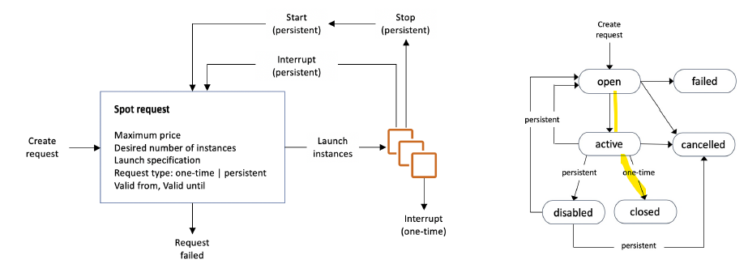
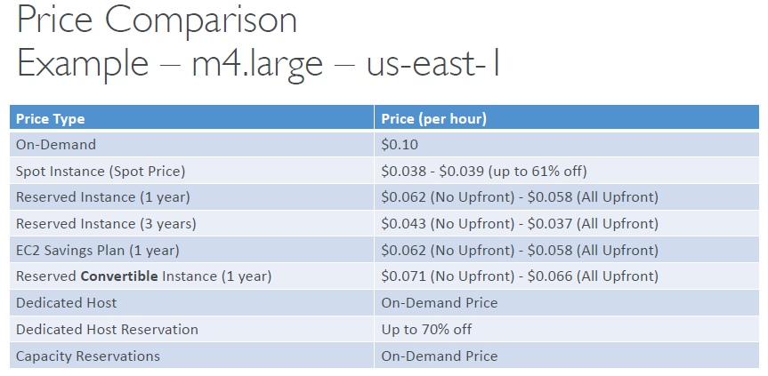

- EC2_01: https://chatgpt.com/c/7ddee1bf-7240-4789-913a-72dae8438d00
- EC2_02 : https://chatgpt.com/c/636011e3-1ce6-4268-8089-47ca3b12c9b9
--- 
# EC2 / ECC (elastic compute cloud)
## 1. Intro
- IaaS
- connect from terminal (instance must have public IP)
  - **SSH** (OS : linux,mac,W10+) 
    - generate SSH key-Pair
  - **Putty** ( OS: W7,8,9) 
  - **EC2 instance Connect** (Amazon Linux 2) - browser session.
```
- aws cli installed in ec2
- run any commnd, provided IAM permission added on ec2-role
- don't run "aws configure" 
```
- get Instance **metadata**
  - http://169.254.169.254/latest/meta-data/ 
  - instance ID,
  - public IP, private IP, elastic IP, etc
  - ...
  - Retrieve runtime information dynamically

- **AMI** 
  - AMIs are bound to the Region they are created in. 
  - So, you need to copy the AMI across Regions for disaster recovery readiness.
  - When the new **EBS-backed AMI** is copied from Region A into Region B,  :dart:
    - no charges for copying an AMI.However, standard storage and data transfer rates apply.
    - it automatically **creates a snapshot (root volumee)** in Region B because AMIs are based on the underlying snapshots
    - Region B will have :
      - 1 AMI 
      - 1 snapshot (root + additional optional EBS vol)
    -  https://docs.aws.amazon.com/AWSEC2/latest/UserGuide/CopyingAMIs.html
  
```yaml
t2.micro      1     1     EBS-Only          Low to Moderate
t2.xlarge     4     16    EBS-Only          Moderate
c5d.4xlarge   16    32    1 x 400 NVMe SSD  Up to 10 Gbps     
r5.16xlarge   64    512   EBS Only          20 Gbps           
m5.8xlarge    32    128   EBS Only          10 Gbps           
```
---
## 2. ec2: Instance type (family,gen,size) :yellow_circle:
- https://ec2instances.github.io/ 
- https://instances.vantage.sh/
- 

### **general purpose** : 
  - balanced, 
  - eg: t2.micro
  - 

### **compute optimized**, 
  - gaming server, media, batch, ML, HPC
  - 

### **memory optimized**
  - real-time system, large dataset processing, BI
  - 

### **storage optimized**
  - File System, RDBMS, data-ware house, cache server, OLTP etc
  - 

---
## 3. Purchase options :yellow_circle:

### 3.1 On-Demand  
- No long-term commitment
- no upfront payment
- **Flexible**
- use case: short workload
- pay by 
  - **second** (after the first minute) (Window and Linux) 
  - **hour** (other OS)

#### Capacity Reservations
- Reserve **On-Demand** instances capacity in a **specific AZ** for **any duration**

---  
### 3.2 Reserved 
- 1 & 3 years
- **fixed** : InstanceType, scope:**Region/AZ**, Tenancy, OS 
- up to 72% discount
- Payment Options – No Upfront (+), Partial Upfront (++), All Upfront (+++)
- use case: 
  - long workloads
  - steady-state usage applications

#### Convertible Reserved 
- upto 66%  discount
- **flexible** : Instance Type, scope:**Region/AZ**, Tenancy, OS
- use case: long workloads with flexible instances types

---  
### 3.3 Savings Plans 
- (1 & 3 years) 
- commitment to an amount of usage.
- Usage beyond EC2 Savings Plans is billed at the On-Demand price :point_left:
- **fixed** : instance family & AWS region
- **Flexible** : Instance Size, OS, Tenancy

---  
### 3.4 Spot Instances 
- upto 90% discount +  MOST cost-efficient
- can lose instances (less reliable), 
- When we **cancel** an active spot request, it does not **terminate** the associated instance :dart:
- `2 min` **grace period.**
- use case:
  - Not suitable for critical jobs or databases
  - workloads that are **resilient to failure** : Batch jobs, Data Analysis, Image processing, etc
- **type**: 
  - **one time** 
    - if interrupted then terminated.
  - **persistent**
    - has to terminate instance manually :point_left:
- **provision** : define launch pool
    ```
    launch pool :
        duration/expiry            <<<
        type: one-time/persistent 
        count
        instance Types 
        cpu (min.max)    
     
    -   define **our max spot price** , else od-price
    
            if max spot price  < current Spot price 
               then use it
            if max spot price  > current Spot price
                then stop/terminate instance
                with 2 min grace
    
    ```
  
- terminate:
  - 

---  
#### 3.4.1 Spot fleet 
- collection of Spot Instances (and optionally On-Demand Instances)
- on-time Instances only
- define **multiple launch pool**
  - thus request various instance types
- provides higher availability and fault tolerance
  - if spot instance is termninated, it will match with another spot instance
  - if none found then OD
  - thus **maintain target capacity** :dart:

- **strategies**: :books:
  - `lowestPrice`: 
    - from the pool with the lowest price 
    - (cost optimization, short workload)
  - `diversified`: 
    - distributed across all pools 
    - (great for availability, long workloads)
  - `capacityOptimized`: 
    - pool with the optimal capacity for the number of instances
  - `priceCapacityOptimized` (recommended): 
    - pools with highest capacity available, 
    - then selectthe pool with the lowest price (best choice for most workloads)

#### 3.4.1 Spot block
- Spot Blocks are priced at the same rate as Spot Instances
- but with the added benefit of no interruptions for the block duration (`1-6 hr`)

---  
### 3.6. Dedicated Instances
- underlying h/w not shared with **other account**.
- May share hardware with other instances in **same account**

---  
### 3.7 Dedicated Hosts
- most expensive $$
- book an entire physical **server/racks/building**. 
  - for companies that have strong regulatory or compliance needs
- control over **instance placement**
- pay by : 
  - physical cores
  - underlying network socket visibility.
- Purchasing Options
  - On-demand – pay per second for active Dedicated Host
  - Reserved - 1 or 3 years (No Upfront, Partial Upfront, All Upfront)

### summary

---
## 4. hibernate
- RAM state ( < `150 GB`), gets preserved in EBS root volume ( with/without **Encryption**).
- hence boot up fast. 
- supported family instances : C3, C4, C5, I3, M3, M4, R3, R4, T2, T3, …
  - `C**` 
  - `M**` 
  - `T**`
- max for `60 days`
- Also, **Root Volume** – must be EBS, encrypted. :point_left:

```
#1
A Machine Learning research group uses a proprietary computer vision application hosted on an Amazon EC2 instance. 
Every time the instance needs to be stopped and started again, the application takes about 3 minutes to start 
as some auxiliary software programs need to be executed so that the application can function. 
The research group would like to minimize the application boostrap time whenever 
the system needs to be stopped and then started at a later point in time.

As a solutions architect, which of the following solutions would you recommend for this use-case?
- Create an Amazon Machine Image (AMI) and launch your Amazon EC2 instances from that
- Use Amazon EC2 Instance Hibernate **
```
---
## 5. Placement group :yellow_circle:
- **cluster** 
  - **low-latency group** in a **single AZ**
  - close-proximity. 
  - hence high n/w throughput
  - usecase : HCP
  - 
  
- **spread**
  - spreads instances across underlying hardware in **mutli-AZ**
  - max : `7 instance/group/AZ`
  - 
  
- **partition**
  - partition-1 in AZ-1 
  - partition-2 in AZ-1
  - ...
  - partition-3 in AZ-2
  - ...
  - max /restriction
    - `100 instances/group`
    - `7 partitions/AZ`
  - use case: hadoop, kafka, casandra
  - 
  
---
## 6. provision instance :yellow_circle:
- **Tenancy**
  - **host** / physical building and racks
  - **Dedicated** / single-tenant (single aws account)
  - **default**/shared/multi-tenant (multiple aws account, shares same hardware)
  - change tenancy: :dart:
  - ```
    dedicated <==> host : can change
    cannot change any other, fixed once
    ---
    some rules to remember:
    1. VPC tenancy take precidence over ASG's LT's tenancy
    2. host > dedicated > default : cannot downgrade.
    ```
- **OS / AMI** 
  - can create AMI on ec2-i. 
  - OS boot volume : `gp* / io*` :point_left:
- **memory/RAM** 
- **cpu architecture**
  - `ARM` 
  - `AMD`
- **user-data script** 
  - bootstrap script  - automate boot tasks
    - install update
    - install software
    - ...
  - run only once (first launch by-default)
    - can change to run everytime instance **restarted** :dart:
  - run with **root user** permission.

- **Storage** 
  - [02_storage](../02_storage)
  - Network-attached (EBS & EFS) 
  - hardware (EC2 Instance Store)
  
- **Network** : 
  - [04_network](../04_network)
  - ENI [00_eni+sg.md](../04_network/00_eni%2Bsg.md)
  - sg: [00_eni+sg.md](../04_network/00_eni%2Bsg.md)
  
- **Elastic load Balancer, Auto Scaling group**  : [ELB and ASG](../04_network/01_ASG)


  