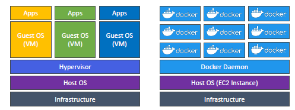

## A. docker
- [02_docker](..%2F..%2F02_docker)
- **machine** vs **virtual machine** vs **container** (partial virtualization : share OS, n/w)
- image --> run on docker-agent --> **Container** 
  - docker-demon / container-d
  - ecs-agent on ec2-i
- container mgt tool in AWS : 
  - container orchestration : ecs and eks(k8s)
  - image repo : ecr, 
  - launch type : fargate or ec2
- 

--- 
## B. k8s vs ECS
- Analogy with k8s.
  - `eks cluster` - **ecs cluster**
  - `worker-node` -  fargate or **ec2 nodes**.
  - `pod`(c1) - **task**(c1) or service[task]
  - `pod/rs/deployment` manifest yaml - **task definition**
  -` control panel/master node`  - ?
  - `service` - **ALB** --> tg --> asg [task-1]
    - desired task = 1
    - max task count = 3
  - `task schedular` - ?

---
## B. ECS  (elastic container service)
- For fargate launch, don't think underlying ec2-i/s
- ECS-cluster (with launch type = ec2)
  - EC2-i1 (`docker-agent`) 
    - task-1 (c1)
    - task-2 (c2)
    - ...
  - EC2-i2 : task-11, task-22, ...
  - EC2-i3 : task-111, task-222, ...
  - ...
  
### ECS Demo:(launchtype = ec2)
- Step-1 : create **cluster-1** 
  - launchType : ec2 (worker nodes)
  - has **ECS-Cluster capacity provider** :point_left:
- Step-2 :create **task-definition-1** :
  - configure - os, cpu, ram, class
  - **task-role** : attach to ecs-agent  (permission - ecr, cw, ecs)
  - **task-exec-role** : attach to task.
  - **container**  
    - imageURI, 
    - port mapping,  
    - env var , 
    - `storage` : EFS or default(21GB EBS)
- Step-3 : **run task**:
  - task (for job) **directly**,  
  - or wrap task with **service** (for long-running web-app) : srv1:[t1,t2,t3]
    - service name - `service-1`
    - choose :  task-definition :`task-definition-1` **
    - Desire capacity : 2 tasks - task-1(c1), task-2(c2)
    - Define **networking**
      - choose `subnet/VPC`
      - create `sg` : allow traffic http,etc --> this will attach to ec2-i or `hidden-ec2-i/in-fargate`
- Step-4 : **expose** task/service 
  - create **ALB-1**
    - health check for tg
    - listener(http:80)  --> tg-1 --> asg --> [ ec2-i1 :: task-1(c1), task-2(c2) ]
    - `Auto Scaling` : scale up/down task 
      - For ec2 launch
        - option-1 (`ASG`) : CW --> metric(CPU,etc) --> `ASG`(up/down Ec2-i and task/container inside)
        - option-2 (`ECS-Cluster capcity provider`): preferred to use, smart, better.
      - For fargate: easy
        - ASG (scale up/down containers only)
        - `ECS-Cluster capcity provider` : intelligent to do everything.
- step-5 : more
  - **task placement**  
- READY :green_circle:
  - check cluster > task > container, logs/event,
  - update service - manually update Desire capacity : 5
  - in prod, service Auto Scaling (ASG, ECS-Cluster capcity provider) will do same.

---      
## C. screenshot
### 1. launch type:
 

### 2. iam roles/policies:

### 3. alb

### 4. Storage:

### 5 scale : ASG + Ecs-cluster capcity provider

--- 
## D. Use case / arch :
### 1 with eventBridge ( trigger )

### 2 with eventBridge ( scheduled )

### 3 with SQS + autoScale

### 4 with SNS

