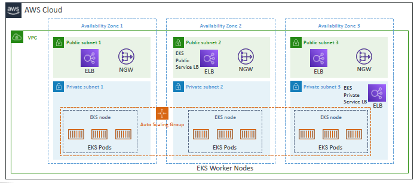

# EKS
## k8s
- [03_Kubernetes](../../03_Kubernetes)
- cloud-agnostic

---
- [04_EKS](../../03_Kubernetes/04_EKS)
- **pod** + **service** 
- **control panel/master node** 
- **worker-nodes**
  - use `EKS optimized AMI` to build container image.
  - Type:
    - **fargate**
    - **managed** : 
      - inbuilt `ASG` to scale nodes, register Node.
      - support od or spot
    - **self-managed** : 
      - register node manually
      - support od or spot

- **Addon**
  - `CSI`: Container Storage Interface :
  - 
  
---
## hands on
- [eks::terraform](../../04_terraform/project/config-3-aws/modules/eks)
```
1.  create cluster-1
  - choose K8s version
  - encrypt k8s secret with KMS : y/n
  - create IAM EKS-cluster-role-1 
    - attach inbuild "AmazonEKSClusterPolicy"
    - ...
  - n/w : 
    - vpc/subnet
    - ceate sg for cluster
    
2. update cluster with more detail
  - resource tab (k8s things) :
    - deployment object
    - service Object
    - pod
    - job
    - ...
    - ...
  - compute tab : 
    - Option-1 :: `Node/NodeGroup (bts: ec2-i)`
      - add Node (single ec2-i) 
      - or, add Node-Group (multiple Ec2-i, set - min, max, desired) 
      - IAM policy for ec2-i : attach "AmazonEKSWorkerNodePolicy", "AmazonEC2ContainerregistryReadOnly"
      - choose : AMI, ec2-i class, etc for ec2-i
    - Option-2 :: `fargate profile`
      - pending
      - ...
      
  - Add-on tab
    -  add EBS-CSI (Container Storage Interface) drive
    -  add VPC-CNI  
    - ...
    - ...
    
  *** Note: very high level, need K8s expertise to do more    
```


