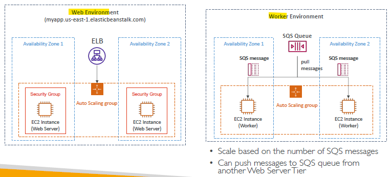

# Elastic Beanstalk 
## A. Common **Web** Architecture

## B. Intro
- Managed services, deals with:
  - **Managing infrastructure**
    - databases, `RDS`
    - load balancers, `ELB`
    - scaling concerns, `ASG`
    - App health monitoring
    - ...
    - note:create cloudFormation template bts for infra.
    
  - **Deploying Code**
    - into multiple env, 
    - compute: EC2/ECS/Lambda
    
- Basically from central place, dealing with all these services, being used commonly for web development. :point_left:
  - **developer focus on code**
  - rest all beanStalk will do `infra + deploymnet`

## C. pricing
- `Free` 
- but pay for underlying infra.

## D. Elastic Beanstalk : `Application`
### **configuration**
- deployment Mode: single instance | high Availability
- ...

### **Application version** 
- code,v1
- code, v2
- ...

### **Environment/s** 
- create multiple `dev, prod, qa`
- it represents infra which are running our application version.
- Type/tier:
  - **web-server**  Environment
    - can send traffic to worker
  - **worker** Environment
  - 
      
---    
## E. Deployment Modes

---
## Z. Hands on
- Create Application
  - create environment
    - choose tier : web* or worker
  - choose platform : language,runtime,etc - java,etc
  - code : upload
  - Configuration preset
    - deployment mode - single, high ava
    - custom
      - ...
  - role
    - add pre created policies : 
      - `AWSElasticBeanStalkWebTier`,
      - `AWSElasticBeanStalkWorkerTier`, 
      - `AWSElasticBeanStalkMultiContainerDocker`
      - ...
      
- it creates `cloudFormation template`
  - view the template in appl-composer.

- get domain url and use it.
- upload new code, seamlessly.
- check other tab : CW, monitor, mmanged updates, alarms, health, etc
- Check `configuration` link on left
  - show all the configs for env
  - edit them