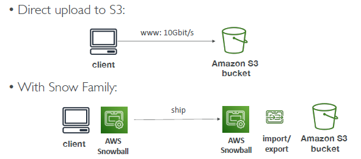

# AWS snow family
 
## A. snowball : Data Migration

### A.1 Snowball `Edge`
- Use cases
  - large data cloud migrations, 
  - DC decommission, 
  - disaster recovery
    
- **Snowball devices** (offline portable devices)
  - Snowball Edge **Storage** Optimized : `80/210 TB ` | `80 GB RAM, 40 cpu`
  - Snowball Edge **Compute** Optimized : `42/28 TB` | `416 GB RAM, 104 cpu`
  - post device :point_left:
  - send/upload to/from:
    - **block volume** / EBS
    - **object storage** / S3 / but not glacier storage class :point_left:
      - 
  - next, transfer over the stable **directconnect network** to destination acct's s3 / ebs

  


---
### A.2 Snowball `Cone`
- Small, portable, light (2 kg) devices
- type:
  - **Snowcone** –  `8 TB HDD`  | `4 GB RAM, 2cpu`
  - **Snowcone SSD** – `14 TB SSD` | `4 GB RAM, 2cpu`
- send option
  - post device (offline)
  -  **AWS DataSync** (online)
    - to send/upload data to/from:
      - AWS **EBS** only 
      - not s3 :x:  :point_left:
    - AWS DataSync agent is pre-installed
    - [more](./05_transferFamily+DataSync.md#b-aws-datasync)

---
### A.3 Snowball `mobile` (offline)
- 100 PB + 100 PB + ...  === upto `1 exabyte` (1 Million TB)
```
  - 1024 TB = 1 PB 
  - 1024 PB = 1 exabyte 
  - so it `1000,000 TB` or 1 Million TB
```
- truck with 
  - GPS
  - 24/7 video surveillance

---
### summary


---
## B. SNOW : Edge computing
- edge : location which can produce data, but limited/no internet connectivity, so cannot compute.
- 
- same device as above.
  - run ec2 + lambda
- long term deployment +  1 / 3 year saving
- interact with `aws-cli` or `AWS OpsHub `(ui)

