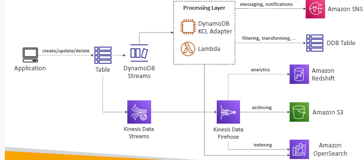

# DynamoDB (serverless)
## A. Intro
- **No Sql** 
  - unstructured
  - rapidly evolve schemas
  - All the data that is needed for a query is present in **one row**
  - don’t perform **aggregations** such as “SUM”, “AVG”, …
  - **scale horizontally** :point_left:
  
- **Fully managed** 
  - no maintenance/patching
  - no db admin
  - no provisioning db

- **high consistent performance DISTRIBUTED database** :point_left:
  - `single-digit millisecond performance`, at **any scale** 
  - `Millions of requests` per seconds
  - `trillions of row`
  - `100s of TB` of storage
  - Scales to `massive workloads`

- Allows event driven programming with **DynamoDB Streams** :point_left:

---
## B. Distributed DB (highly available)
- Traditional relational DB:
  - **Vertical scaling** (getting a more powerful CPU / RAM / IO)
  - **`limited` Horizontal scaling** 
    - increasing Read Replicas.
    - but limited. eg max 16 read replica/s.
    
### B.1. Single region Table
- dynamoDB Distributed database (highly available)
  - table-1
    - partitions-1 (node-1) <--> **2 way multiple-AZs replication** <--> partitions-1(node-2)
      - both can Read and Write
      - no leader/primary concept.
    - partitions-2
    - ...
    - ...
    - scale out more partition
    
### B.2. Global Table
- table-1 (R/W) is `region-1`
- table-1 (R/W) is `region-2`
- `2 way replication` b/w both regions.
- 
- Side Note: `Enable` **DynamoDB Streams** first,  helps to replicate data across replica tables in other AWS Regions

---
## C. DynamoDB streams
- some usecase:
    - `React` to changes in real-time by invoking `lambda`,` KCL-adaptor(Java-App) `
    - Real-time usage `analytics` : send stream to `AmazonShift`
    - Implement cross-region `replication`
- 
- 

---
## D. Storage 
- storage classes ( like in s3 ): 
  - **Standard**
  - **Infrequent Access (IA)** 
    - to save more cost

---
## E. Security
- Integrated with IAM for security, authorization and administration
- encryption at rest/fly

---
## F. DR
- **Automatic backup** for last `35 days`. 
- take ondemand backup for longer retention.
- Enable Cross-region copy. no performace impact/ doentime.
- PITR - point in time recovery
- `export` (json,ion) data --> S3.
- `import` (json,csv,ion) --> Dynamo DB
- 

---
## G. Developer things :books:
### 1. fundamentals
- **Tables**
  - PK : **partitionKey** , or
  - PK : **partitionKey** + **Sortkey**
- **record**
  - attributes (`400 KB max`)
- **Datatype**: 
  - string, 
  - num, 
  - Bool,
  - null 
  - collection : list, Map, Set
- **TTL** 
  - set expiration for record
  - it will auto-delete and send event stream
  - eg: 
    - TTL is `2 hr`
    - webUser --> session 2 hr --> session logout --> cleanUp his/her data after 2 hr.

### 2. Read/write units
  ```
   RCU, WCU - measure `throughput` of read and write operations on a table.
   RCU - 2 read/sec upto 4KB/sec
   WCU - 1 write/sec upto 2KB/sec
  ```
- `Provision` mode : `we` define RCU, WCU + autoScale:`y/n`
  - use case : predicated workload
  - this will help to optimize/lower cost.
- `On-demand` mode : `workload` defines RCU, WCU automatically adjusted + autoScale:`y`
  - use case : un-predictable workload.
  - simplified billing but `expensive`

---
### 99. hands
```
- create db - no such thing :_)
- create table-1
    - choose : partition key (hash value used to retieve from table)
    - choose : sort key (optianal)
- capacity:
    - a. on-demand: simple, expensive 
    - b. Provision ** 
        - RCU
            - option-1 (scale-on) min-1 , max-100 , 70% utlization
            - option-2 (scale-off) capicity: 1
        - WCU
            - option-1 (scale-on) min-1 , max-100 , 70% utlization
            - option-2 (scale-off) capicity: 1
- indexing : pending
- Encryption (3 key options ) : dynamoDB-ownedKey, AWS-KMS, customerKey

- create item/record
    - record-1 : add attribute1,2,3,4    
    - record-2 : add attribute1,2
    - no schema :)    
```


