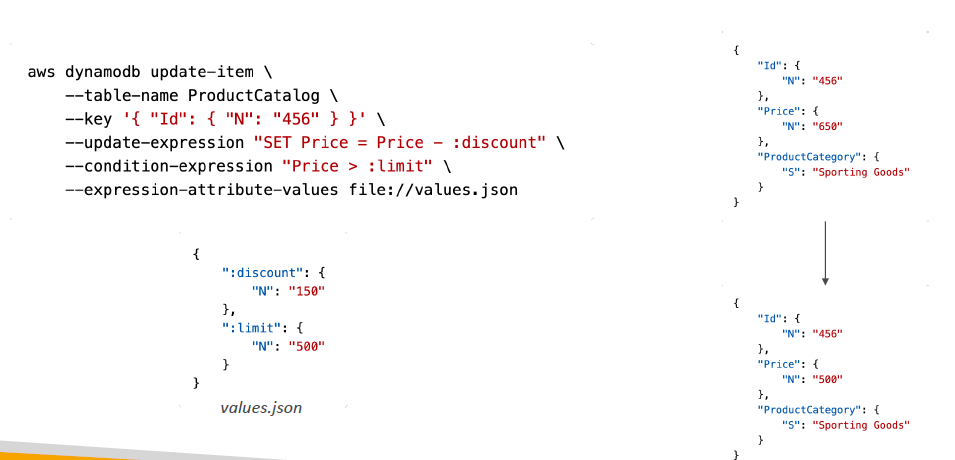

# A. DynamoDB - `Simple Operations` :books:
## 1. Read
### 1.1. GetItem
- Read based on Primary key
- Primary Key can be HASH or HASH+RANGE
- Eventually Consistent Read (default)
- Option to use Strongly Consistent Reads (more RCU - might take longer)
- **ProjectionExpression** 
  - to retrieve only certain attributes

### 1.2. Scan
- Scan the entire table and then filter out data
  - ProjectionExpression
  - FilterExpression
- Consumes a lot of RCU
- For faster performance, use **Parallel Scan**
- can use **limit and pagination**.
---
## 2. Write
### 2.1 PutItem
- Creates a new item 
- or fully replace an old item (same Primary Key)
- Consumes WCUs

### 2.2 UpdateItem
- Edits an existing item’s attributes 
- or adds a new item if it doesn’t exist
- use **Atomic Counters**

### 2.3 conditional Write
- Accept a `write/update/delete` only 
  - if conditions are met, 
  - otherwise returns an error
- Helps with **concurrent access** to items
- No performance impact
- 
- **conditional**
  - `attribute_exists`
  - `attribute_not_exists`
  - `attribute_type`
  - `contains` (for string)
  - `begins_with` (for string)
  - ProductCategory `IN` (:cat1, :cat2) and Price `between` :low and :high
  - `size` (string length)

---
## 3. Query
- returns Item/s based on below **expression**:
  - **KeyCondition** : 
    - on partitionKey
    - on sortKey
  - **Filter** 
    - addition filter on other attributes.
- set **limit**
  - no of item
  - size. eg : 1 MB data.
- perform **pagination**
- **index** ?
  - local secondary ?
  - Global Secondary ?

---
## 4. Delete
### 4.1 DeleteItem
- Delete an individual item
- Ability to perform a conditional delete

### 4.2 DeleteTable
- Delete a whole table and all its items
- Much quicker deletion than calling DeleteItem on all items

---

# B. DynamoDB - `Batch Operations` :books:
- reducing the number of API calls
- done in parallel for better efficiency

### 1. BatchWriteItem
- Up to `25` PutItem and/or DeleteItem in one call
- Up to `16 MB` of data written, up to `400 KB` of data per item
- Can’t update items (use UpdateItem)
- error: **UnprocessedItems** for failed write operations 
  - exponential backoff 
  - add WCU

### 2. BatchGetItem
- Return items from one or more tables
- Up to `100 items`, up to `16 MB` of data
- Items are retrieved in parallel to minimize latency
- error: **UnprocessedKeys** for failed read operations 
  - exponential backoff 
  - add RCU

---
#  program
## 1. py : update item
- https://us-west-2.console.aws.amazon.com/lambda/home?region=us-west-2#/functions/dynamodb-ps-games-operation?tab=code
- https://us-west-2.console.aws.amazon.com/dynamodbv2/home?region=us-west-2#item-explorer?operation=SCAN&table=ps-games
```
{
  "id": { "N": "101" },
  "name": { "S": "The Last of Us Part II" },
  "release_year": { "N": "2020" },
  "genre": { "S": "Action-Adventure" },
  "developer": { "S": "Naughty Dog" },
  "rating": { "N": "9.5" },
  "platforms": { "SS": ["PS4", "PS5"] },
  "multiplayer": { "BOOL": false },
  "file_size": { "N": "80" },
  "version" : { "N", "1"}
}

======

import boto3
from decimal import Decimal

dynamodb = boto3.resource('dynamodb')
table = dynamodb.Table('playstation-games')

# Use Decimal for numeric values
try:
    table.update_item(
        Key={"id": 101, "name": "The Last of Us Part II"},
        UpdateExpression="SET rating = :new_rating, version = version + :incr",
        ConditionExpression="version = :expected_version",
        ExpressionAttributeValues={
            ":new_rating": Decimal('9.6'),  # Use Decimal instead of float
            ":expected_version": Decimal('1'),
            ":incr": Decimal('1')
        }
    )
    print("Update successful!")
except dynamodb.meta.client.exceptions.ConditionalCheckFailedException:
    print("Version mismatch! Item was updated by another process.")
    
====
aws dynamodb update-item \
  --table-name ps-games \
  --key '{
      "id": {"N": "101"},
      "name": {"S": "The Last of Us Part II"}
  }' \
  --update-expression "SET rating = :new_rating, version = version + :incr" \
  --condition-expression "version = :expected_version" \
  --expression-attribute-values '{
      ":new_rating": {"N": "9.6"},
      ":expected_version": {"N": "1"},
      ":incr": {"N": "1"}
  }' \
  --region us-west-2

```