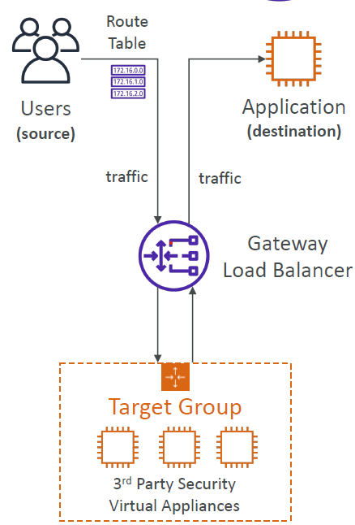
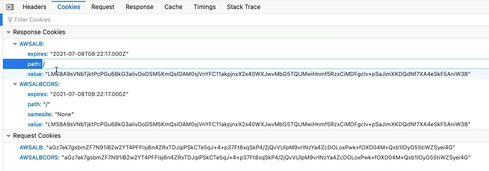

- https://chatgpt.com/c/b1fe7e08-270f-4a92-a4db-b95e6beab7c7
- QnA: traffic is routed to instance from ELB using `private IPS` of ENI of instance.
---
## A. keys Terms
- `Availability` : multi AZ, prevent datacenter loss
- `Scalability`:
    - `horizon` scaling(elasticity) / `Distributed system`
        - scale in and out
    - `vertical` scaling
        - scale up and down.
- `load balancing` : gateway | forwards traffic to healthy servers. 
- `Sticky Sessions` : 
  - Client always redirect to same instance, in order to not lose his session data.
  - might bring some imbalance.
  - cookies: 
    - `LB generated` / Duration-based? : uses these reserved name: `AWSALB, AWSALBAPP, AWSALBTG`
    - `Application (TG) based` : MY_TG_1_COOKIE, etc
- SSl/**TLS**.
  - `X.502` === TLS certificate (private key, bodt, chain)
  - ccgg uses `digicert` as `CA`.
  - **SNI** (Server Name Indication)
    - resolves multiple certificate load problem.
    - allows to expose multiple HTTPS applications each with its own SSL certificate on the same listener.
  - encrypt `in-fly` traffic.
---
## B. ASG
- asg span over AZs.
- client --> ELB(sg-lb-1) --> target-group --> ASG [ec2-i1 (sg-1), ...]

### Trigger
  - CloudWatch --> metric(CPU,memory,network, `custom`, `RequestCountPerTarget`) --> `alarm` --> ASG --> scale in/out
  - asg works in conjunction with `ELB`
    - if ELB::health-check fails, ASG will terminate corresponding target instances.
    - not scaling, but replacing unhealthy targets.

### Cooldown Period
  - pausing further scaling actions for a specified amount of time, after a previous scaling activity completes.
  - this allows the system to **stabilize** before initiating another scaling operation.
  - so during this time, does not add new instances.

### Scaling types
- **Dynamic**: 
  - `Simple scaling` :
    - create trigger(CW:Alarm) + define **single action** + set cooldown-period 
    - demo : created one and link with tg. count : `desired, min, max`.
    - single step : cpu 70 : add 3 instance.
    
  - `Step scaling` 
    - create trigger(CW:Alarm) + define **different/many actions** + set cooldown-period
    - more fine-tuned / more action:
      - if CPU utilization is slightly above the threshold, add 1 instance; 
      - if it is far above, add 3 instances.
      
  - `target tracking Scaling` 
    - define only **target value**. eg: 50% of CPU,memory,network utilization
    - no need to create alarm + action
    
- **scheduled** : 
  - eg: scale up/down to max/min count on weekends.

- **predictive** : 
  - continuously `forecast` load and schedule scaling ahead of time.
  - Easy to create. once created ait for Week. 
  - `ML` will be applied on historic data.

### Instance launch settings
- **Launch template** :point_left:
  - more modern and flexible way 
  - Editable/mutable: Launch Templates allow versioning
  - EC2 details (AMI, OS, Role, etc), 
  - more flexible - mix of purchasing options.
  - Configure `user data` for automation, during instance initialization.
  
- **Launch Configurations**
  - Immutable - replace entire template if changes needed.
  - simpler but less flexible -  does not multiple instance types like od, spot, etc

### scale-down: `Default Termination Policy`
- order:
  - AZ with the most instances is selected for termination
  - Instances in the `Standby` status
  - instance launched with oldest version of launch-configuration/template.
  - oldest age
  - the instance(s) nearest the end of their billing hour. (like reserver period is close to end.)

### Instance refresh (like k8s deploymnet )
- update ec2-i with new launch template version.
- **rolling Updates** : iReplaces instances incrementally to avoid downtime.
- desired capacity is maintained : specify minimum healthy %
- can pause, resume, or cancel an instance refresh if necessary.
- specify **warm up time** : wait times for instance stabilization
```
aws autoscaling start-instance-refresh --auto-scaling-group-name <ASG-name> --preferences <json>

{
    "MinHealthyPercentage": 90,
    "InstanceWarmup": 300
}

# monitor
aws autoscaling describe-instance-refreshes --auto-scaling-group-name <ASG-name>

```
---

## C. ELB (regional)
- **DNS name** : `XXXX.region.elb.amazonaws.com` 
- public IP might change :point_left:

### `Proxy server` with additional feature
- sits b/w client and backend-server. **hides** the backend server's IP address.
- **forwards** client requests to the appropriate backend server based on configured rules in `balanced distribution way`.
  - Content-Based Routing (url, queryparam,etc)
- **gateway** : offers a synchronous decoupling of applications
- client **Session** Stickiness
  - Enforce stickiness with cookies
- integrated with ACM, WAF to add **security**. 
  - Termination of SSL/TLS at the ELB level
  - allowing it to decrypt and inspect incoming traffic before forwarding it to the backend instances.
  - separate `public-traffic` and `private-traffic`
- also act as **reverse-proxy**
  - it forwards client requests to backend servers and sends responses from those servers back to the clients.
  
### Cross-Zone Load Balancing 
- `mutli-AZ`(span over AZs), forwards traffic to multiple ec2 in different AZs.
- if az-1 has more instances running, most traffic must forward to az-1
- Enabled by default, `free`


### more
- **health-check mechanism** (/health) 
  - At **tg-level**. forwards traffic to healthy tg.
  - `Grace Period` : helps to avoid premature health check failures.
  - `impaired status of EC2` : OS check, n/w status failed on Ec2 - failed
    -  marks unhealthy, and **terminate** after grace period.

- has **Security group** : 2 level od sg: sg-lb-1 >> sg-ec2-i1 
- has **integration**  with:
  - ACM : [cert-1 for domain-1, cert-2 for domain-2, ... ] : `SNI` helps to load single Cert.
  - route-53, 
  - ASG
  - tg - ECS, EKS, EC2
  - Cloudwatch
  - WAF
  - **Global-Accelerator**
  
- **Types** (3)
  - `Classic` CLB (deprecated)
  - `ALB` : operate at layer 7 : HTTP,HTTPS, websocket
  - network, `NLB` : operate at layer 4: TCP, UDP, TLS : `very low latency, fast`
  - gateway : `GWLB`, 2020 : provides advance security

---
### 1 ELB : ALB - Application LB (`layer 7`)
- `client` (IP-1) --https--> `ELB` with ACM (add extra header in http : `X-forwarded-for`) --http--> `backend-app-server`
  - notice https vs http
- client >> ELB >> [ tg, redirect, fixed-http-response ]
- tg / `target groups`:
  - Types:
    - LB >> tg [EC2-I1, EC2-I3,...] : `VM`
    - LB >> tg [VM-1 [docker-1, docker-2, ...]] : `containers`
    - LB >> tg [lambda-1, lambda-2]
    - LB >> tg [ip address] : `on-prem server IPs`
  - Also, LB >> tg-1, tg-2, ... multilpe tg is possible.
  - routing/forwarding can happen at `route/path/url` ,` query-param `
    - eg: /url-1?`plateform=mobile` --> tg-1
  - demo:
      ```
      - Launch `ec2-i1` and `ec2-i2`, add sg-1 to both.
        - sg-1 : allow traffic ONLY from below `elb-sg-1` 
      - create target group - `tg-1` + /health/ + http:80
      - Creat ELB - elb-1, elb-dns-1
        - choose AZs
        - add `elb-sg-1` : all public traffic
        - add Listener & Routing :  
          - Listener-1::No-contion : outside traffic on http:80  --> forward to --> `tg-1` 
          - Listener-1::consition-1 (priority-100) : path, header, queryparam, etc. [TRY] --> tg-x
          - Listener-2::No-Condition (priority-200)  on https:443 --> forward to --> tg-2 + make sure ACM has Cert for tg-dns name.
          - ...
          - ...  
          - Note:rule with higestest priorty win  
        - hit dns-1
        - terminate ec2-i1 and hit elb-dns-1 again.
      ```
- **registration delay** (old name : Connection Draining)
  - feature of load balancers that ensures `active request`s are completed before **instances** are deregistered / terminated
  - prevents disrupting in-flight requests and ensures a smooth user experience
  - default 300sec / 5 min : allow 5 min to drains
  - max 3600sec / 1 hr
  - make 0 to disable
  - if low like 5sec, then ec2-i will terminate fast, and all active clients session might lost,
  - and assign to new instance on subsequent req.
---
### 2 ELB : NLB - Network LB (`layer 4`)
- operates at layer 4:  handle TCP, UDP, and TLS traffic
- expose a fixed IP to the public web + **no sg**
  - so add sg to EC2-i or tg
  - or add network access control lists (NACLs)
- TLS traffic: decrypt message using ACM cert.
- Similar to ELB but fast, handles `millionsOfReq/Second`. ultra-low latencies.
  - It `automatically scales` to handle the vast amounts of incoming traffic
- `use-case`:
  - applications that need fixed IP addresses. `AWS assign static-IP to ALB, one for each AZ`.
  - ideal for TCP/UDP Applications.
  - microservices architectures.
  - gaming and streaming services.

- target group:
  - ELB/ALB
  - EC2 instances
  - IP Addresses
- `health-check` support multiple-protocol : `http,https,TCP`
- **Cross-Zone Load Balancing** : disable by default, paid :point_left:

---
### 3  ELB : GWLB - gateway LB (`layer 3`)
- (layer 3 of OSI) IP packets.
- all traffic --> GWLB --> TG (3rd party security instance) --> Application/ destinition
- 3rd party `security` instance:
  - `Deep packet inspection`
  - `payload manipulate`.
- uses protocol-GENEVE, port-6081 ?
- **Cross-Zone Load Balancing** : disable by default, paid :point_left:
- 

--- 
## Z. Screeshots
### Client Stcikness with cookies


### Cross-Zone Load Balancing

