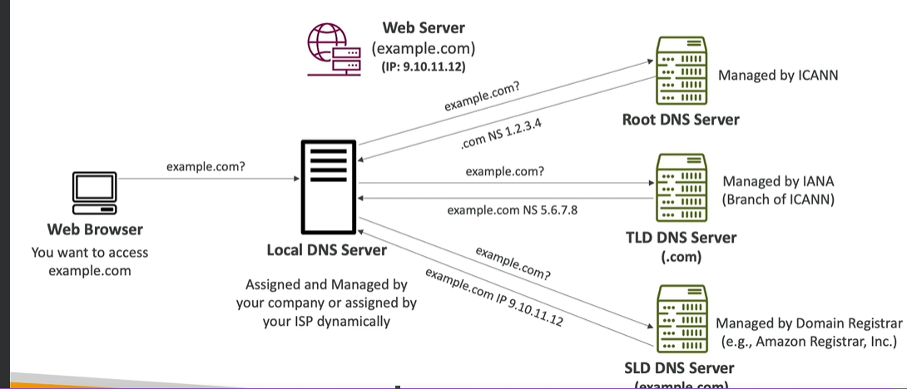
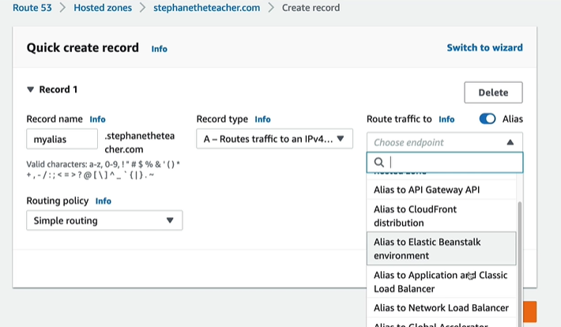
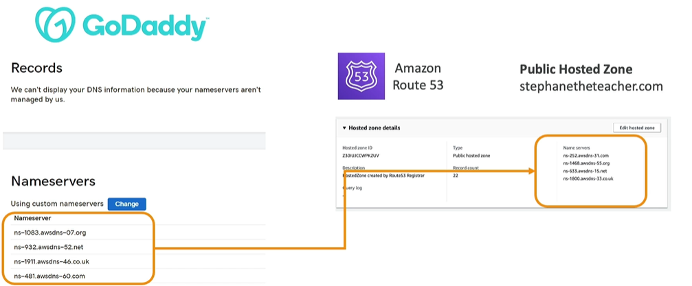

# Route 53
- only service provide : `100% availability`
- fact:: `53` is reference `tradition DNS port`

## A. Key concept
### **DNS** 
  - **registrar** : dns record stores in **zone file**
  - **Naming Server** : resolve dns queries
    - 

### **TTL**
  - client cache the result from DNS server, for that that period locally.
  - hence wont query again till TTl expire.
  - eg: 24 hr, 60 sec
  - Domain/subdomain Name (example.com) + value (11.22.33.44)

### **namespace**: 
  - root domain `.` 
  - top level domain TLD
  - second level domain SLD
  - sub domain 
  - FQDN 
  - URL 
    - 
  
### **DNS Records**
- `A : domain -> IPv4`
- `AAAA : domain -> Ipv6`
- `CNAME : domain -> doanother Domain (except root/TLD)`
  - eg: xxxx.us-east-1.alb.com --> my-elb.com
- `NS : domain -> Name Server`
- `Alias` (AWS specific) 
  - **benefit** : free + native health-check
  - eg:
    - domain --> aws resources (ELB, CloudFront, `API-gateway`, s3, `VPS-interafceEndpoint`, `Global-Accelerator`, `ElasticBeanstalk`)
    - domain --> CAN NOT [ec2 DNS name] :point_left:
    - domain --> root domain + TLD (works) :)
  - Configuring TTL not allowed, set bt R53.
  - Alias === [ A or AAAA + flag:alias=True ]
  - 
-  `advanced`:   [ CAA / DS / MX / NAPTR / PTR / SOA / TXT / SPF / SRV ] - skip

### `AWS::Hosted Zone
- **cost** : .50/m
- **Container** for DNS Record/s
- define traffic **routing** for its domain, its sub-domains :point_left:
- **Type**
  - **public** : internet traffic, return ( public IP + TTL)
  - **private**  : internal traffic within VPC, return ( private IP + TTL)
    - enable explicity `DNS hostnames` 
    - enable explicity `DNS resolution`

---  
## C. R53::Routing policy
- `simple` : domain -> [ip-1, domain-2, ...] multiple target, 
  - randomly choose 1 
  - irrespective of health :point_left:
  
- `weighted` : domain -> [ip-1::Weight10, domain-2::Weight70, ...]
  - choose by weight
  
- `Latency` : domain -> [ip-1::region-1, domain-2:region-2, ...] multiple target, 
  - AWS will look for latency and pick one with low value.

- `failover` : domain -> [ip-1::Primary, domain-2::Seconday, ...] multiple target, 
  - primary until healthy, else secondary.
  
- `Geolocation` :  domain -> [ip-1::Country-1, domain-2::Country-2, domain-3::default,...] multiple target, 
  - from client get Country.
  
- `Geo-proximity` : domain -> [ip-1::bais-0, domain-2::bais-50, ...] multiple target, 
  - shift more traffic to ip-1. `more like weighted`.
  
- `IP based` : domain -> [ip-1::Client-IP-range/CIDR-1, domain-2::Client-IP-range/CIDR-2, ...]
  - choose by client_IP
  
- `Multi value` : domain -> [ip-1, domain-2, ...] multiple target, randomly choose 1 (`healthy`) 
  - similar to `simple`.
  - randomly choose 1 but healthy only :point_left:

- 3rd party:  route by `goDaddy` policy.
  - link goDaddy with R53, 
  - just by updating  **NS record** in R53 hosted-zone(public),  with goDaddy DNs.
  - can use R53 then.
  
---
## D. R53 : health Check
- a. health checker : `Endpoint`
  - update sg : runs outside private VPC. hence can not access resources.
  - provide health endpoints.
  - set interval : 10 sec or 30 sec
- b. health checker : `Caculated`
  - choose : state of other health checks
  - AND OR NOT, etc. mix amd match.
- c. health checker : `CW Alarm state`
  - create CW alarm, first.
  - select it. while creating R53 health check

---
- Demo :
```
- launch Ec2-i1, i2, and i3  (in az1, az2,az3), with simple webapp
- create ALB
    - `alb-1-dns` : hostname/domainname
    - choose az1, az2, az3
    - create TG (tg-1)
        - sg : allow all HTTPs traffic
        - AZ1, az2, az3
        - regsister Ec2-i1, i2, and i3
    - routing and filter: 
        - Listener-1::No-contion : outside traffic on `http:80`  --> forward to --> `tg-1` 

- create hosted Zone  [Zone : hz.com ]
  - NS hz.com -> *****, ****, ****, **** some entry comes automatically once HZ created : alrady present
  - A + alias:F, ec2-1.com ->   ec2-1 public IP  
  - A + alias:F, ec2-2.com ->   ec2-2 public IP  
  - A + alias:F, ec2-3.com ->   ec2-3 public IP  
  - CNAME        abl.com --> alb-1-dns
  - A + alias:T, abl-alias.com --> now can provide another domain --> alb-1-dns ; FREE
  - CNAME        hz.com -->   alb-1-dns : ERROR
  - A + alias:T, hz.com --> alb-1-dns : WORKS
  
  // Rourting policies
  // SIMPLE
  -  record-id-1, A + alias:F, webapp1.com ->   ec2-1 public IP  SIMPLE Random
  -  record-id-2, A + alias:F, webapp1.com ->   ec2-2 public IP  SIMPLE Random
  -  record-id-3, A + alias:F, webapp1.com ->   ec2-3 public IP  SIMPLE Random
  // WEIGHTED
  -  record-id-11, A + alias:F, webapp2.com ->   ec2-1 public IP  WEIGHTED 10
  -  record-id-21, A + alias:F, webapp2.com ->   ec2-2 public IP  WEIGHTED 20
  -  record-id-33, A + alias:F, webapp2.com ->   ec2-3 public IP  WEIGHTED 70
  // LATENCY
  -  record-id-111, A + alias:F, webapp3.com ->   ec2-1 public IP  LATENCY us-east-1
  -  record-id-222, A + alias:F, webapp3.com ->   ec2-2 public IP  LATENCY us-east-1
  -  record-id-333, A + alias:F, webapp3.com ->   ec2-3 public IP  LATENCY us-west-2
  // failover
  -  record-id-1111, A + alias:F, webapp4.com ->   ec2-1 public IP  failover "primary",  R53:checkCheck-1
  -  record-id-2222, A + alias:F, webapp4.com ->   ec2-2 public IP  failover "seconday", R53:checkCheck-2 (optional)
  // Geolocation
  -  record-id-1111, A + alias:F, webapp5.com ->   ec2-1 public IP  Geolocation "ASIA",  
  -  record-id-2222, A + alias:F, webapp5.com ->   ec2-2 public IP  Geolocation "EUROPE"
  // Geo-proximity
  -  record-id-1111, A + alias:F, webapp6.com ->   ec2-1 public IP  Geo-proximity Bias-10  
  -  record-id-2222, A + alias:F, webapp6.com ->   ec2-2 public IP  Geo-proximity Bias-50
  // Multi-value
  -  record-id-1111, A + alias:F, webapp7.com ->   ec2-1 public IP Multi-value  R53:checkCheck-1 
  -  record-id-2222, A + alias:F, webapp7.com ->   ec2-2 public IP Multi-value  R53:checkCheck-1
    
- acess webapp:
  - diectly from ec2-i public IPS
  - add (A + alias:F) record and access
  - via ELB 
    - alb-1-dns
    - abl-alias.com
  - hz.com
  - Rourting policies demo : webapp[1,2,3,...7].com
```
---
## Screenshot:
> credit: https://www.udemy.com/course/aws-certified-solutions-architect-associate-saa-c03/

- 
- 
---
- low latency
  - 
---
- health check and routing
  - 
  - 
  - 
  - 
  - 
  - 
  - 