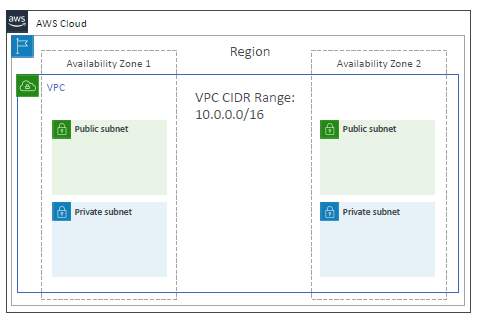
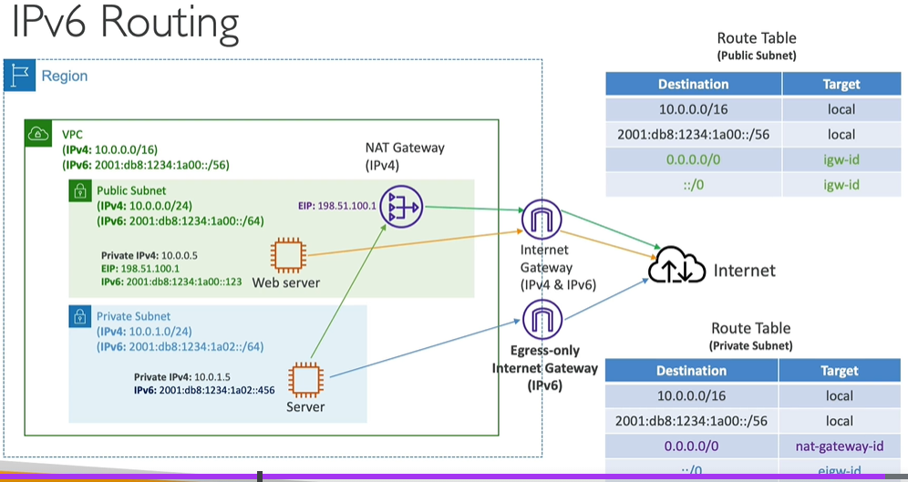
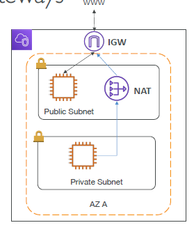
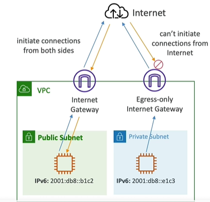
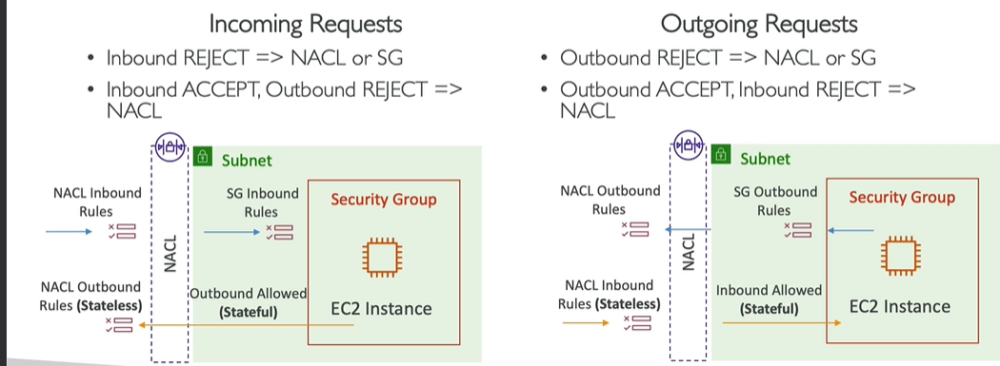
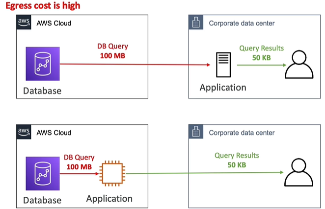
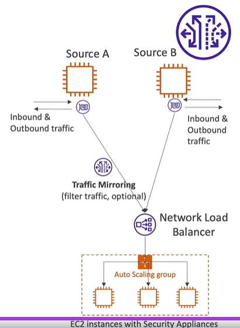
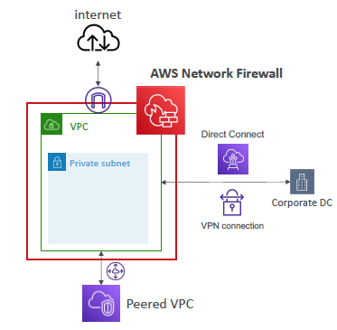
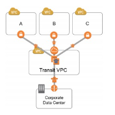

# A  network fundamental
## 1 cidr
- CIDR/IP-range : base-IP/fixed-bit (0-32)
- 0.0.0.0/0  or ::0 -  Any traffic in internet.
- **Private IP**
  -  **10.0.0.0 – 10.255.255.255** 
    - 10.0.0.0/8 : in big networks, 
    - 10.0.0.0/28 - will use 
    - 10.0.0.0/16 - will use
  -  **172.16.0.0 – 172.31.255.255** 
    - (172.16.0.0/12)  AWS default VPC uses this.
  -  **192.168.0.0 – 192.168.255.255** 
    - 192.168.0.0/16: Home n/w

## 2 ephemeral port
- [ephemeral port](../99_img/vpc-2/img_2.png) 
- random port client open, to receive response on that port from server. 

---
# B. VPC ( Regional)
## 1. fact
- ec2>eni>sg === ec2>sg
- s3 upload : ingress traffic

## 2. Intro
- max: `5-VPC` in  a region with **non-overlapping CIDR**.
- single VPC can have max `5-CIDR`
  - CIDR min ****/28 = 32-28 = 4 --> 2^4 = `16`
  - CIDR max ****/16 = 32-16 = 16 --> 2^16 = `65,536`
- **private resource** : referring only private IPs ranges.
- **route table** `rtb` vs **security group** `sg`
  - sg allow/deny traffic
  - rtb helps in forwarding , routing allowed traffic.

---
## 3. Default VPC : walkthrough
- 
- 

### 3.1 CIDR
- **CIDR-1** : `172.32.0.0/16`
- **CIDR-2,3,4,5**  
  - Add these once IPs are exhausted in your VPC.
    
### 3.2 subnet (found 4) 
- 4 az === 4 subnets 
- each has it own IP CIDR.
   - first 4 and last IP  are reserved (`5-resevered in each subnet`) 
   - first: **network address**
   - 2:reserved - **VPC router**
   - 3:reserved - **DNS**
   - 4:reserved - future use
   - last:reserved - **network broadcast address**, (not supported currently)

### 3.3 Route table
- vpc - associated with main-rtb
  - subnet-1 : associate with main-rtb, or create new rtb
  - subnet-2
  - ...
  - 1-2-1 mapping :point_left:

- **destination**
  - 0.0.0.0/0(internet),
  - subnet-CIDR
  - vpc-CIDR
  - custom-cidr
  - ...
- **target**
  - `igw`, `nat-g/i`, `local`, `vpc-peer`, `vgc`, `cgw`, `dxg`, `transient-gateway`
  - `VPC-endpoint`, `s3-gateway`, `dynamoDb-gateway`

- **IPv6 routing**
  - 
  
### 3.4 Network ACL (NACL)
- similar to SG/Firewall, another layer of traffic check at subnet level
- Inbound + outbound rule (with weight/priority) for allow/deny traffic

- **stateless**
  - inbound rule is checked >  allow/deny 
  - if allowed > response came > outbound rule is checked >  allow/deny
  - 
- **ACL rules**
  - 1-32,766 (high to low precedence), use increment of 100.
  - first matching rule, drive decision.
  - `*` last rule, denies a request.
  - thus, Does not execute all rule, once executed a matching high priority rule, it stops.
- **default rule**
  - **allows everything in/out** :point_left:
  - don't change it, rather create new ACL and associate with your subnet.
  - 
- `subnet`  **1-2-1** `ACL`

#### sg vs ACL
- Operates at the instance level | subnet level
- Stateful| Stateless: return traffic must be explicitly allowed by rules (think of ephemeral ports)
- `allow` rules only |  `allow/deny` rules
- `All` rules are evaluated | Rules are evaluated `in order` (lowest to highest) and `first match wins`.

#### NACL with  ephemeral port range

  
---
## 4. IGW


---
## 5. NAT 
- [03_VPC-2-NAT.md](03_VPC-2-NAT.md)
  - **Bastian host**
  - NAT instance (outdated after 2020) :x:
  - **NAT gateway**

---
## 6. Dual-stack mode VPC
- can not disable Ipv4, but enable Ipv6 ( for all public in AWS) `3.8*10^38`
- ec2-i will have both:
  - **private IPv4** 
  - **public IPv6** 
- so if IPv4 is exhausted, even though soo many IPv6 available, will still get exhausted error. :point_left:

---
## 7. Egress-Only Internet gateway
- used only for Ipv6
- note: update rtb ::0 | Egress-IGW
- 

---
## 8. VPC Flow Logs
- reference: video:339 SSA
- **log level** : 
  - VPC
  - Subnet
  - ENI 
-  **destination** :
  - S3  >> athena
  - CloudWatch 
    - CW::metric >> CW::alarm >> sns
    - ...
  - KDF 
- 
- 
- 

- hands on:
```
- create flow log -1 and give it S3
- choose type of traffic : ALL, allow, deny
- to : s3 (bucket-name-1)
- choose format :keep default
- role-1 : give s3 permission
- check logs (perform complex analysis > give it athena)
  -eni-1.log 
  -eni-2.log. ...
  - Attena:
    - choose query result loc: bucket-name-1-result
    - ...

- create flow log -2 and give it CW
- choose type of traffic : ALL, allow, deny
- to : cloudwatch (log-group-1)
- choose format :keep default
- role-2 : give CW permission
- check logs --> create metric > alarm > SNS
```

---
## 9. pricing (per GB)
- if 2 DB are in same AZ, replication cost will be less, but availability will be less.
- refer VPC-endpoint(s3-gateway) `1 cent`
- ingress - free
- choose AWS direct location, close/same as your location/region-AZ

- 
- 
- 
- 

| **Service/Feature**            | **Pricing**                                                                 |
|--------------------------------|-----------------------------------------------------------------------------|
| **VPC Peering**                | Intra-region: $0.01/GB, Inter-region: $0.02–$0.09/GB                        |
| **AWS Transit Gateway (TGW)**  | $0.36/hour per attachment, $0.02–$0.05/GB data transfer                     |
| **NAT Gateway**                | $0.045/hour, $0.045/GB for outbound data                                    |
| **Elastic IP (EIP)**           | Free for 1 associated IP; additional/unused: $0.005/hour                    |
| **VPN Connections**            | $0.05/hour per VPN connection, standard data transfer rates apply           |
| **Traffic Mirroring**          | $0.015/GB                                                                    |
| **Endpoints (PrivateLink)**    | Interface Endpoints: $0.01/hour + $0.01/GB, Gateway LB Endpoints: $0.0035/GB |
| **Data Transfer**              | Intra-AZ: Free, Inter-AZ: $0.01/GB, Inter-region: $0.02–$0.09/GB            |
| **Interface Endpoints**        | $0.01/hour per endpoint + $0.01/GB                                          |
| **Gateway Endpoints**          | Free   |
---
## 10. Traffic Mirroring
- Steps/use-case:
  - capture traffic (from Specific `source ENIs`)
  - route/send to `ELB/NLB` or `target ENI`
  - ec2-i(security appliance)
  - perform inspection (threat monitoring, etc)
- 

---
## 11. topolgies
- [03_VPC-4-tolologies.md](03_VPC-4-tolologies.md)
  - **on-prem VPN**
    - client gateway
  - **aws vpc**
    - virtual gateway
    - Dx gateway
    - Transient gateway
  - s2s + cloudHub
---
## 99. handson: create new VPC
- region - us-west-2
- vpc-1 : https://us-west-2.console.aws.amazon.com/vpcconsole/home?region=us-west-2#VpcDetails:VpcId=vpc-04ce2894d2f99bbb8
```
- edit CIDR : add IPv6 cide.
- For Internet access:
  - create `igw-1` (igw-0ee888f95b632848e, internet gateway) to vpc-1 and `attach` to vpc-1
  - create `nat-ec2-i1` (NAT - network access translation)
  - create `ngw-1` ( NAT gateway) : pending
- route table:
  - `rtb-main` : gets created automatically with vpc.
    - will automatically get associated underlying subnet/s, if not attached to any explicit rtb.
  - `rtb-explicit/s` : can create and association to subnet.
      - create `rtb-explicit-1-private-vpc1` , routes:
        - destination: internet(0.0.0.0/0) --> nat-instance-1 [nat-i](03_VPC-2.md) ==> give internet access (without exposing ec2-i)
      - create `rtb-explicit-2-public-vpc1` , routes: 
        - destination: internet(0.0.0.0/0)  --> igw-1 ==> give internet access.
        - VPC private CIDR --> local (within VPC)
        - 
  - `relation`:
    - VPC <--1-to-1--> rtb-main
    - underlying subnet/s <--1-to-1--> rtb-explicit/s or rtb-main:default
  - 

- add `subnet`
  - az-1 (us-west-2a)
    - vpc-1-subnet-`private`-1-us-west-2a
      - link with rtb-explicit-2-private-vpc1.
    - vpc-1-subnet-`public`-1-us-west-2a
      - link with rtb-explicit-2-public-vpc1.
      - contains: `ACL`+ Ec2-i1(public IP-1)
      - edit CIDR : add `IPv6` CIDR block + enable: assigning IPv6.
        - update `sg/acl` rule for IPv6
        - update `rtb` with ::0 (IPv6 anywhere)
  - az-2 (us-west-2b)
    - vpc-1-subnet-`private`-2-us-west-2b
      - link with rtb-explicit-2-private-vpc1
    - vpc-1-subnet-`public`-2-us-west-2b
      - link with rtb-explicit-2-public-vpc1
```

---
## 100. Summary
- `CIDR` – IP Range
- `VPC` – Virtual Private Cloud => we define a list of IPv4 & IPv6 CIDR
- `Subnets` – tied to an AZ, we define a CIDR
- `Internet Gateway` – at the VPC level, provide IPv4 & IPv6 Internet Access
- `Route Tables` – must be edited to add routes from subnets to the IGW, VPC Peering Connections, VPC Endpoints, …
- `Bastion Host` – public EC2 instance to SSH into, that has SSH connectivity to EC2 instances in private subnets
- `NAT Instances` – gives Internet access to EC2 instances in private subnets. Old, must be setup in a public subnet, disable Source / Destination check flag
- `NAT Gateway` – managed by AWS, provides scalable Internet access to private EC2 instances, when the target is an IPv4 address
- `NACL` – stateless, subnet rules for inbound and outbound, don’t forget Ephemeral Ports
- `Security Groups` – stateful, operate at the EC2 instance level
- `VPC Peering `– connect two VPCs with non overlapping CIDR, non-transitive
- `VPC Endpoints` – provide private access to AWS Services (S3, DynamoDB, CloudFormation, SSM) within a VPC
- `VPC Flow Logs` – can be setup at the VPC / Subnet / ENI Level, for ACCEPT and REJECT traffic, helps identifying attacks, analyze using Athena or CloudWatch Logs Insights
- `Site-to-Site VPN` – setup a Customer Gateway on DC, a Virtual Private Gateway on VPC, and site-to-site VPN over public Internet
- `AWS VPN CloudHub` – hub-and-spoke VPN model to connect your sites Direct Connect – setup a Virtual Private Gateway on VPC, and establish a direct private connection to an AWS Direct Connect Location
- `Direct Connect Gateway` – setup a Direct Connect to many VPCs in different AWS regions
- `AWS PrivateLink` / VPC Endpoint Services:
  - Connect services privately from your service VPC to customers VPC
  - Doesn’t need VPC Peering, public Internet, NAT Gateway, Route Tables
  - Must be used with Network Load Balancer & ENI
- `ClassicLink` – connect EC2-Classic EC2 instances privately to your VPC
- `Transit Gateway` – transitive peering connections for VPC, VPN & DX
- `Traffic Mirroring` – copy network traffic from ENIs for further analysis
- `Egress-only Internet Gateway` – like a NAT Gateway, but for IPv6 targets

---
# C. VPC firewall
- managed service
- inspect all traffic to/from:
  - internet
  - peered VPC
  - Data-center/customer (DX oe S2S)
  - ...
  - 
- firewall use **gateway Load Balancer** 
  - layer 3 to 7 protection
  - tg ec2-i : **security applicance** running
    - rules - filter ip, port, protocol, domain level(*.abc.com), regex
    - action : allow, drop, alert
- more:
  - can be used to manage multiple aws account
  - analysis:
    - send logs to s3, CW, KDF

---
# D. Extra
## 1. hared service VPC


## 2. Transit VPC
-  Transit VPC uses customer-managed EC2 instances in a dedicated transit VP` with an Internet gateway
- 