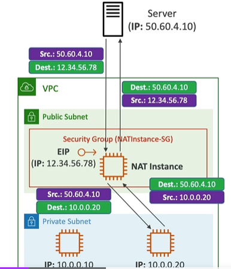
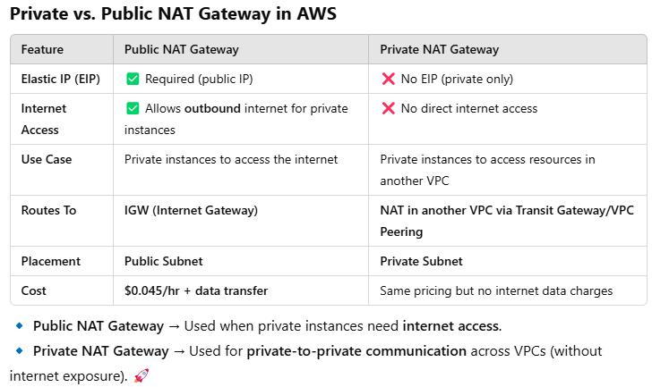

# VPC-2

## 1. bastion host
- Access(perform **SSH**) ec2-i in private subnet from **internet**  ( via bastion host)
- SSH protocol, which is a TCP based protocol on port 22. :point_left:
- just update SGs:
  - **sg-bastion** : 
    - allow inbound traffic 0.0.0.0/0  on port 22(SSH)
  - **sg-ec2-i** : 
    - allow inbound traffic from  sg-bastion, on port 22(SSH) 
    - 
- bastion host is not typically used to manage all `outgoing traffic` from the private network to the internet.

---
## 2. NAT instance :x:
- can be used as a bastion server :point_left:
- **outdated after 2020** 
- NAT instances are not a managed service, it has to be managed and maintained by the **customer**.
- Alternative : **NAT gateway** 
- need internet  access for ec2-i running on private subnet. how ?
  - route internet traffic to IGW via through NAT-instance.
    - **deploy NAT-instance** in public subnet
      - create ec2-i, from PreConfigured Linux AMI, `amzn-ami-vpc-nat-<year>.xxxxxxx-<cpu-arch>`
      - **disable source/destination IP check**, so that it will re-write `src` and `dest` IPs :point_left:
      - 
    - **update rtb** of private subnet
      - 0.0.0.0/0  ::  NAT-instance
    - update NAT-instance **sg**
    - update sg of private ec2-i, to allow traffic from  NAT-instance-sg
    - assign **elastic-IP**
      
- it supports **port forwarding** :point_left: :dart:
  - by modifying the instance's **iptables rules**. 
  - to forward traffic 
    - from : specific port on the NAT Instance 
    - to : port on a private EC2 instance.

- 
- https://app.diagrams.net/#Hlekhrajdinkar%2F02-spring%2Fmain%2Faws%2FVPC-1.drawio
- types and use case: **private** and public
  - 
  - private NAT-g: use to route traffic from VPC-1 to VPC-2, having overllaping CIDR.
---
## 3. NAT Gateway 
- Can’t be used by EC2 instance in the same subnet, where NAT gateway is present  :point_left: :point_left:
- :dart:
  - NAT gateway cannot be used as a bastion server 
  - does  not support port forwarding 
  
- primary task:
  - enable instances in a private subnet to connect to the internet or other AWS services
  - but prevent the internet from initiating a connection with those instances.
  
- **AZ bounded** :point_left:
- **AWS-managed**
  - no administration 
  - No Security Groups to manage
    - alternative: attach ACL on subnet
  
- **higher bandwidth** supports bandwidth : `5 - 45 Gbps`.

- **provision**  
  - create one with `in each AZ`
  - assign **elastic-IP** :point_left:
  - choose **public subnet** (having IGW)
  - update route table of each private subnet.
    - if destination is `0.0.0.0/0`  ::  then route to `NAT-gateway-az-1`
    - if destination is `0.0.0.0/0`  ::  then route to `NAT-gateway-az-2`
    - ...

- **more**
  - supported **protocols**: TCP, UDP, and ICMP.
  - support up to `55,000` **simultaneous connections**, to each unique destination.
  - primarily for **outbound-only traffic** from private subnets

