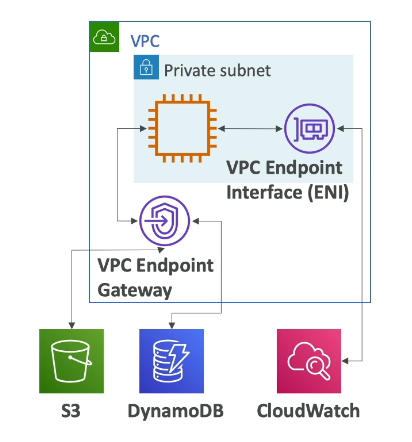

# 1. VPC peering
- connects 2 VPS **in same region** :point_left:
  - **Same AWS Account**
    - Aws1::VPC-1  <--- VPC peer---> Aws1::VPC-2
  - **Cross Account**
    - Aws1::VPC-1  <--- VPC peer---> Aws2::VPC-1
- **NOT Transitive** 
  - VPC-1  <--> VPC-2 <--> VPC-3 
  - this does not mean VPC-1 can connect VPC-3
  - create dedicated connections.
  - or use **transitive gateway**, for connecting mutliple VPC/s
    - $0.05 per GB for inter-VPC data transfer.
    - $0.36 per hour per attached VPC.
- more: 
  - **no overlapping CIDR**
  - operates over the **AWS backbone network**, ensuring
    - low latency 
    - high throughput

- hands on: 
```
#1. connecting ec2-i on vpc-1 to ==> ec2-i on default-vpc, in same AWS account
- having VPC-1 (cidr1) + default-VPC(cidr2) 
- create `VPC-peer-1` : select vpcs -> ( VPC-1 + default-VPC )
- update main-rtb of both VPC with VPC-peer-1
  - vpc-1-main-rtb       : [ destinition:cidr2 => VPC-peer-1 ]
  - default-vpc-main-rtb : [ destinition:cidr1 => VPC-peer-1 ]
- Now route going both ways :) 
```

---
# 2. VPC Endpoint 
## intro
- 
- highly available
  - scales horizontally
- `service-1` aws-?:region-? --> **AWS PrivateLink** -->  `service-2` aws-?:region-?
- Works within the AWS network, allowing secure access to services **via private IPs**
- in ccgg:mapss. everything in one region.

## scenarios (for understanding)
- **ECS-1:TASK-1** (region-1,VPC-1) ==> SEND TO SNS (region-2,VPC-2)
- option-1 : **VPC1 > NGW > IWG > internet > VPC2**
  - using internet
  - 
    
- option-2 : **VPC1 > VPC-endpoint > aws-private-network/link > VPC2** : 
  - better: remains on VPC/s, no internet

## Type
### interface : $
- use with ALL services
- AWS use PrivateLink to comm.
- attach ENI to aws resource + update private DNS for subnet/vpc
- update security group as per this ENI.
- 

### Gateway : free
-  Avialable for  **S3 and DynamoDB** , only 
- s3-gateway : aws create special gateway to access global s3 services.
- DynamoDB-gateway :  aws create special gateway to access global Dynamo DB.
- just update rtb with these gateway/s, like wwe did for igw,nat,etc.
- 

## hands on
```
- vpc-1 >  public-subnet-1 (ec2-i1) > rtb: igw-1 (was present)
- connect,SSh to ec2-i1 > aws ls s3 : works becuase of igw-1
- remove igw-1 from rtb
- aws ls s3 - no response
- Fix with VPC-endpoint:
  - a.  create interface : 
    - name: vpc-endpoint-interface-1
    - select service (to)
    - select vpc  (from)
    - select AZ + subnet, where these will be deployed.
    - update sg rules. (remember : ec2>eni>sg === ec2>sg)
  - b. s3 gateway:
    - select vpc
    - select rtb, to be updated.
- aws ls s3 : works now, because of s3-gateway (recommended to use) / s3-private-Link
```


  
