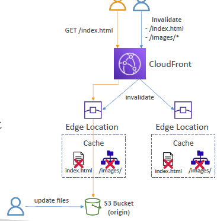
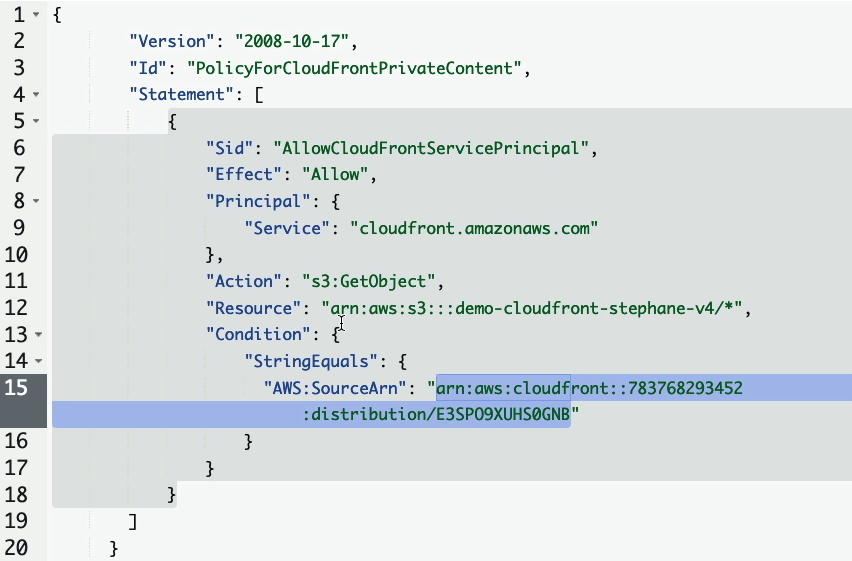

# AWS cloudFront (global)
### Pictorial description
- 
- 
- 
- **1-2-M**
  - one distribution - multiple origins

### key point
- CDN **content delivery network**, cache data all around the world/countries
  - `allow-list` countries
  - `black-list` countries.
- static-content cached for **TTL** (eg : a day), thus low latency.
- Also can **invalidate** cache at any time
- run on **edgeLoc** 
- **side benefit**: 
  - integrated with AWS-shield (firewall)
    - protect from `DDoS` :point_left:
- can also configure CloudFront to use HTTPS to get objects from your origin.
---
## A. Distribution

### 1. origin
- source:
  - s3 bucket` or  `s3(static Web), 
  - Any http backend
  - ALB
- distribution(edge-location) ---> **`privatelink` physical connection** ---> origin(eg:alb on us-east-1)
    - cf also needs access-policy to access origin
### 2. origin access
- make origin `publicly` accessible.
  - get list of Public IPs of all 400+ edge location
  - add app level security to allow access only to above IPs.
  - update sg to allow traffic.
- **OAC - Origin access control** 
  - policy allow CF to connect/access origin.
  - 
### 3. origin failover 
- to help support your `data resiliency` needs.

### 4. CloudFront Function
- **purpose**:
  - Website Security and Privacy
  - Dynamic Web Application at the Edge
  - Search Engine Optimization (SEO)
  - Intelligently Route Across Origins and Data Centers
  - Bot Mitigation at the Edge
  - Real-time Image Transformation
  - A/B Testing
  - User Authentication and Authorization
  - User Prioritization
  - User Tracking and Analytics
- **Type**:
  - lambda@Edge
  - CloudFront-Function
  -   
  
#### a. lambda@Edge 
- `nodeJs` or `Py`
-  lambda is **heavy**
- scale to `1000s of request/sec`
- execution time : 5-10 sec
- globally service. :point_left:
  - author: **us-east-1**
  - replicated to edge location from author.
- 

#### b. CloudFront-Function
- `js`
- very **light** weight 
  - 10 KB pkg
  - Max 2Mb ram
- scale to `million of Req/sec`
- **pricing**: 1/6 time cheaper than lambda.
- 

- 
---
## B. Demo  
### 1. s3 as origin
```
  - create CF > distribution-1
    - choose default object (optional) : index.html
    - choose `origin` : add s3-bucket-1 + upload index.html
        - choose `origin-access` (s3 access ways) :
            - public, or
            - OAC **
                - create OAC-1 and attach to distribution-1
                - Copy OAC-1:policy
                - so we don't need to make s3-bucket-1 public
  
  - update s3-bucket-1 policy with `OAC-1:policy`.
    - this will allow distribution-1 to access s3.
   
  - Copy public-url and hit it
    - public-url --> redirect to --> public-url/index.html.
    
  - Now upload abc.png in bucket
  - hit - blic-url/abc.hit
  - this comes from distributio, not directly from s3.
  
   - Now upload sub-folder/abc.png in bucket
  - hit - public-url/sub-folder/abc.hit
  - ...
  - so on
```

### 2. ALB as origin


---
## C. Pricing

- **price class**
  - `100` - usa, europe, etc
  - `200` - africa, asia, etc
  - `ALL`
- 

---  
## D. signed URl / cookies
- CloudFront supports two types of **signers** for creating signed URLs or cookies:
  - `Trusted AWS Account Signers`
  - `Key Pair Signers` (deprecated) :x:
    - key pairs associated with the root AWS account
  - `CloudFront key groups`
    - **public key** is added to the **key group** in the CloudFront distribution settings
    - The corresponding **private key** is securely stored by the developer or application creating signed URLs.

---
- Choosing Between ElastiCache and CloudFront:
  - If your goal is to improve the performance of database queries or store session data `in memory`, use Amazon ElastiCache. 
  - It is suited for scenarios where you need fast, in-memory data access.
  - If your goal is to deliver content quickly to users across the globe, reduce latency for static and dynamic content, or offload content delivery from your origin server, use Amazon CloudFront.


