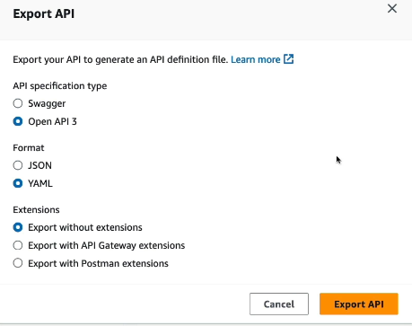

# A. API-gateway - Stage :books:
## 1. Intro

- once created API-g, need to deploy it on **stages**
  - give stage a **name** -dev,qa,prod,whatever
  - stages has **deployment history** 
    - stage can be **rollback**.
    - so think of `deploymnet object in k8s`
  - has **stage variable**, for dynamic configuration for stages. eg:
    - lambda-arn
    - http-endpoint-uri
    - ...
    - note: passed to **context** object. => lambda.handler(event,`context`) :point_left:
    - format **${stageVariables.`var-1`}**

---    
## 2. example
```yaml
    - api-gateway-1:
      - integrated with lambda-1 arn ==> xxxx:${stageVariables.`lambda-alias`} 
        - created one stage variable
        - similarly create more stage variable.
      - set value of stageVariable "lambda-alias" in all stages, then
      - stages:
        - dev-1
          - set lambda-alias: dev
          - dev is point to $LATEST
        - qa-1
          - set lambda-alias: v10
```

---
## 3. **`cache` setting**
- cache request/response
- define at stage level
- provision **size** : `0.5 GB` to `237 GB`
- set cache object **TTL**
  - default: `5 min / 300 sec`
  - max: `1 hr / 3600 sec`
- optionally encrypt

### **cache Invalidation** :point_left:
- from console
- any client without/with iam:permission can do it
  - header: **cache-control:max-age = 0**
  - iam permission : **execute-api:InvalidateCache**

---  
## 4. canary deployment

- api-gateway-1
    - stage-1 (`95 %` traffic) : monitor-1
    - stage-2 ( `5 %` traffic) : monitor-2
- console >>  **canary tab**
    - set above configuration.

---
## 5. supports `OpenAPI`
- export:
  - 
  - this is API document which client can refer.
- generate SDK
  - for client to consume API
- [api-gateway-open-api-1.json](api-gateway-open-api-1.json)
  - Replace `{region}` with your AWS region
  - Replace `{lambda-arn}` with the ARN of the Lambda function handling the request.
  - check **schema**. :point_left:
  - import this into api-gateway
  - **schema validation**

---
## 5. Monitor
### `CW:logs` :
- enable/disable
- set log level
  - error only
  - error + info
  - full req + response log
### `CW:x-rays` 
- enable/disable
- give full picture

### `CW:metric` :point_left:
- enable/disable below metrics
  - **CacheHitCount** 
  - **CacheMissCount**: efficiency of the cache
  - **IntegrationLatency** (backend latency, latency from lambda)
  - **latency** (overall : backenf + gateway itself)
  - **4XXError** (client-side) 
    - `429` throttleError
  - **5XXError** (server-side)
    - 504 server timeout
    - 503 service not available
    - 502 bad gateway

---
# B. API-gateway : API key 
- **purpose**:
  - authentication 
  - **usage tracking**
- create **API keys** to identify API clients/customer
    - Ex: WBjHxNtoAb4WPKBC7cGm64CBibIb24b4jt8jJHo9
    - httpheader: **x-api-key**=your-api-key

---
# C. API-gateway : usage plan
- create plan at **API key level**.
- eg: set:
  - **Throttling limits** 
  - **Quotas limits** is the overall number of maximum requests
  - associate **stages and methods**

---
# D. API-gateway : web socket
