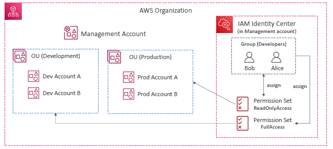

# A. **Directory Service**
## 1. Simple AD

- aws managed AD, users present only in this AD
- least expensive option 
- your best choice if you have `5,000 or fewer users`

## 2. AD Connector

- users present in on-prem AD, only
- `proxy` help to connect it.

## 3. AWS managed AD

- hybrid kind : user present in both : `AWS AD` + `on-prem AD`
- best choice if you have more than 5,000 users
- `AWS AD` create trust with `on-prem AD`

---
# B. SSO or **Identity provider** 
- use case:
    - sso for all account in [aws org](./03_AWS_org+control-tower)
    - sso for all ec2 instance in an aws account
- IP has :
    - `AD : Active directory`  + integrate to `3rd party IP (OKta)`
        - [check here](#f-aws--ad-active-directory)
    - `permission set` : which user has access to what: `fine grained permission and assginmnet`
        - lek role-1(full-access) on  member-account-1
        - lek role-2(read-access) on  member-account-1
        - lek role-3(write-access) on  member-account-1
        - lek role-1(write-access) on  member-account-2

- Flow:
    - lek -> okta home  --> aws-mgt-acct:`AWS IP/SSO with permission-Set` --> `Okta SSO`
        - member-account-1 > assume role-1, role-2, role-3
        - member-account-2 > assume role-1
        - how and where SAML fits ?

- 
- 
- 
- 

