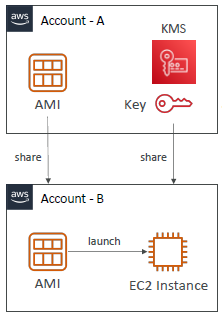
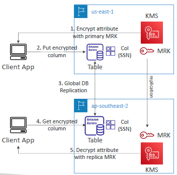

# KMS 
## A. Encryption
### 1. Encryption at `Fly`
- TLS / SSL certificate / HTTPS
- prevent from MITM


### 2. Encryption at `Rest`
- encryption/decryption happens at server.


### 3. Client side encryption

- Don't trust server
- cant make KMS api call


---
## B. KMS: intro
- manges **encryption-keys**
  - needs to be **rotated**
  - has kms-key **alias**
  - scope: **region** :point_left:
    - for cross region copy will need 2 separate keys, once for each region
    - eg: copy from region-1 to region-2
      - aws will **decrypt** using region-**1**-key
      - aws will **re-encrypt** using region-**2**-key

- **integrated** with:
  - `IAM`
  - `cloudTrail`, check log for KMS usage/audit.
  - `secret manager` 
    - encrypt **password** with kms-key
  - `EC2`
    - encrypt **AMI** with kms
  - `ebs`, `rds`,  `s3-key`, `sqs-keys`, etc
  - ...
  - all other service which requires encryption.

- **KMS API call** 
  - all above service makes api to kms.
  - we can api call with **cli/sdk**
    - to encrypt/decrypt anything(eg:env var) using kms-key-1

--- 
## C. KMS: `key types`
```
# --- symmetric(AES-256) ---
- generate single key
  - private
  
- aws-service integrated with kms, uses it.   <<<

# ---  A-symmetric (RSA) ---
- generate 2 keys
  - public ( for encrypt)
     - access it, download it.
     - share with client
  - private ( for decrypt)
  
- for client-server comm                       <<<
```

### **1. AWS owned**  `FREE`
- keys already created for services. 
- eg
  - sse-s3
  - sse-sns
  - ...

### **2. AWS managed key**  `FREE`
- request key from kms
- rotation:  automatic yearly
- key looks like - aws/serviceName/**** . eg
  - aws/rds/...
  - aws/ebs/...

### **3. Customer manged key**  `PAID`
- customer upload its own key. 
- import key into kms, which generated outside aws
- rotation:  must enable it :point_left:
- pricing 
  - `1$/month` / key
  - API calls : `0.03/10,000`

---
## C. KMS: `Regionality` :point_left:
### 1. single regional 
- same key cannot be present in 2 diff regions.
- Scenario/eg: cross region ebs-snapshot copy
    - VALID   : ebs-volume in region-1-`az1` -->  snapshot > encrypt(r1-k1) --> restored to region-1-`az2/3`
    - INVALID : ebs-volume in region-1 -->  snapshot > encrypt(r1-k1) --> restored to `region-2`.
    - VALID   : ebs-volume in region-1 -->  snapshot > `encrypt(r1-k1) > decrypt(r1-k1) > re-encrpted(r2-k1)` --> restored to region-2

### 2. multi regional 
- same key is replicated over regions.
- simplify, but `not recommended`
  - same key replicated in multipe region
      - `primary` (policy-1)
      - `replicatedd key` (can have diff policy-2, in another region)
  - purpose :
      - encrypt in one region and use/decrypt in another region, seamlessly
      - don't need to re-encrypt again with another region key
  - use-case :
      - global Aurora DB
      - global Dynamo DB
      - having client side encryption

---
## D. KMS: `Security`
### 1. KMS Policy
- like s3 policy
- define who can access key.
- **default policy** 
  - already exists
  - allows everyone in account  :point_left:
- **custom policy** 
  - eg: 
    - for cross account access, restricted access with in acct, etc
      - 
    - give access to specific services (lambda-fn)
      ```
      lambda-1 copy ebs snapshot from one region to another region
        - only lambda-1 must have access below 2 keys, no one else.
          - region-1-key (to decrypt) 
          - region-2-key (to re-encrypt) 
      ```
---
## D. Scenarios
### 1.1 S3 - `CRR` replication 
- [here](./../02_storage/03_S3-1.md#security-while-crr-replication)

### 1.2 S3  - `SRR` replication
- bucket-1(key-1) --> replicate(decrypt with key-1 > encrypt with key-2) --> bucket-2(key-2)
- add permission for both keys to ...
- 
### 3. share AMI cross region

- share AMI : update `launch-permission` for AMI to allow access
- share kms-key-1 : update `kms-policy` to allow access
- Account-b >> decrypt with kms-key-1 >> re-encrypt with its kms-key-2(Account-b)

### 4. EBS volume (cross region)


---
## E.Demo
```
- crate key-1
- choose : regionality : single region
- choose access permision : 
    - check boxes - check who can access
    - cross account access (optinal) : add another aws acct
    - this will auto create access policy
- rotation yearly : y/n
- review and done

// READY
- actin:
    - disable
    - schedule for deletion 
   
- use aws-cli : encypti failtext with above key-1    
```

---
## Z. Screenshot
flows
- 
- 
- 
---
cross region copy
- 
---
regional key with global dynao and aurora


