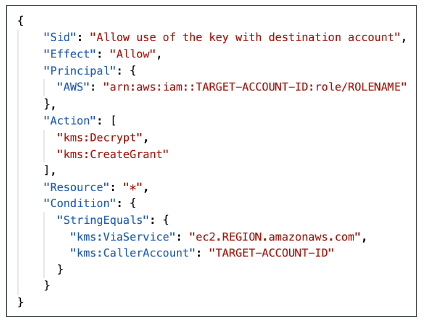
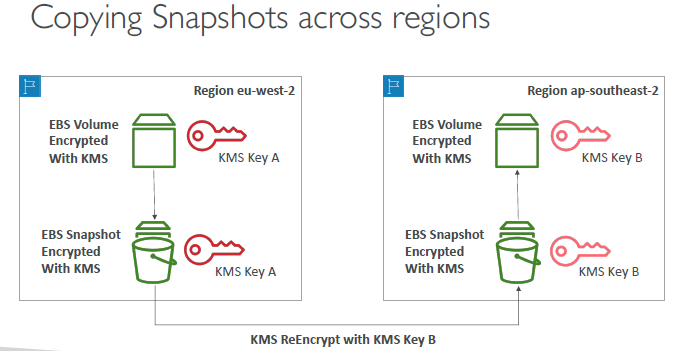
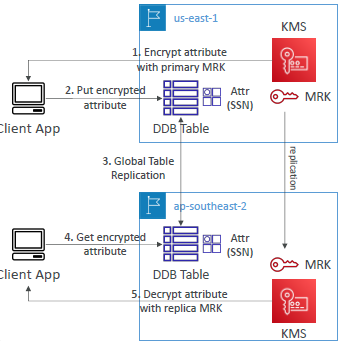
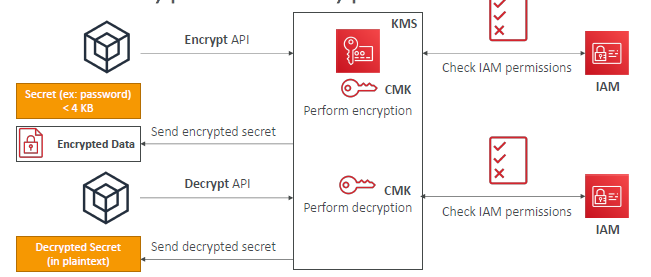
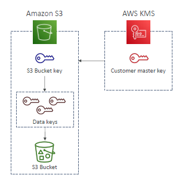
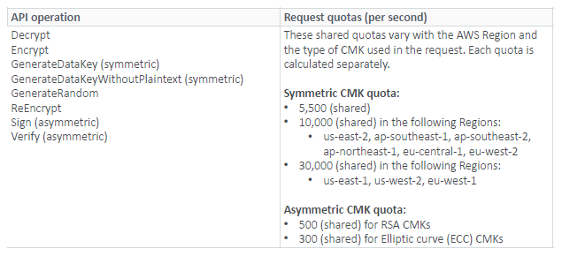

# Encryption
## 1. Encryption at `Fly`
- TLS / SSL certificate / HTTPS
- prevent from MITM


## 2. Encryption at `Rest`
- encryption/decryption happens at server.


## 3. Client side encryption

- Don't trust server
- cant make KMS api call


```
# --- symmetric(AES-256) ---
- generate single key
  - private
  
- aws-service integrated with kms, uses it.   <<<

# ---  A-symmetric (RSA) ---
- generate 2 keys
  - public ( for encrypt)
     - access it, download it.
     - share with client
  - private ( for decrypt)
  
- for client-server comm                       <<<
```
--- 
# KMS
## A. KMS: key types
### **1. AWS owned**  
- keys already created for services. 
- key is `FREE` + API call is `FREE`
- eg
  - sse-s3
  - sse-sns
  - ...
- **sse-s3**
  - Fully managed by S3
    - Key rotation is not applicable for us.
    - Minimal key management overhead
  - access control via S3 bucket policies
  - No specific key tracking (basic S3 logs)
  - No additional cost for encryption

---
### **2. AWS managed key**  
- request key from kms (sse-kms), CMK
- has kms-key **alias**
- provides you with an **audit trail** that shows when your CMK was used and by whom. :dart:
- **pending deletion** state for 7 - 30 days :dart:
```
- key looks like - aws/serviceName/**** . eg
  - aws/rds/...
  - aws/ebs/...
```
- key is `FREE` + pay for API call

- needs to be **rotated**
  - default : 365 days
  - range : 90 - 2650 days
  - have od rotation, at any time.
  - automatic yearly

- scope: **region** :point_left:
  - for cross region copy will need 2 separate keys, once for each region
  - eg: copy from region-1 to region-2
    - aws will **decrypt** using region-**1**-key
    - aws will **re-encrypt** using region-**2**-key

#### Integration
  - `IAM`
  - `cloudTrail`, check log for KMS usage/audit. :dart:
  - `secret manager` : encrypt **password** with kms-key
  - `EC2`: encrypt **AMI** with kms
  - `ebs`, `rds`,  `s3-key`, `sqs-keys`, etc
  - `lambda`: encrypt env var
  - ...
  - all other service which requires encryption.

#### key Policy
- like s3 policy
- define who can access key.
- **default policy**
  - already exists
  - allows everyone in account  :point_left:
- **custom policy**
  - eg:
    - for cross account access, restricted access with in acct, etc
      - 
    - give access to specific services (lambda-fn)
      ```
      lambda-1 copy ebs snapshot from one region to another region
        - only lambda-1 must have access below 2 keys, no one else.
          - region-1-key (to decrypt) 
          - region-2-key (to re-encrypt) 
      ```
#### Regionality :point_left:
##### single regional
- same key cannot be present in 2 diff regions.
- requires additional api call (for cross region)
  - decrypt  call
  - re-encrypt call

##### multi regional
- **simplify but not recommended**
- same key replicated in multiple region
  - primary (policy-1)
  - replicated key (policy-2, in another region)
- purpose
  - encrypt in one region and use/decrypt in another region, **seamlessly**
  - don't need to re-encrypt again with another region key
- **use-case**
  - global Aurora DB
  - global Dynamo DB

---
### **3. Customer manged key**  `PAID`
- customer upload its own key. 
- import key into kms, which generated outside aws
- rotation:  must enable it :point_left:
- pricing 
  - `1$/month` / key
  - API calls : `0.03/10,000`

---
## B. hands on
```yaml
Compliance and regulatory requirements	SSE-KMS
High-performance applications	        SSE-S3
Tracking key usage for audit logs	    SSE-KMS
Minimal key management overhead     	SSE-S3
```

```
- create key-1
    - symetric
        - type: aws owned
- choose : regionality 
    - single region
- key policy
    - add json
    - or use console to define multiple options.
- rotation yearly : y/n

// READY

- action:
    - disable
    - schedule for deletion 
   
- use aws-cli : encypti failtext with above key-1 
```   
---
## C. Examples
### 1.1 S3 - `CRR` replication 
- [here](./../02_storage/03_S3-1.md#security-while-crr-replication)

### 1.2 S3  - `SRR` replication
- bucket-1(key-1) --> replicate(decrypt with key-1 > encrypt with key-2) --> bucket-2(key-2)
- add permission for both keys to ...
- 
### 3. share AMI cross region

- share AMI : update `launch-permission` for AMI to allow access
- share kms-key-1 : update `kms-policy` to allow access
- Account-b >> decrypt with kms-key-1 >> re-encrypt with its kms-key-2(Account-b)

### 4. EBS volume (cross region)


### 5 multi region key - Dynamo / RDS





---
## Z. KMS: more ( for DVA)
## 1. Encrypt/decrypt (< 4KB)
- straight forward, nothing new
- 

---
## 2. Encrypt/decrypt (> 4KB) `big files`
- happens at client side :point_left:
- generating **data key**: `DEK`
  - using it for en/de
  - can **cache** this and re-use
    - reduce the no of api call and save quota :point_left:
  - CLI/SDK simplifies it, so use it.

```yaml
## === way-1 ===
## Step-1 generate DEK
- aws kms generateDatakey
  - plaintext DEK

- aws kms generateDatakey --CMK-1
  - plaintext DEK
  - plaintext DEK + CMK-1 ==> encrypted DEK (ciphertextBlob)

- aws kms generateDatakeyWithoutPlaintext --CMK-1
  - plaintext DEK + CMK-1 ==> encrypted DEK (ciphertextBlob)

## Step-2 perform encryption/decryption
...
...

# === way-2 ===
  pip i aws-encryption-sdk-cli

  aws-encryption-cli --encrypt \
  --input <input_file_or_directory> \
  --output <output_file_or_directory> \
  --wrapping-keys key=arn:aws:kms:region:account-id:key/key-id

  aws-encryption-cli --decrypt \
  --input <encrypted_file_or_directory> \
  --output <decrypted_file_or_directory>

```

### 2.1 **envelop encryption**


### 2.2 **envelop de-cryption**


- eg with s3
  - 
---

## 3. KMS request quota
- share quota across account.
- will get ThrottleException

