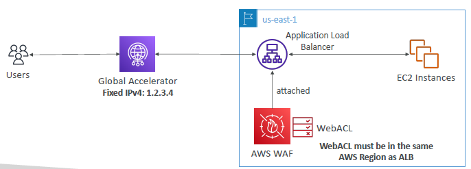

# A. WAF (webapp FireWall)

## 1. Intro
- can integrate with **ALB**(not NLB)
  - webApp --> ALB(`layer:7`) --> WAF(layer:7): valid ---> expose to web-client
  - webApp --> NLB(`layer:4`) --> WAF(layer:7) :x:
  
### web-ACL
- **reusable rules**
  - `HTTP headers, HTTP body, or URI strings`
    - > prevents : `SQL injection` and `Cross-Site Scripting (XSS)`
  - Size constraints
  - geo-match  - block countries.
  - `Rate-based rules` eg: 10 req/per
    - > prevents :  `DDoS protection`

  - `IP Set`:
    - allowed ips set, up to `10,000 IPs` max in a set.
    - use multiple Rules for more IPs.
    - keep IP `static/fixed`:
      - use fixed for API for ALB
      - use AWS global accelerator (has fixed any-cast IPs)
      - > `webApp --> ALB(layer:7) --> WAF(l7):ACL --> AWS global accelerator` --> expose to web-client.
        

--- 
## 2. Deployment option
- regionally, on: 
  - ALB 
  - API-gateway 
  - AppSync(GrapgQL-API)
- globally, on:
  - CloudFront distribution
 

---
# B. FireWall manager 
- all types of security, at common place.
- AWS org > `mgt acct`(main) > create `security policy`(`region` level)
- apply these policy on `multiple member` account in your org.

- Security policies
  - `WAF rules` (Application Load Balancer, API Gateways, CloudFront)
  - `AWS Shield Advanced` (ALB, CLB, NLB, Elastic IP, CloudFront)
  - `Sg` : EC2:ENI , ALB and ENI-resources in VPC
  - `Network Firewall` (VPC Level)... pending
  - `R53 Resolver` ( DNS Firewall)
      

