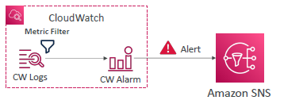

# Monitoring in AWS
### CloudWatch
  - **Metrics**: Collect and track key metrics
  - **Logs**: Collect, monitor, analyze and store log files
  - Events: Send notifications when certain events happen in your AWS
  - **Alarms**: React in real-time to metrics / events
### X-Ray
  - Troubleshooting application performance and errors
  - **Distributed tracing** of microservices
### CloudTrail
  - **Internal monitoring of API calls** being made
  - **Audit** changes to AWS Resources by your users
---
# **Cloudwatch**
## A. Cloudwatch : `Metric`
- `namespace-1` : 
  - metric-1 : attribute-1, ... upto attribute-30
  - metric-2 : attribute-1, ...
  - ...
- `metric` are **variable** for monitoring, eg:
  - cpu utilization for ec2
  - memory utilization
  - network call
  - DB call in app
- can create **custom metric** on any service.

### dashboard for metric
- **option-1**
  - create custom metric or use existing metric
  - stream metric
  - create dashboard
- **option-2**
  - create custom metric
  - deliver stream metric data using `KDF` to:
    - 3rd party : `datadog, splunk, dynatrace`
    - use 3rd party dashboard

---  
## B. Cloudwatch : `logs`
- **expiration** policies 
  - never expire
  - set 1 day to 10 years
- logs are **encrypted** by KMS

### log-insight 
- **dashboard**
  - insight-rule-1 to ingest dashboard data
  - insight-rule-2
  - ...
- from multiple log-group (same/cross aws acct)
- powered by `sagemaker`
- eg:
  - **lambda-insight**, 
  - **CW-container-insight**
  - **app-insight**
  - **cw-contributor-insight**
    - build from `VPC logs`. etc
    - find heaviest n/w user, urlWithMostError, IPs,

### log-group
- log-instance-1/2/3/...
- create `log-metric-filter`, `Logs-streams`
- eg: log-metric-filter - search pattern1 in log, if occurs, capture some value, say 100.

### log-source
- log:Source --> CW:log --> **send**  -->  with/without log-metric-filter --> destination --> S3, KDS, KDF, lambda, OpenSearch
  - for S3, (`CreateExportTask`, take up 12 hr, not real-time)

- log:Source --> CW:log --> **subscribe** --> subscription-filter(destination),max=2 --> `log-stream` --> KDS, KDF, lambda, OpenSearch
  - can aggregate multiple log streams
  - create cross account subscription.
  - aggregate log streams + cross account subscription. eg:
    - aws1:log-group-1: `subscription filter-1-lg1` --> logs-stream-1  --> destination-1
    - aws1:log-group-1: `subscription filter-2-lg1` --> logs-stream-2  --> destination-1
    - `aws2`:log-group-2: `subscription filter-1-lg2` --> logs-stream-3  --> destination-1

- log:Source
  - `application`: ECS/EKS, Lambda, Beanstalk (internal-app-agent - ecs/eks-container-agent, lambda-agent)
  - `network` : VPS flow-logs, R53, API-gateway (internal-n/w-agent)
  - `cloudTrail`
  - `program and agent` : outside aws + ec2
    - SDK 
    - CW: `log-agent` : collects only logs
    - CW: `unified-agent` -->  log + metric(ram.cpu.etc - at `granular` level) .
      - run on `ec2-i` + `on-prem vms` 
      - have centralized config for all-agent in `SSM-parameter store`.
      - eg: (metric)
        - **CPU** (active, guest, idle, system, user, steal)
        - **Disk metrics** (free, used, total), Disk IO (writes, reads, bytes, iops)
        - **RAM** (free, inactive, used, total, cached)
        - **Netstat** (number of TCP and UDP connections, net packets, bytes)
        - **Processes** (total, dead, bloqued, idle, running, sleep)

---
## C. Cloudwatch : `alarm`  
- trigger notifications for any metric
- `state` : ok, in-alarm, insufficient-data
- action : stop,reboot,recover ec2, asg, sns, etc.
- `composite alarm` alarm1 AND/OR alarm2
- alarm can be created on :
  - metric
  - logs
  


---
## D. demo
```
- create lambda 
- run multiple time
- lambda "log-group-1" created :
    - log instance-1
    - log instance-2
    
// actions on  log-group-1 :
// 1. export to s3

// 2. create subscription-filter (max=2)
- KDF
- S3

// 3. create metric-filter on log-group-1
log-group-1 > metric-filter tab
    - name: filter-1
    - namespace: filter-namespace-1
    - filter pattern : "error"
    - metric value : 100
    - so, when error found in metric will occur with value 100
    
// 4 . create log-stream-1 from log-group-1 > start live tail

// 5 . create alarm
- launch ec2-i1 
- CW > create metric-1
  - add ec2-i1
  - type : cpu
  - every 5 min, 3 of 3
  - greater than 90%
  - state action:
    - ok > action:
    - in-alarrm > action : terminate ec2-i1
    - insufficient-data > action :
     >> manually update state from aws-cli
    
...

```
---
##  Z. screenshots
- Logs streams
  - 

- 

- 

- cw:logs  >>> s3
  - since volume is too much and lots of log stream generated
  - use KDF to deliver logs to S3.
  - 


