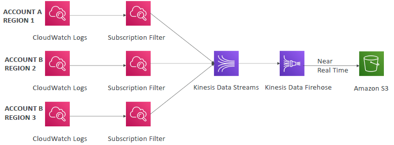
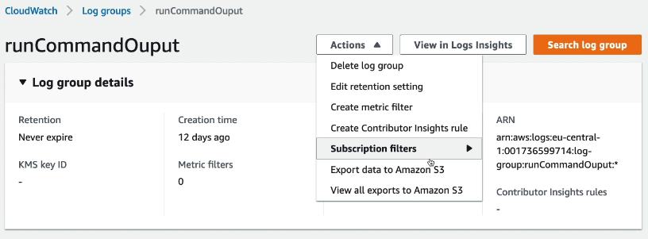

# Cloudwatch : `logs` :books:
- **expiration** policies 
  - never expire
  - set 1 day to 10 years
- logs are **encrypted** by KMS

## 1 `log-group`
- for each application create a log group

---
## 2 `Log-streams`
- instance within log group

---
## 3 `export logs`
- Amazon S3
- KDS Kinesis Data Streams
- KDF Kinesis Data Firehose
- AWS Lambda
- OpenSearch

---
## 4 `log source`
- `SDK`
- `CloudWatch Unified Agent`
- **ECS**: collection from containers
- **AWS Lambda**: collection from function logs
- **VPC Flow Logs**: VPC specific logs
- **Route53**: Log DNS queries
- more:
  - API Gateway
  - Elastic Beanstalk: collection of logs from application
  - CloudTrail based on filter

---
## 5 `log insight` 
- **dashboard**
  - insight-rule-1 to ingest dashboard data
  - insight-rule-2
  - ...
- from multiple log-group (same/cross aws acct)
- powered by `sagemaker`
- eg:
  - **lambda-insight**, 
  - **CW-container-insight**
  - **app-insight**
  - **cw-contributor-insight**
    - build from `VPC logs`. etc
    - find heaviest n/w user, urlWithMostError, IPs,

---
## log-source
- log:Source --> CW:log --> **send**  -->  with/without log-metric-filter --> destination --> S3, KDS, KDF, lambda, OpenSearch
  - for S3, (`CreateExportTask`, take up 12 hr, not real-time)

- log:Source --> CW:log --> **subscribe** --> subscription-filter(destination),max=2 --> `log-stream` --> KDS, KDF, lambda, OpenSearch
  - can aggregate multiple log streams
  - create cross account subscription.
  - aggregate log streams + cross account subscription. eg:
    - aws1:log-group-1: `subscription filter-1-lg1` --> logs-stream-1  --> destination-1
    - aws1:log-group-1: `subscription filter-2-lg1` --> logs-stream-2  --> destination-1
    - aws2:log-group-2: `subscription filter-1-lg2` --> logs-stream-3  --> destination-1

- log:Source
  - `application`: ECS/EKS, Lambda, Beanstalk (internal-app-agent - ecs/eks-container-agent, lambda-agent)
  - `network` : VPS flow-logs, R53, API-gateway (internal-n/w-agent)
  - `cloudTrail`
  - `program and agent` : outside aws + ec2
    - SDK 
    - CW: `log-agent` : collects only logs
    - CW: `unified-agent` -->  log + metric(ram.cpu.etc - at `granular` level) .
      - run on `ec2-i` + `on-prem vms` 
      - have centralized config for all-agent in `SSM-parameter store`.
      - eg: (metric)
        - **CPU** (active, guest, idle, system, user, steal)
        - **Disk metrics** (free, used, total), Disk IO (writes, reads, bytes, iops)
        - **RAM** (free, inactive, used, total, cached)
        - **Netstat** (number of TCP and UDP connections, net packets, bytes)
        - **Processes** (total, dead, bloqued, idle, running, sleep)

### log-metric-filter
- eg: log-metric-filter - search pattern1 in log, if occurs, capture some value, say 100.
---
## D. demo
```
- create lambda 
- run multiple time
- lambda "log-group-1" created :
    - log instance-1
    - log instance-2
    
// actions on  log-group-1 :
// 1. export to s3

// 2. create subscription-filter (max=2)
- KDF
- S3

// 3. create metric-filter on log-group-1
log-group-1 > metric-filter tab
    - name: filter-1
    - namespace: filter-namespace-1
    - filter pattern : "error"
    - metric value : 100
    - so, when error found in metric will occur with value 100
    
// 4 . create log-stream-1 from log-group-1 > start live tail
...
```
---
##  Z. screenshots
- Logs streams
  - 

- 

- 

- cw:logs  >>> s3
  - since volume is too much and lots of log stream generated
  - use KDF to deliver logs to S3.
  - 


