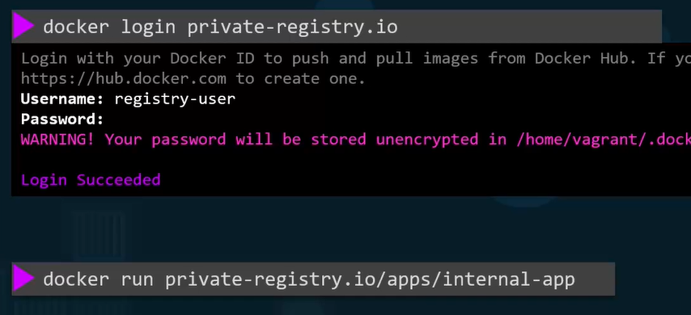

## key points
- container/s not completed isolated and share host kernal/os, but isolated based **namespaces**.
- all the process run by container/s, runs on the host but in their own `Namespaces`.
- **process isolation** : a container cannot see anything out of its namespace.
- `ps aux` show all process
  - a - all user
  - u - user-oriented format
  - u - includes daemon process
  - same process has diff pid in diff namespace. 
- by default, docker runs container with `root` user **on host** (with less Linux **capability**)
  - dockerfile > USER < userID >
  - docker run --user option
- **Docker host** : on host machine install docker
  - eg: docker desktop on out laptops.
  - all containers runs on this  docker host.
- **.dockerignore** : 
  - Specifies files/directories that should be excluded when building a Docker image.
  - Reduces build context size
  - Prevents sensitive files (e.g., .env, credentials.json) from accidentally being copied into the image.

---
## Layered Arch


---
## Registry




---
## Container Security:
- --user < userID > 
- --cap-add/drop < CAPABILITY >
- Add these at:
  - container level :  
  - pod level :        
  - both present, container will override.

---
- pod-1
  - c1
    - process-1: port-1
    - process-2 : port-2
    - ...
  - c2
      - process-11 : port-11
      - process-22 : port-22
      - ...
---
## Docker's architecture
- **Docker Engine** / container-d
  - core runtime that powers Docker. 
  - It is a lightweight, modular application consisting of:
    - **Docker Daemon** (`docker-d`) :point_left:
      - A background service 
      - manages Docker objects (containers, images, networks, volumes).
      - Handles container lifecycle
      - Pulls/pushes images from/to registries.
      - create layers
    - **REST API** – Allows interaction with the daemon programmatically (e.g., via CLI or SDKs).
    - **CLI** (optional)
    - container-d
- **Docker Images**
  - read-only template used to create containers
  - each instruction in a Dockerfile creates a new layer
  - Application code + dependencies (libraries, runtime)
  - Metadata (environment variables, default commands)
- **Container**
  - **runnable** instance of an image
  - **Isolated process** running on the host OS via namespace.
  - Shares the **host kernel** 
  - but has its own **filesystem**
```
Docker Client (CLI)  
       ↓ (REST API)  
Docker Daemon (dockerd) → Manages → Images → Containers  
       ↑  
Registry (Docker Hub, ECR, etc.)  
```