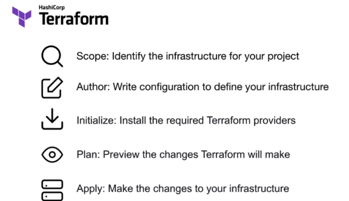
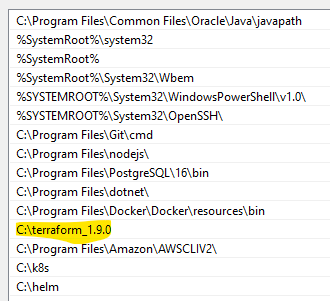
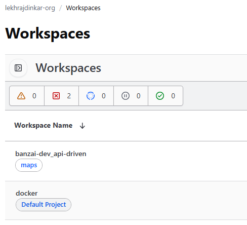

- https://chatgpt.com/c/672bc367-e60c-800d-9fc4-5782d0a7741b - question
- https://chatgpt.com/c/672cec04-fb0c-800d-a873-d0ad332219fb - sample aws config.

---  
## A. Official Tutorial: 
- check more : https://developer.hashicorp.com/terraform/tutorials
### Fundamental
  - https://developer.hashicorp.com/terraform/tutorials/configuration-language
  - https://developer.hashicorp.com/terraform/tutorials/cli
  - https://developer.hashicorp.com/terraform/tutorials/modules/module
  - https://developer.hashicorp.com/terraform/tutorials/provision
  - https://developer.hashicorp.com/terraform/tutorials/state/state-import
### Cloud
- https://developer.hashicorp.com/terraform/tutorials/cloud
- https://developer.hashicorp.com/terraform/tutorials/aws-get-started/

---

## B.Terraform  - intro
- 
- Switching from one provider (e.g., AWS) to another (e.g., Azure) usually requires rewriting the configuration.
  - https://registry.terraform.io/providers/
  - https://registry.terraform.io/providers/kreuzwerker/docker/latest/docs
  - https://registry.terraform.io/providers/hashicorp/aws/latest/docs
- However, Terraform provides ways to make this process more manageable/consistent.
  - Define common Variables,Outputs, modules, etc across providers.
- `tf providers`:
  - automatically finds dependencies b/w resources and deploy in correct order.

---
## C. install / setup
- windows: install binary in local, set PATH.
  - 
- next, run locally or through HCP 
- **HCP** (hashicorp cloud plateform) : **remote state**
  - create account. (signup with github)
  - create **org** (`lekhrajdinkar-org`) 
  - create **projects** (`default project` and `maps`)  
  - under projects > add **workspace** (cli/api driven)
    - 
    - https://app.terraform.io/app/lekhrajdinkar-org/workspaces/banzai-dev_api-driven
    - https://app.terraform.io/app/lekhrajdinkar-org/workspaces/docker
    - 
  - check out confiurationCode from git
    - root-module >> main.tf >> `terraform` { `cloud` { update this } }
  - **benefits**
    - state mgt
    - run history
    - workspace Variable + env var
    - suitable for long-running iac

### Basic Commands
- https://developer.hashicorp.com/terraform/tutorials/cli/init
- `terraform -version`  # Terraform v1.9.0
``` 
  console       Try Terraform expressions at an interactive command prompt
  fmt           Reformat your configuration in the standard style
  force-unlock  Release a stuck lock on the current workspace
  get           Install or upgrade remote Terraform modules
  graph         Generate a Graphviz graph of the steps in an operation
  import        Associate existing infrastructure with a Terraform resource
  login         Obtain and save credentials for a remote host , [ HCP-cluser > org >project > workspace ]
  logout        Remove locally-stored credentials for a remote host
  metadata      Metadata related commands
  output        Show output values from your root module
  providers     Show the providers required for this configuration
  refresh       Update the state to match remote systems
  show          Show the current state or a saved plan
  state         Advanced state management
  taint         Mark a resource instance as not fully functional
  test          Execute integration tests for Terraform modules
  untaint       Remove the 'tainted' state from a resource instance
  version       Show the current Terraform version
  
  workspace     Workspace management
    Subcommands:
    delete    Delete a workspace
    list      List Workspaces
    new       Create a new workspace
    select    Select a workspace
    show      Show the name of the current workspace
```
---
## D. Quick hands on 
###  provider : Docker
- cd .../04_terraform/project/docker  <<<<
- login to workspace (`docker`): https://app.terraform.io/app/lekhrajdinkar-org/workspaces/docker
- clone project from **git**.
  - or, can try sample project : git clone https://github.com/hashicorp/tfc-getting-started.git

- **terraform login**
  - copy token from, C:\Users\Manisha\AppData\Roaming\terraform.d\credentials.tfrc.json
  - or create new token : https://app.terraform.io/app/settings/tokens?source=terraform-login
  - 
- **terraform init** - finds and downloads required provider.
```
Initializing HCP Terraform...
Initializing provider plugins...
- Finding kreuzwerker/docker versions matching "~> 3.0.1"...
- Installing kreuzwerker/docker v3.0.2...
- Installed kreuzwerker/docker v3.0.2 (self-signed, key ID BD080C4571C6104C)
Partner and community providers are signed by their developers.
If you'd like to know more about provider signing, you can read about it here:
https://www.terraform.io/docs/cli/plugins/signing.html
Terraform has created a lock file .terraform.lock.hcl to record the provider
selections it made above. Include this file in your version control repository
so that Terraform can guarantee to make the same selections by default when
you run "terraform init" in the future.
```
- **terraform fmt** : formatting
- **terraform validate** : validate configuration/s
- **terraform plan** : prints out execution plan.
  - failed : https://app.terraform.io/app/lekhrajdinkar-org/workspaces/docker/runs/run-8hZLDTrQfEJ27ixj
  - provider "docker" { } empty - fix it.
- **terraform apply**
  - ran run directly, without running plan.
- **terraform destroy**
  - print out execute plan for destroy
  - confirm to apply.
  
###  provider : aws
- cd .../04_terraform/project/banzai-dev_api-driven   <<<<
- pre-work: configure awscli + gimme-aws-creds
- login to https://app.terraform.io/app/lekhrajdinkar-org/workspaces/banzai-dev_api-driven
- init
- plan and apply
- next, make some changes and update tf file resource. say ami id
- plan and apply
- destroy