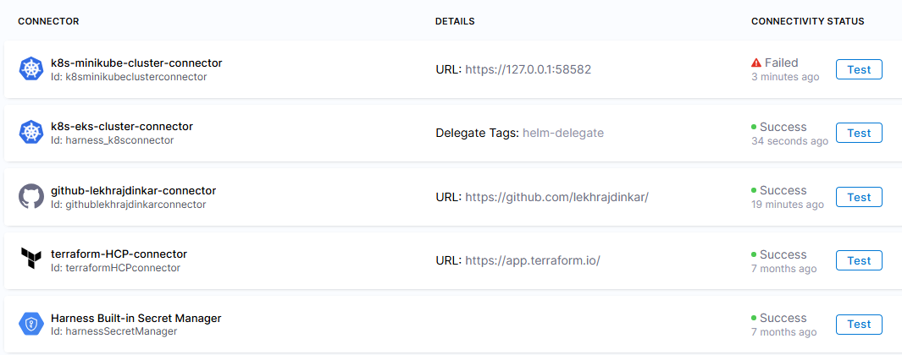

- https://developer.harness.io/docs/continuous-delivery/get-started/key-concepts
---
# Harness
## onboarding
- https://app.harness.io/ng/account/e0wDKKO_S46x3M75TWv0iw/all/settings/
- **Account**: `lekhrajdinkar`  
  - **Organization**: `default`
    - **project**
      - **outbound-api : dashboard**
        - pipelines 
        - users 
        - Environments
        - Services
      - outbound-ui : dashboard
        - ...
        - ...
--- 
## B project1 - maps-outbound-api
### B.1. pre-work (plateform team)
#### 1 setup : secrets
- **aws**
  - aws_eks_get_token
    - **aws eks get-token  --cluster-name maps-outbound-us-west-2-dev2-eks-fargate-cluster --region us-west-2**
    - Need to update token manually, once expired
    - https://app.harness.io/ng/account/e0wDKKO_S46x3M75TWv0iw/all/settings/secrets/aws_eks_get_token/overview
  - aws_eks_cluster_ca_data
  - aws_533267082359_secret_access_key
- **minikube**
  - minikube-admin-client-key
  - minikube-admin-client-crt
  - C:\Users\Manisha\.minikube\profiles\minikube
- **github**-access-token-org
- **terraform**-hcp-dev

#### 2 setup : delegates
[02_delegates.md](02_delegates.md)

#### 3 setup : connectors
- **kubernetes**
  - k8s-eks-cluster-connector
  - k8s-minikube-cluster-connector
- **github**-lekhrajdinkar-connector
- **terraform**-hcp-connector
- **aws**
  - aws-secret-manager-connector
  - aws-account-connector
- **more**
  - nexus-repo-connector 
  - service-now-connector



#### 4 Access control
- **service account** : none
- **user group** : `app_DevLead` (LDAP role)
  - u1, u2
- **roles**
  - found 19, built-in. eg: pipeline-executor
  - create custom role
    - pipeline-owner
    - pipeline-developer
  - role has defined granular **permission**.
    - **resource/s : action/s**
    - service  : R , W, Edit, View, etc
    - template : R , W, Edit, View, etc
    - pipeline : R , W, Edit, View, etc
    - ...

---
### B.2. CD pipeline (developer team)
#### 1 Template
- template for  step, stage, pipeline, service
  
#### 2 pipeline :point_left: :point_left:
- https://app.harness.io/ng/account/e0wDKKO_S46x3M75TWv0iw/all/orgs/default/projects/mapsoutboundapi/pipelines
- pipeline > stages (build, deploy, another pipleline) > steps (run, image push, etc)
  - input-set + pipeline variable
  - triggers
  - codebase : github connector + repo

#### 3 services :x:

#### 4 environment :x:
- **env-group**
  - oz-dev
    - dev1 (pre-prod)
    - dev2 (pre-prod)
    - prod\
    
---
## C. project2 - maps-outbound-ui
- [dashboard](https://app.harness.io/ng/account/e0wDKKO_S46x3M75TWv0iw/module/cd/orgs/default/projects/frontendproject/overview)

---
## D. project3- ccgg
### D.1 maps :pipelines
#### 1 terraform-pipeline ( input::component - in, out, kafka, engine)
- stage1/step1 - **template-1** :: gauntlet scan
  - input: image-container-registry + image(tf,k8s,aws)
  - env var: git-branch, atm, env_gate
- stage2 - bash :: **TRF_PLAN**
- stage3 - **TRF_PLAN_APPROVAL**
  - harness-template-2 :: manual approval
- stage14 - bash :: **TFR_APPLY**
```bash
terraform -v
tfr_workspace=<+pipeline.variables.tf_ws>
tfe_ws_id=<+pipeline.variables.tf_ws_id>
tfe_host=<+pipeline.variables.tf_host>
wget ccggAnsible/tfeSync.zip
unzip tfeSync.zip
./tfesync -w tfe_ws_id
# create :: credential.trfc.son with $TFE_TOKEN
# create :; backend.tf with tf_ws_id
terrafom init
terrafom plan -var-file ./env/${ENV}.tfvars
```

#### 2 interface-pipeline 
- **template-1** :: gauntlet scan
- **version**
```
GIT_BRANCH = <+pipeline.variables.GIT_BRANCH>
VERSION = $GIT_BRANCH.split('\/')[1]
VERSION_WITH_SEQ = "${VERSION}-"<+pipeline.sequenceId>
```
- stage1 **BUILD**
  - harness-template :: **AWS (build and push to ECR)**
    - aws connector (aws secret key from broadAccessRole)
    - aws account id + region
    - image name
    - codebase, already present
  - **harness-template-1** :: **build and push to docker Hub**
  - bash :: push
- stage2 **DEPLOY**
  - bash :: deploy to ECS
  ```bash
  current_role = $(aws sts get-caller-identity)
  export $(printf "AWS_ACCESS_KEY=%s AWS_SECRET_ACCESS_KEY=%s AWS_SESSION_TOKEN=%s")
  $(aws sts assume --role harness-pipleline-role --session-name --query "Credential.[AccesskeyId,SecretAccesskey,SessionToken] --output text")
  
  current_role = $(aws sts get-caller-identity)
  
  old_tasks=$(aws ecs list-task --cluster --service-name --region    --query tasjArn[*] --output text)
  for task in old_tasks; 
  do aws ecs stop task --cluster --service-name --region
  aws ecs stop task --cluster --service-name --region --force-new-deployment
  ```