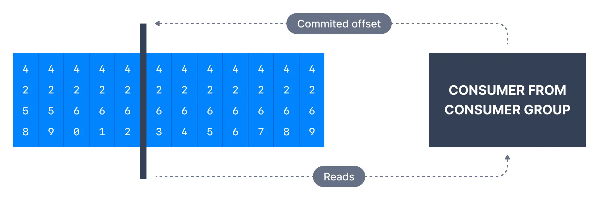
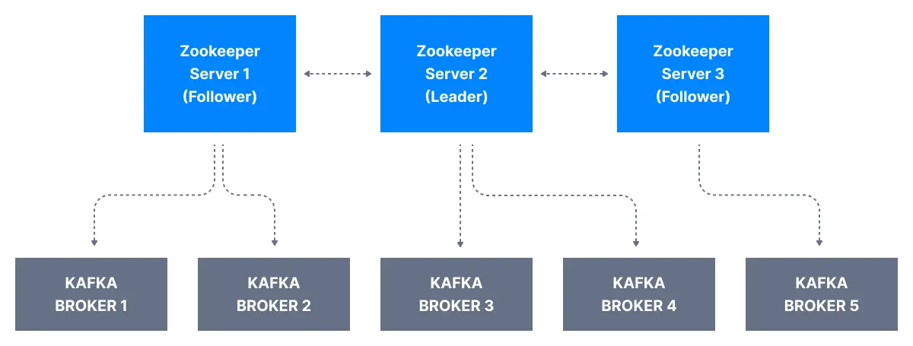

tutor reference:
- https://courses.datacumulus.com/
- udemy: https://www.udemy.com/course/apache-kafka
- github code : https://conduktor.io/apache-kafka-for-beginners
- slides : https://learn.conduktor.io/kafka/ :point_left:

---
# kafka 
## A intro
-  **real-time data streaming pipelines**.
- **data stream** : unbounded/endless sequence of data, with data throughput can high or low. eg:
    - Log Analysis - Log stream from multiple ms.
    - Web Analytics - modern web app measure user activity.
- `open-source`, managed by confluent(linkedIn)
- **distributed system** 
  - cluster + brokers/nodes (has `TOPICS`)
  - scalable and fault-tolerant to node loss.

---
## B install - conduktor
- https://conduktor.io/get-started
- curl -L https://releases.conduktor.io/quick-start -o docker-compose.yml && docker compose up -d --wait && echo "Conduktor started on http://localhost:8080"

---
## C use cases
### 1 as a data integration layer
- producer  and consumer system/s, with diff data-format + schema, protocol
- 
- 
### 2 Decouple systems 
### 3 Microservice communication
### 4 Integration with Big Data technologies
### 5 Event-sourcing store
### 6 Activity Tracker
- Gather metrics from many different locations
- collect logs
- collect web user activity

---
## D fundamental / component
- `producer` --> **kafka-Cluster [ broker > topic > partition ]** --> `consumer group/s` [consumer-1,... ]
- 
- 
- **broker**
  - single Kafka server
  - kakfa store data in a directory on the broker disk.
  - if we connect to any broker, then can discover and connect to other broker in the same cluster
    - Every broker in the cluster has metadata about all the other brokers
    - therefore any broker in the cluster is also called a `bootstrap server`.
    - 
  
  
### **topics** 
  - roughly analogous to SQL tables (not queryable)
  - data store in binary format.
  - topic is broken down into a number of **partitions**
    - to achieve high throughput and scalability
    - Kafka does a good job of distributing partitions evenly among the available brokers.
    - up to 200,000 partition (with zookepeer)
    - without zoo kepeer - millions of partition.
  - `offset` - integer value that Kafka adds to each message as it is written into a partition. from 0.
  - data retency : 7 days (default).
  - not deleted after consumed.
  - resilience and availability : via replication /In-Sync Replicas (ISR) of each partition on other. eg:
    - kafka cluster with 3 broker, topic-1 has 3 partition 
    - intially, kafka will distriube, one partition into each broker.
    - broker-1:p1, b2:p2, b3:p3
    - if Topic Replication Factor = 1  :point_left:
      - for each partition: `1 leader` + no replication
    - if Topic Replication Factor = 2
      - for each partition: `1 leader` + `1 ISR on other broker`
    - if Topic Replication Factor = 3 
      - for each partition: `1 leader` + `1 ISR on other broker` +   `1 ISR on other broker`
        - For a topic replication factor of 3, topic data durability can withstand the loss of 2 brokers.
    - Topic Replication Factor = max value : no. of broker - 1
    - 

### **producer**
  - application - java/py with kafka client.
  - Kafka producers only write data to the **leader** broker for a partition
  - specify a level of acknowledgment `acks`
    - acks=0 : written successfully
    - acks=1 : written successfully + acknowledged by leader
    - acks=all : written successfully + acknowledged by leader + accepted by all ISR


### **message**
  - `message-value` : content
  - `message-key` 
    - null : load balance , round-robin fashion into p1,p2,...
    - non-null :  all messages that share the same key, will always go to same partition. uses **hashing** `murmur2 algo`
  - 
  - `Kafka Message Serializers` / `Kafka Message Deserializers`
    - IntegerSerializer
    - StringSerializer
    - converts message-value/key into byte streams

### **Consumer**
  - application - java/py with kafka client.
  - If a consumer consumes data from multiple partition, the message order is not guaranteed across multiple partitions
  - By default, Kafka consumers will only consume data that was produced after it first connected to Kafka.
    - hence no access historic, by default.
  - can implement - `pull model`
    - instead of having Kafka brokers continuously push data to consumers,
    - consumers must request data from Kafka brokers
  - **Publish-Subscribe Behavior**
    - when multiple consumer groups subscribe to the same topic
  - **consumer group**
    - each partition of topic is consumed by one consumer within a consumer group :point_left:
    - Messages are effectively divided among the consumers.
- 
- 
- 
- 
```
# summary

topic with 2 partition consumed by :
- consumer-1
- consumer-2
- consumer-group-1 (consumer-3, sonsumer-4).

Together, Consumer-3 and Consumer-4 consume all messages from the topic, 
dividing the workload between the two partitions.
```
    
### more
- **Kafka Connect**
  - Kafka Connect Source Connectors 
  - Kafka Connect Sink Connectors
  
- **Schema Registry**

- **ksqlDB**
  - transform Kafka topics to SQL-like database
  - thus can perform SQL-like operation
  
- **Zookeeper**
  - like master node in k8s cluter.
  - Zookeeper is used to track cluster state, membership, and leadership.
  - Being Eliminated from Kafka v4.x. less secure
  - metadata management in the Kafka world
  - perform leader elections
  - stores configurations for topics and permissions.
  - does NOT store consumer offsets 
  - ensemble / Zookeeper cluster: 3,5, 7,...
  - 

- **Kafka KRaft Mode**
 