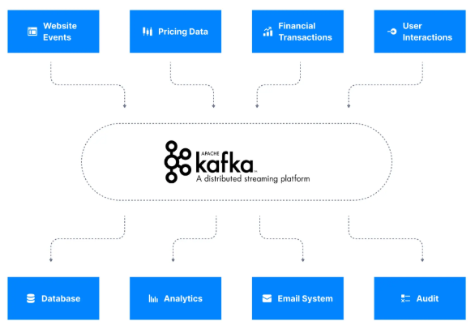
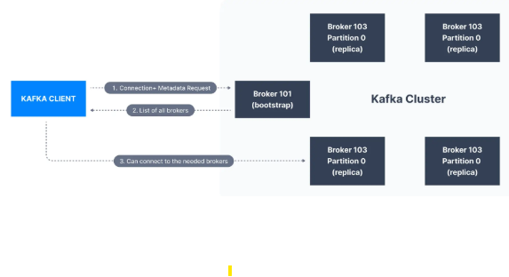
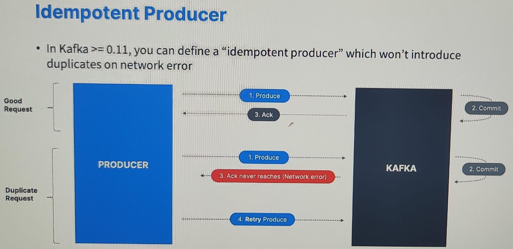
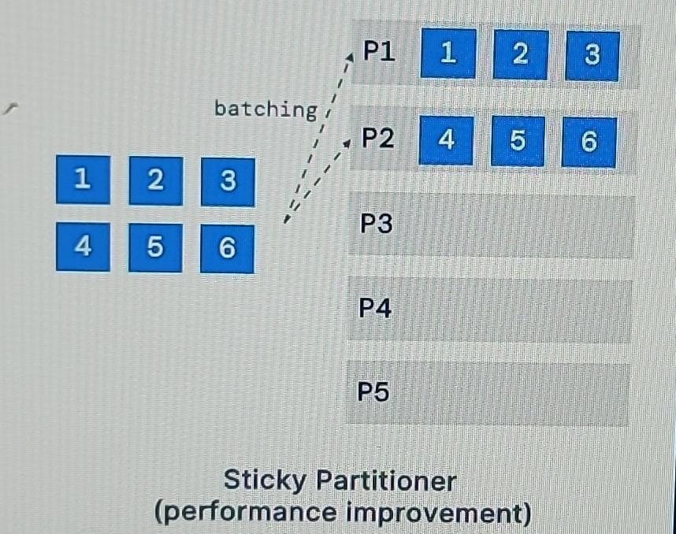
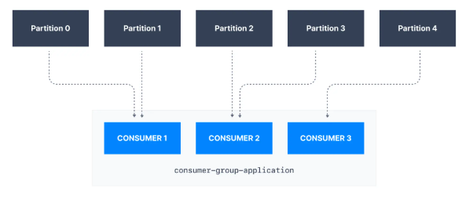
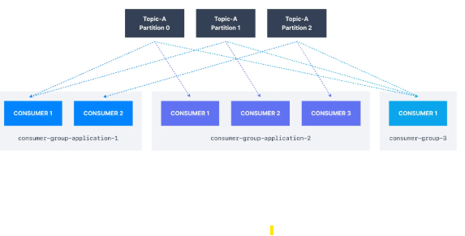
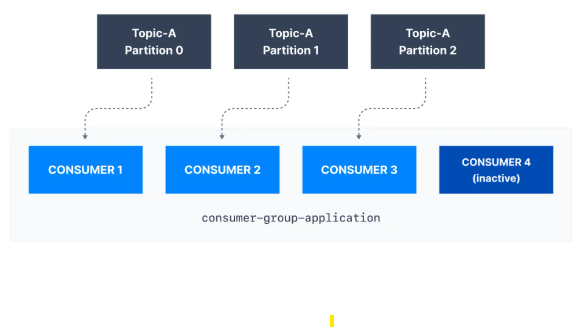
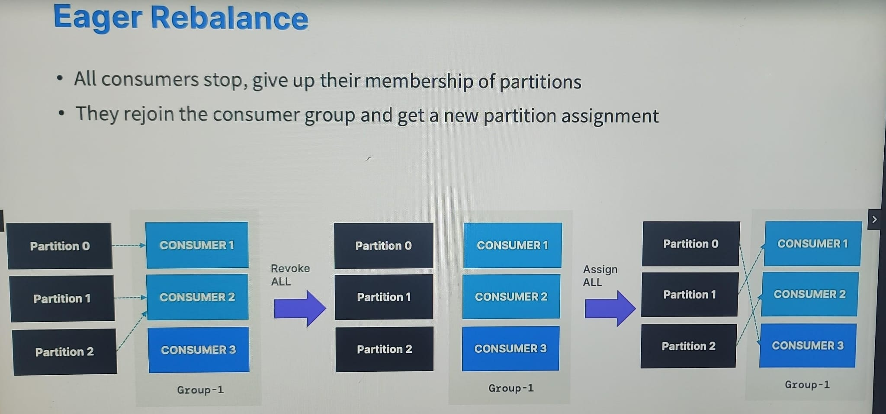
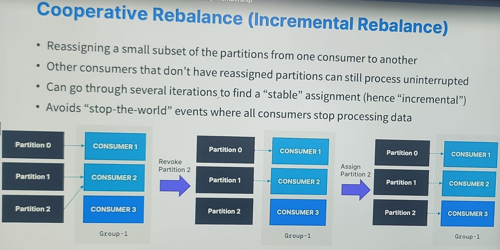

# reference
- project : [kafka](..%2F..%2Fsrc%2Fmain%2Fjava%2Fcom%2Flekhraj%2Fjava%2Fspring%2Fkafka)
- udemy: 
  - https://www.udemy.com/course/apache-kafka
  - https://conduktor.io/apache-kafka-for-beginners
  - slides : https://learn.conduktor.io/kafka/ :point_left:

---
# kafka 
## A intro
-  **real-time data streaming pipelines**. (primary task)
- **data stream** : unbounded/endless sequence of data, with data throughput can high or low. eg:
    - Log Analysis - Log stream from multiple ms.
    - Web Analytics - modern web app measure user activity.
- `open-source`, managed by confluent(linkedIn)
- **distributed system** 
  - cluster + brokers/nodes (has `TOPICS`)
  - scalable and fault-tolerant to node loss.

---
## B install - conduktor
- https://conduktor.io/get-started
- https://releases.conduktor.io/quick-start -o docker-compose.yml
- http://localhost:8080
- **curl -L https://releases.conduktor.io/quick-start -o docker-compose.yml && docker compose up -d --wait && echo "Conduktor started on http://localhost:8080"**
- https://github.com/conduktor/kafka-beginners-course/tree/main/conduktor-platform - worked
---
## C use cases
- https://chatgpt.com/c/6748bff9-8df8-800d-8faa-ac5244853529
### 1 as a data integration layer
- producer  and consumer system/s, with diff data-format + schema, protocol
- 
- 
### 2 Decouple systems 
### 3 Microservice communication
### 4 Integration with Big Data technologies
### 5 Event-sourcing store
### 6 Activity Tracker
- Gather metrics from many different locations
- collect logs
- collect web user activity

---
## D fundamental / component
- https://chatgpt.com/c/6748c06d-048c-800d-996e-6ca852cd0329
- `producer` --> **kafka-Cluster [ broker > topic > partition ]** --> `consumer group/s` [consumer-1,... ]
- 
- 
- **broker**
  - single Kafka server
  - kakfa store data in a directory on the broker disk.
  - if we connect to any broker, then can discover and connect to other broker in the same cluster
    - Every broker in the cluster has metadata about all the other brokers
    - therefore any broker in the cluster is also called a `bootstrap server`.
    - 
  
--- 
### **1 topics** 
- roughly analogous to SQL tables (not queryable)
- data store in `binary-format`
- data retention: 7 days (default).
- **partitions** : topic is broken down into a number of partitions
  - to achieve high throughput and scalability + parallel consumer/s
  - Kafka does a good job of distributing partitions evenly among the available brokers.
  - up to 200,000 partition (with zookepeer)
  - without zoo kepeer - millions of partition.
- **offset** - integer value that Kafka adds to each message as it is written into a partition. from 0.
  ```
  ## Consumer setting to update it:
  # a. Auto 
  - enable.auto.commit=true + auto.commit.interval.ms=5000
  
  # b. Manual
  - enable.auto.commit=false 
  - KafkaConsumer.CommitSync()/CommitASync();
  
  # c Manaul advance
  - skip it
  - stores offset externally
  ```
- **replicas** / In-Sync Replicas (ISR)
  - to achive - resilience and availability
  ```
  cluster - broker-1,  broker-2 , broker-3 (3 brokers)
  Topic-1 - partition-1 , partition-2, partition-3
  
  # initial distribution (with RF=1)
  broker-1 : [ partition-1 ]
  broker-2 : [ partition-2 ]
  broker-3 : [ partition-3 ]
  
  # add replication: RF=? 
  - RF=2  
    broker-1 : [ partition-1, partition-3-isr1 ]
    broker-2 : [ partition-2, partition-1-isr1 ]
    broker-3 : [ partition-3, partition-2-isr1 ]
  
  - RF=3
    broker-1 : [ partition-1, partition-3-isr1, partition-2-isr2 ]
    broker-2 : [ partition-2, partition-1-isr1, partition-3-isr2 ]
    broker-3 : [ partition-3, partition-2-isr1, partition-1-isr2 ]
  
  - RF=4 (invalid) :  must be <= no of broker
  ```
- 

---
### **2 producer**
- application - java/py with kafka client.
- Kafka producers only write data to the **leader** broker for a partition
- specify a level of acknowledgment `acks`
  - acks=0 : written successfully
  - acks=1 : written successfully + acknowledged by leader
  - acks=all : written successfully + acknowledged by leader + accepted by all ISR
- if  ack not received, the producer retries.
  - retries : 0 - 2^32
  - retry.backoff.ms = 100 ms (default) # retry delay
  - delivery.timeout.md=    # max time for delivery, afterwards exception which developer has to handle.
- **idempotent producer**  
  - use kafka 3+
  - detects duplicate and prevent it. 
  - has retry ability with duplicate check.
  - 
  
- kafka 3+ sets below :point_left:
```
  - producer.idempotence = true
  - acks=all
  - min.insync.replicas=2 # leader + at leat one replica.
  - reties= MAX_INT
  - delivery.timeout.ms = 120000 # 2 min
  - max.in.flight.request.oer.connection=5
```
- **archive message**:
  - at `producer level`
  - at `broker level`
    - consumes CPU cycle, thus performance issue.
  
- **High throughput producer**:
  - **partition class** 
    - **RoundRobin** 
      - 
    - **sticky** (looks for batch.size + linger.ms)
      - **linger.ms = 10ms** # `accumulate` message for 10 ms and then send
      - **batch.size = 16000** # `accumulate` message till 16 kb and then publish
      - note: increase above values, to achieve High throughput
      - 
  - compression (use **snappy**)
    - compression.type=snappy
    - spring.kafka.producer.properties.compression.type=snappy

---
### **3 message**
- `message-value` : content
- `message-key` 
  - **null** : load balance , round-robin fashion into p1,p2,...
  - **non-null** :  
    - all messages that share the same key, will always go to same partition. 
    - true unless partition NOT chnages :point_left:
    - uses **hashing** `murmur2 algo`
    
- 
- `Kafka Message Serializers` / `Kafka Message Deserializers`
  - IntegerSerializer
  - StringSerializer
  - converts message-value/key into byte streams

---
### **4 Consumer**
- application - java/py with kafka client.
- If a consumer consumes data from multiple partition, the message order is not guaranteed across multiple partitions
- By default, Kafka consumers will only consume data that was produced after it first connected to Kafka.
  - hence no access historic, by default.
- can implement - `pull model`
  - instead of having Kafka brokers continuously push data to consumers,
  - consumers must request data from Kafka brokers
- **Publish-Subscribe Behavior**
  - when multiple consumer groups subscribe to the same topic
- **consumer group**
  - each partition of topic is consumed by one consumer within a consumer group :point_left:
  - Messages are effectively divided among the consumers.
  - static consumer in group --> having `group.instance.id` is also set. :point_left:
- 
- 
- 
- 
```
topic with 2 partition consumed by :
- consumer-1
- consumer-2
- consumer-group-1 (consumer-3, sonsumer-4(idempotent)).
    - consumer-4 leave and comes back within thresold time, the will get same partition again. <<<

Together, Consumer-3 and Consumer-4 consume all messages from the topic, 
dividing the workload between the two partitions.
```
- **update offset**
```
  ## Consumer setting to update it:
  # a. Auto 
  - enable.auto.commit=true + auto.commit.interval.ms=1000 (1 min)
  
  # b. Manual
  - enable.auto.commit=false 
  - consumer processing - A-sync or sync 
  - KafkaConsumer.CommitSync()/CommitASync();
```
- **Delivery semantic** (just concept)
  - scenario-1 :: `at most once` (max=1)
    - consumer > poll > processing **synchronously** (will take around 2 min) 
    - offset auto-updated by 1, after 1 min of polling.
    - early offset update, since processing stilling going on.
  - Scenario-2 :: `at least once` (min=1)
   - consumer > poll > processing **synchronously** (will take around 20 sec)
   - 2 message read, and broker crashed while processing 3rd.
   - offset not updated.
   - broker is up again and will consume from old offset
   - above 2 messages will be processed again.
   - so keep consumer `idempotent`

- **rebalance**
  - whenever consume leaves/joins group, rebalance happens
  - moving partition b/w consumers.
  - if static member leave the group and joins back within **session.timeout.ms**, the gets it original partition.
  - 
  -   
---    
### 5 more
- **5.1 Kafka Connect**
  - Kafka Connect Source Connectors 
  - Kafka Connect Sink Connectors
  
- **5.2 Schema Registry**

- **5.3 ksqlDB**
  - transform Kafka topics to SQL-like database
  - thus can perform SQL-like operation
  
- **5.4 Zookeeper**
  - like master node in k8s cluster.
  - Zookeeper is used to track cluster state, membership, and leadership.
  - Being Eliminated from Kafka v4.x. less secure
  - metadata management in the Kafka world
  - perform leader elections
  - stores configurations for topics and permissions.
  - does NOT store consumer offsets 
  - ensemble / Zookeeper cluster: 3,5, 7,...
  - 

- **5.5 Kafka KRaft Mode**

---

# Programs
- https://chatgpt.com/c/674a1fef-5634-800d-b445-dfa969b74011
```
    <dependency>
        <groupId>org.springframework.kafka</groupId>
        <artifactId>spring-kafka</artifactId>
    </dependency>
    
spring.kafka.bootstrap-servers=localhost:9092
spring.kafka.consumer.group-id=kafka-generic-consumer-group
spring.kafka.consumer.auto-offset-reset=earliest/latest/none

spring.kafka.consumer.key-deserializer=org.apache.kafka.common.serialization.StringDeserializer
```

## producer
```
 - @Autowired KafkaTemplate<String, String> kafkaTemplate;
 - String message = objectMapper.writeValueAsString(student);
 - kafkaTemplate.send("topic-1", message);
```
### produce - sysn + async
- **sysc** - send(produceRecord)
- **a-sync**  - send(produceRecord, `new Callback() { @override onCompletion ... }`)

### produce in batch 
- props.put("batch.size","400"); 
- key must be null 
- props.put("partitioner.class","RR); // for demo purpose only.
- consumer side 
  - read messages in batch `poll()` 
  - process batch `for(m:messages)` 
  - then update offset manually
  - keep consumer code, idempotent.
    
### produce with key (k1,k2,k3)
- add consumer group with 3 consumer/s
- check ordering :)

---
## consumer 
```
 @KafkaListener(topics = {"kafka-topic-1", "kafka-topic-2"}, groupId = "kafka-generic-consumer-group") m(String s) {...}
```
- consume : props.groupId("group.id","") + props.put("group.instance.id","") **static consumer**
    - props.put("auto.offset.rest","none")
    - props.put("auto.offset.rest","latest")
    - props.put("auto.offset.rest","earliest")

### scenario-1: generic consumer for diff schema
```
kafka-topic-1 (schema : student)
kafka-topic-2 (schema- customer)
kafka-generic-consumer-1 : subscribed to kafka-topic-1 and kafka-topic-2.

# producer sending json 
# De-Serailize json to string
# while consuming, Objectmapper.readObject(jsonStr, student/customer.class)
spring.kafka.consumer.value-deserializer=org.apache.kafka.common.serialization.StringDeserializer

```

### scenario-2 : partitions < consumer
```
Topic: topic-1 with 2 partitions (partition-0 and partition-1).
Consumer Group: topic-1-group-1.
Consumers: c1, c2, c3, c4.

# Partition Assignment
partition-0: Assigned to c1.
partition-1: Assigned to c2.
c3 and c4 are idle because there are not enough partitions for them.
```

### scenario-3 : partitions > consumer
```
Topic: topic-1 with 4 partitions (partition-0, partition-1, partition-2, partition-3).
Consumer Group: topic-1-group-1.
Consumers: c1, c2

# Partition Assignment :

## --- Using RangeAssignor --- 
c1: partition-0, partition-1.
c2: partition-2, partition-3.

## ---  Using RoundRobinAssignor --- 
c1: partition-0, partition-2.
c2: partition-1, partition-3.
```


 