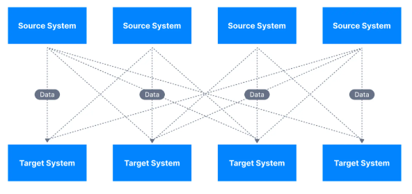
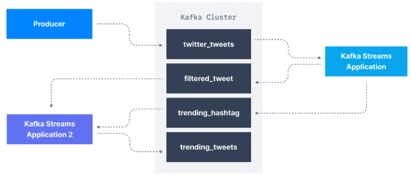
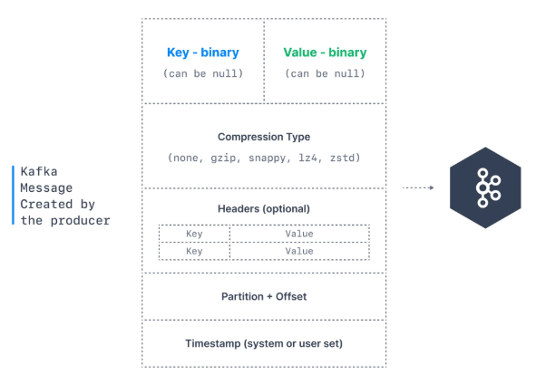

# reference
- project : [kafka](..%2F..%2Fsrc%2Fmain%2Fjava%2Fcom%2Flekhraj%2Fjava%2Fspring%2Fkafka)
- udemy: 
  - https://www.udemy.com/course/apache-kafka
  - https://conduktor.io/apache-kafka-for-beginners
  - slides : https://learn.conduktor.io/kafka/ :point_left:

---
# kafka 
## A intro
-  **real-time data streaming pipelines**.
- **data stream** : unbounded/endless sequence of data, with data throughput can high or low. eg:
    - Log Analysis - Log stream from multiple ms.
    - Web Analytics - modern web app measure user activity.
- `open-source`, managed by confluent(linkedIn)
- **distributed system** 
  - cluster + brokers/nodes (has `TOPICS`)
  - scalable and fault-tolerant to node loss.

---
## B install - conduktor
- https://conduktor.io/get-started
- curl -L https://releases.conduktor.io/quick-start -o docker-compose.yml && docker compose up -d --wait && echo "Conduktor started on http://localhost:8080"
- http://localhost:8888/
---
## C use cases
- https://chatgpt.com/c/6748bff9-8df8-800d-8faa-ac5244853529
### 1 as a data integration layer
- producer  and consumer system/s, with diff data-format + schema, protocol
- 
- 
### 2 Decouple systems 
### 3 Microservice communication
### 4 Integration with Big Data technologies
### 5 Event-sourcing store
### 6 Activity Tracker
- Gather metrics from many different locations
- collect logs
- collect web user activity

---
## D fundamental / component
- https://chatgpt.com/c/6748c06d-048c-800d-996e-6ca852cd0329
- `producer` --> **kafka-Cluster [ broker > topic > partition ]** --> `consumer group/s` [consumer-1,... ]
- 
- 
- **broker**
  - single Kafka server
  - kakfa store data in a directory on the broker disk.
  - if we connect to any broker, then can discover and connect to other broker in the same cluster
    - Every broker in the cluster has metadata about all the other brokers
    - therefore any broker in the cluster is also called a `bootstrap server`.
    - 
  
  
### **topics** 
  - roughly analogous to SQL tables (not queryable)
  - data store in binary format.
  - topic is broken down into a number of **partitions**
    - to achieve high throughput and scalability
    - Kafka does a good job of distributing partitions evenly among the available brokers.
    - up to 200,000 partition (with zookepeer)
    - without zoo kepeer - millions of partition.
  - `offset` - integer value that Kafka adds to each message as it is written into a partition. from 0.
  - data retency : 7 days (default).
  - not deleted after consumed.
  - resilience and availability : via replication /In-Sync Replicas (ISR) of each partition on other. eg:
    - kafka cluster with 3 broker, topic-1 has 3 partition 
    - intially, kafka will distriube, one partition into each broker.
    - broker-1:p1, b2:p2, b3:p3
    - if Topic Replication Factor = 1  :point_left:
      - for each partition: `1 leader` + no replication
    - if Topic Replication Factor = 2
      - for each partition: `1 leader` + `1 ISR on other broker`
    - if Topic Replication Factor = 3 
      - for each partition: `1 leader` + `1 ISR on other broker` +   `1 ISR on other broker`
        - For a topic replication factor of 3, topic data durability can withstand the loss of 2 brokers.
    - Topic Replication Factor = max value : no. of broker - 1
    - 

### **producer**
  - application - java/py with kafka client.
  - Kafka producers only write data to the **leader** broker for a partition
  - specify a level of acknowledgment `acks`
    - acks=0 : written successfully
    - acks=1 : written successfully + acknowledged by leader
    - acks=all : written successfully + acknowledged by leader + accepted by all ISR


### **message**
  - `message-value` : content
  - `message-key` 
    - null : load balance , round-robin fashion into p1,p2,...
    - non-null :  all messages that share the same key, will always go to same partition. uses **hashing** `murmur2 algo`
  - 
  - `Kafka Message Serializers` / `Kafka Message Deserializers`
    - IntegerSerializer
    - StringSerializer
    - converts message-value/key into byte streams

### **Consumer**
  - application - java/py with kafka client.
  - If a consumer consumes data from multiple partition, the message order is not guaranteed across multiple partitions
  - By default, Kafka consumers will only consume data that was produced after it first connected to Kafka.
    - hence no access historic, by default.
  - can implement - `pull model`
    - instead of having Kafka brokers continuously push data to consumers,
    - consumers must request data from Kafka brokers
  - **Publish-Subscribe Behavior**
    - when multiple consumer groups subscribe to the same topic
  - **consumer group**
    - each partition of topic is consumed by one consumer within a consumer group :point_left:
    - Messages are effectively divided among the consumers.
- 
- 
- 
- 
```
# summary

topic with 2 partition consumed by :
- consumer-1
- consumer-2
- consumer-group-1 (consumer-3, sonsumer-4).

Together, Consumer-3 and Consumer-4 consume all messages from the topic, 
dividing the workload between the two partitions.
```
    
### more
- **Kafka Connect**
  - Kafka Connect Source Connectors 
  - Kafka Connect Sink Connectors
  
- **Schema Registry**

- **ksqlDB**
  - transform Kafka topics to SQL-like database
  - thus can perform SQL-like operation
  
- **Zookeeper**
  - like master node in k8s cluter.
  - Zookeeper is used to track cluster state, membership, and leadership.
  - Being Eliminated from Kafka v4.x. less secure
  - metadata management in the Kafka world
  - perform leader elections
  - stores configurations for topics and permissions.
  - does NOT store consumer offsets 
  - ensemble / Zookeeper cluster: 3,5, 7,...
  - 

- **Kafka KRaft Mode**

---

# Programs
- https://chatgpt.com/c/674a1fef-5634-800d-b445-dfa969b74011
```
    <dependency>
        <groupId>org.springframework.kafka</groupId>
        <artifactId>spring-kafka</artifactId>
    </dependency>
    
spring.kafka.bootstrap-servers=localhost:9092
spring.kafka.consumer.group-id=kafka-generic-consumer-group
spring.kafka.consumer.auto-offset-reset=earliest/latest/none

spring.kafka.consumer.key-deserializer=org.apache.kafka.common.serialization.StringDeserializer
```

## producer
```
 - @Autowired KafkaTemplate<String, String> kafkaTemplate;
 - String message = objectMapper.writeValueAsString(student);
 - kafkaTemplate.send("topic-1", message);
```
- produce
    - sysc - send(produceRrecord)
    - a-sync send(produceRrecord, new Callback() { @override onCompletion ... })
- produce in batch : props.put("batch.size","400"); // key  must be null + props.put("partitioner.class","");
- produce with key


## consume 
```
 @KafkaListener(topics = {"kafka-topic-1", "kafka-topic-2"}, groupId = "kafka-generic-consumer-group") m(String s) {...}
```
- consume : props.groupId("group.id","")
    - props.put("auto.offset.rest","none")
    - props.put("auto.offset.rest","latest")
    - props.put("auto.offset.rest","earliest")

### scenario-1: generic consumer for diff schema
```
kafka-topic-1 (schema : student)
kafka-topic-2 (schema- customer)
kafka-generic-consumer-1 : subscribed to kafka-topic-1 and kafka-topic-2.

# producer sending json 
# De-Serailize json to string
# while consuming, Objectmapper.readObject(jsonStr, student/customer.class)
spring.kafka.consumer.value-deserializer=org.apache.kafka.common.serialization.StringDeserializer

```

### scenario-2 : partitions < consumer
```
Topic: topic-1 with 2 partitions (partition-0 and partition-1).
Consumer Group: topic-1-group-1.
Consumers: c1, c2, c3, c4.

# Partition Assignment
partition-0: Assigned to c1.
partition-1: Assigned to c2.
c3 and c4 are idle because there are not enough partitions for them.
```

### scenario-3 : partitions > consumer
```
Topic: topic-1 with 4 partitions (partition-0, partition-1, partition-2, partition-3).
Consumer Group: topic-1-group-1.
Consumers: c1, c2

# Partition Assignment :

## --- Using RangeAssignor --- 
c1: partition-0, partition-1.
c2: partition-2, partition-3.

## ---  Using RoundRobinAssignor --- 
c1: partition-0, partition-2.
c2: partition-1, partition-3.
```
 