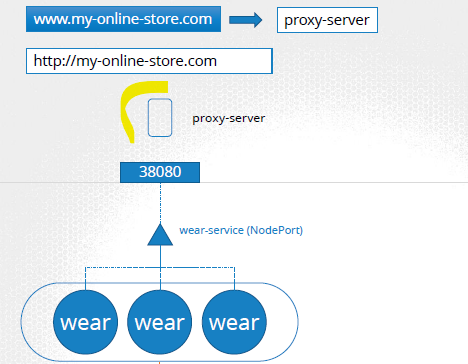
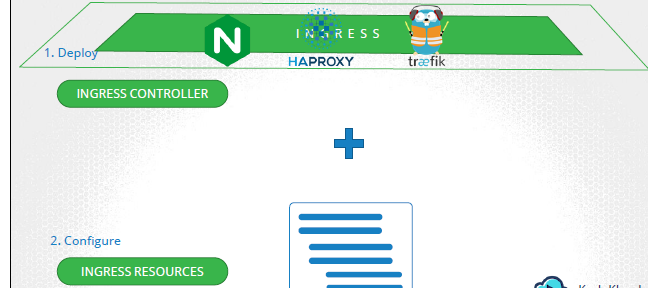
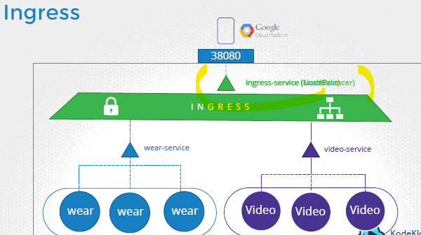
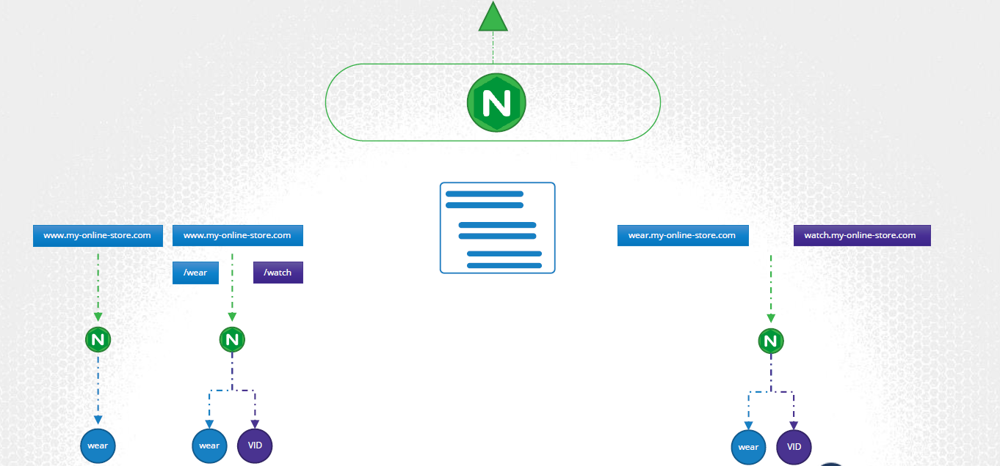
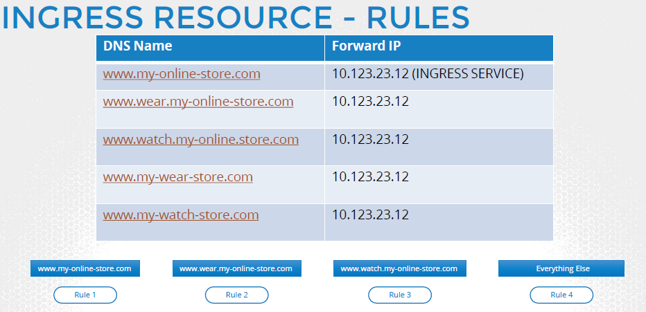

## A. Scenario
- K8s Cluster has : 
- `app-1` : online shop - **deploymnet-object-1**
  - 
  - access app-1:
    - with nodeIp:port
    - with proxy
      - 
    - with `loadBalancer-service-1` + `gcp-lb-1`

- `app-2` : video-stream app - **deploymnet-object-2**
  - deploy it same cluster, as new deploymnet object
  - access : with `loadBalancer-service-2` + `gcp-lb-2`

- add `gcp-lb-3` --> forward/route traffic to  gcp-lb-1 or gcp-lb-2
  - routing rules:
    - /apparel --> gcp-lb-1
    - /video --> gcp-lb-2
- **end result** : gcp-lb-3 >> gcp-lb-1/2 >> k8s service-1/2

- Next, add security (SSL, firewall). but where ? best place,  having less maintenance :
  - add at app-1/2 level : problem , if application grows
  - add at proxy / gcp-lb-1/2/3 level
---  

## B. ingress
- Another k8s object, think of as **Layer-7 load balance** where :
  - will add routing rule, to forward traffic to multiple k8s service/s
  - will add SSL
  - will add firewall
  - thus, simplfies all such config at central place.
- ingress object components:
  - 
  
### ingress controller (pod)
  - proxy server, will be used for routing,forwarding, security
  - need to deploy this server, does not come by default
  - eg: `nginx server` : deploy at as pod 
    - 1 **configmap** for Nginx configuration 
    - 2 **SA** (with access to all these object)
      - 
    - 3 expose this pod with **service** ( NodePort / loadBalancer)
      - 
      

  ```
  #1 
  
  kind: ConfigMap
  apiVersion: v1
  metadata:
    name: nginx-configuration
  spec:
    
  ```

  ```
  #2
  
  kind: ServiceAccount
  apiVersion: v1
  metadata:
    name: nginx-ingress-sa-1
  spec:
   # Roles ?
   # ClusterRole ?
   # RoleBinding ?
  ```

  ```
    #3
    
    apiVersion: v1
    kind: Service
    metadata:
      name: nginx-ingress
    spec:
      type: NodePort
      ports:
        - port: 80
          targetPort: 80
          protocol: TCP
          name: http
        - port: 443
          targetPort: 443
          protocol: TCP
          name: https
      selector:
        name: nginx-ingress
   ```

  ```
  ## ingress-controller pod ##
  
  apiVersion: extensions/v1beta1
  kind: Deployment
  metadata:
    name: nginx-ingress-controller
  spec:
    replicas: 1
    selector:
      matchLabels:
         name: nginx-ingress
    template:
      metadata:
        labels:
        name: nginx-ingress
      spec:
        containers:
          - name: nginx-ingress-controller
            image: quay.io/kubernetes-ingresscontroller/nginx-ingress-controller:0.21.0
            args:
            - /nginx-ingress-controller
            - --configmap=$(POD_NAMESPACE)/nginx-configuration
            env:
            - name: POD_NAME
              valueFrom:
                fieldRef:
                  fieldPath: metadata.name
            - name: POD_NAMESPACE
              valueFrom:
                fieldRef:
                  fieldPath: metadata.namespace
            ports:
            - name: http
              containerPort: 80
            - name: https
              containerPort: 443
  
   ```
---
### ingress resources 
- Ingress Object having:
  - routing / forwarding rules
  - Security : SSL, firewall, etc.
- eg: rule-1(path-1/2/...),  rule-2(path-1/2/...)
  - 
  - 
  
```
apiVersion: extensions/v1beta1
kind: Ingress
metadata:
  name: ingress-1
spec:
  rules:
  - host: my-online-store.com
    http:
      paths:
      - path: /wear
        backend:
          serviceName : wear-service
          servicePort : 80
      - path: /watch
        backend:
          serviceName : watch-service
          servicePort : 80 
             
  - host: watch.my-online-store.com
    http:
      paths:
      - path: *
        backend:
          serviceName : wear-service
          servicePort : 80
          
  - host: watch.my-online-store.com
    http: 
      paths:
      - path: *
        backend:
          serviceName : watch-service
          servicePort : 80
```

