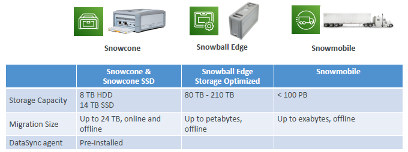

# AWS snow family
 
## A. snowball : Data Migration

### A.1 Snowball `Edge`
- `Use cases`: large data cloud migrations, DC decommission, disaster recovery
- If it takes more than a week to transfer over the network, use Snowball devices!
- challenges without snow:
  - high aws network `cost`
  - `connection` (limited/slow, shared bandwidth, not stable)
  
- `offline portable devices` to perform data migrations
- collect and process data at the `edge`

- supports both - `block volume` + `S3 object storage`
- Type of devices (hdd/NVMe)
  - Snowball Edge `Storage` Optimized : 80/210 TB  | `80 GB RAM, 40 cpu`
  - Snowball Edge `Compute` Optimized : `42/28 TB` | `416 GB RAM, 104 cpu`
- post/offline
  

### A.2 Snowball `Cone`
- Small, portable, light (2 kg)
- `Snowcone` –  `8 TB HDD`  | `4 GB RAM, 2cpu`
- `Snowcone SSD`– `14 TB SSD` | `4 GB RAM, 2cpu`
- send option:
  - post/offline 
  - online:`AWS DataSync` to send/upload data to AWS (`EBS` only) , `not s3`

### A.3 Snowball `mobile`
- size 100 PB
- `truck` (GPS, 24/7 video surveillance)  --> 100 PB + 100 PB + ...  === upto `1 exabyte`
  - 1000 TB = 1 PB 
  - 1000 PB = 1 exabyte 
  - so it `1000,000 TB` or 1 Million TB
- truck/offline

### summary
- 
- 
- Snowball cannot import to Glacier directly

---
## B. SNOW : Edge computing
- edge : location which can produce data, but limited/no internet connectivity, so cannot compute.
- 
- same device as above.
  - run ec2 + lambda
- long term deployment +  1 / 3 year saving
- interact with `aws-cli` or `AWS OpsHub `(ui)

