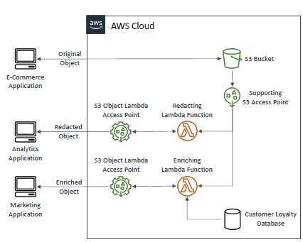
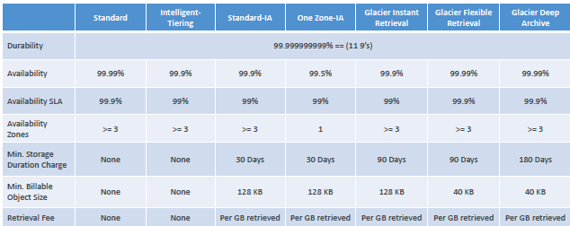

# s3
- `infinitely scaling` storage,  highly `durable`, highly `available`, low `latency` (100-200 ms)
- other services use S3 as an `integration` + main `building blocks` of AWS
- `regional` service. (bucket-name: globally unique, 3-63)
- 3500-5500 (request/sec)/prefix

---
## A. S3: Use case
- `storage` + Hybrid-Cloud-storage , `Archive` ,  `Backup` (eg: snapshot : ebs,efs,db )
- `hosting`: Media, Static website, Application | Software delivery
- `DR` 
  - `cross-region-replication`, move data from region to another then restore.
- on s3 --> run Data lakes & big data `analytics`.

---
## B. S3 : Batch Operation
- Perform `bulk` operations on `existing` S3 objects with a single request.
- `job` : [ list of Object + action + optional param ]
-  Flow ` s3:Inventary` > `s3:Select` > `S3:batch/JOB`  > processed object/s
- use-case/s:
  - Modify object metadata & properties
  - `replication` : Copy objects between S3 buckets
  - `Encrypt` un-encrypted objects
  - Modify ACLs, tags
  - Restore objects from S3 Glacier
  - Invoke Lambda function to perform custom action on each object

---
## C. S3 Bucket
- > s3://my-bucket/my_folder1/another_folder/my_file.txt
  - `bucket` : my-bucket
    - general-purpose + Directory(New)
  - `object`: my_file.txt.
    - max:`5TB`
    - metadata : info about object in k-v form
    - tags
    - versionID
  - `key`: my_folder1/another_folder/my_file.txt.
    - key contain "/", looks like directory but `no-concept-of-directory`
    
  - `access point` : 
    - expose s3 object as public endpoint and allow to do certain things (restricted, IAM policies attached)
    - not all object, select object by prefix
    - has IAM `access point policy` + `dns`
    - eg:
      - access-point-1(policy-1:R,W) <--> s3:bucket-1/area-1/...
      - access-point-2(policy-1:R,W) <--> s3:bucket-1/area-2/...
      - access-point-3(policy-1:R) <--> s3:bucket-1/area-1/... + s3:bucket-1/area-2/...
    - 
    
  - `lambda access point`
    -  once object is fetch want to run some operation on object using lambda.
    - kind of ETL::transform
    - `lambda-access-point-1 <--> lambda-1(runSomeCode)` <--> access-point-1(policy-1:R,W) --> s3:bucket-1/area-1/...
    - 
---
### C.1. S3 bucket: versioning
- enable for each bucket + UI:showVersion.
- can roll back to previous version/s
- protect again un-intended delete.
- delete:
  - `delete` : adds delete marker.
  - `delete marker` : undo delete.
  - UI: show-version > select version > `delete the version` : permanent deletes.

---
### C.2. S3 bucket: Replication (async)
- create replication `rule`.
  - First, `enable version` is must on src and dest buckets + `attach IAM`
  - replicate object + replicate delete marker(y/n)

- only `new` object will be replicated.
- for `old` objects : use `S3 Batch replication`  separately.
- `No chaining`:
  - having b1 --> b2 | b2 --> b3
  - if obj-1 added in b1, it will be replicated to b2 only.
- Type:SRR (same region) + CRR (Cross region)
- CRR (encryption options )
  - `kms keys (single region)` 
    - un-encrypted object --> Replicated to region-2
    - encrypted object (sse-s3, sse-c) --> Replicated to region-2
    - encrypted object (sse-kms) : `key-region-1`
      - specify the kms-key in another region, which will be used for encryption : `key-region-2`
      - update  key-region-2::`custom policy` for your specific access.
      - or, use key-region-2::`default policy` : access already given to all principle in same account.
      - Re-encrypt with key-region-2  
      - finally, replicated to region-2
     
  - `kms keys (multi-region) `
    - un-encrypted object --> Replicated to region-2 : same as abv
    - encrypted object (sse-s3, sse-c) --> Replicated to region-2  : same as abv
    - encrypted object (sse-kms) : `key-1`
      - same key-1 is present in region-1 and region-2
      - but s3 will treat then as diff keys 
      - and, perform: `decryption and rn-encryption` again [IMP]
 
---
## D. S3 > bucket > object - storage Classes
- Amazon S3 `Standard`
  - General Purpose : highly durable/available.
  - Infrequent Access (IA) : low cost, `usecase`:DR-backup/recovery
  - One Zone-Infrequent Access : single-AZ, `usecase`:data which can recreate.

- Amazon S3 `Glacier` : low cost + but retrieval free, `usecase`:archive,
  - Instant Retrieval : retrieval (ms), `min:90 days`
  - Flexible Retrieval : retrieval (1-5 min, 3-5 hr, 5-12 hr:free)  `min:90 days`
  - Deep Archive :   retrieval (12 hr, 48 hr)`min:180 days`

- Amazon S3 `Intelligent Tiering`
  - move object b/w tier based on (usage + config)
  - mix of above classes into single
  - `tiers`:
    - `Frequent Access` tier (automatic): default tier
    - `Infrequent Access` tier (automatic): objects not accessed for 30 days
    - `Archive Instant Access` tier (automatic): objects not accessed for 90 days
    - `Archive Access tier` (optional): configurable from 90 days to 700+ days
    - `Deep-Archive Access` tier (optional): config. from 180 days to 700+ days
- comparison:


### s3 analytics
- on bucketObject (standard GP / Standard IA) --> run `s3 analytics` --> take 24/28 hrs --> `CSV report`
- report gives `recommendation` to create `life cycle rule` to move object b/w storage classes.
- 
- 

---
## E. S3 : Event Notification
- sends `event` to target, quickly.
- target: sns,lambda,SQS, etc
  - s3 --> event --> `sns` (update `sns-policy`, to allow to send event)
  - s3 --> event --> `Lambda` (update `lambda-policy`, to allow to send event)
  - s3 --> event --> `SQS` (update `sqs-policy`, to allow to send event)
  - bts : s3 --> EventBridge (filtering) --> target(18+ services) | also `archive event`, `replay event`, etc
  - could assign iam-role to S3 ?

---
## F. S3 : More
- `multipart`, `transfer-acceleration (UP)`, `byte-range fetch (DOWN)`:
  - upload in multipart if 100MB+,  recommended for 5GB+
  - transfer acceleration (upload) - 4 cent extra/GB, uses `edge-locations`.
  - parallelize GETS to speed up download. can configure how many `bytes` to read.
  - 
  - 

- `server side filtering` 
  - use `S3-select` + `Glacier-Select`
  - filters csv row and column, more like SQL queries. 
  - 

- `requester pay`: network cost on requester
  - 

---
## F. Demo
```  
  - create bucket - bucket-1-us-west-2, will be created in all AZ.
  - disable : ACL, , versioning
  - enable : public access + attach BUCKET POLICIES (read from any principle, resource:*)
  - encryption: SSE-S3 *, SSE-KMS, DSSE-KMS
  - upload png file
  - https://bucket-1-us-west-2.s3.us-west-2.amazonaws.com/Screenshot+2024-07-16+002401.png
  - inspect : 
      - Open link --> `s3 pre-signed url`, credential-info are encode in url.
      - access with public-url :  failed | ok after making public.
  - static website hoisting : enable on bucket + index.html
    - endpoints: https://bucket-1.s3-website.region.amazon.com
    
  // Replication
  - create another  buvket-2-us-west-1
  - create replication rule:
    - add target bucket : bucket-1-us-west-2
    - enable versionsing
    - craete new IAM
    
  // storage classes:
  - bucket-1 > mgt > create Life Cycle rule
    - select object: ALL /  by-prefix/suffix / by-tag
    - create transistion Rule/s
      - rule-1 : move from class1 to clas2 after xxdays
      - ...
      - ... 
    - -create deletion Rule/s
      - delete old version/s
      - delete all version/s
      - mark for delete
      - delete incomplete multi-part
```
---
# S3 Glacier object : Vault lock
- WORM policy : write once, read many.
- set `retention period`, can be extend.
- `usecase`: data retention. and compliance
- `lock` object in glacier
- retention mode: 
  - `compliance` --> no longer be deleted/updated in the future, not even by root.


## S3 oject : lock
- WORM policy.
- set `retention period`, can be extend.
- set (optional) `legal hold` : lock `indefinitely`. (irrespective of retention-period)
- retention mode: 
  - `compliance` --> no longer be deleted/updated in the future, not even by root.
  - `Governance` --> root user can update/delete.

---
# Storage lens service 
- Understand, analyze, and `optimize` storage across entire `AWS Organization` (acct > region > bucket)
- `dashboard` : enable by default/cant delete.
  - aggregated reports/csv gernerted by specific metric --> can publish to CW for free.
  - `advance` metric (available for 15 month), paid
  - `free` metric (available for 14 day, once generated)
  - metric/s :
    - `summary` metric : insight to object -size, count, fastest growing bucket, etc
    - `cost-optimization` metric : insight to non-current, incomplete multiparts, etc
    - `Data protection` metric: count of encrypted Bucket, replication rule
    - `Access-mgt` : object owner
    - `event` metric : s3-eventNotification count, etc
    - `Activity` + `statusCode` : GET, POST, etc +   count of 200, 404, etc
    - `performance` : s3 transfer acce enable count
    
- 

  


