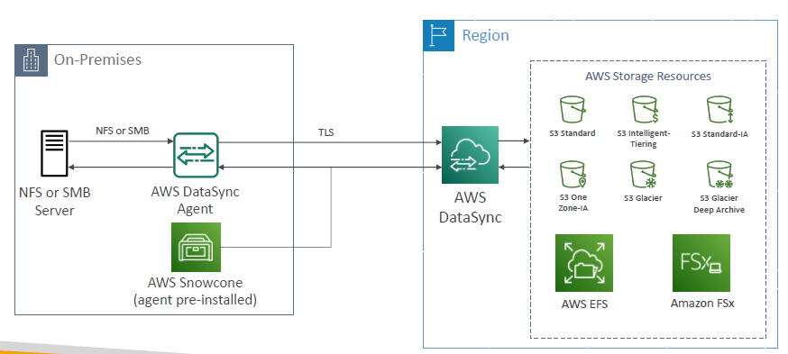
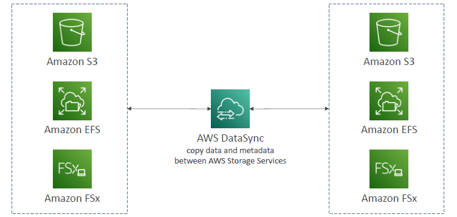

# more
## A. AWS Transfer Family

---
## B. AWS DataSync
- hourly, daily, weekly `sync (not continuous, scheduled)` : Move large amount of data/files to and from 
  - On-prem and aws (using `datasync-agent` - 10 Gbps, use multiple agent)
  - AWS to AWS (no agent)
- on aws its `s3/glacier, EFS, FSx`, where data is synchronized.
- File permissions and metadata are `preserved`
- protocol: NFS-POSIX, SMB
- 
- Notice : TLS; save n/w cost with snowcone
- 

---

# Quick Summary on All storage options
- `S3`: Object Storage
- `S3 Glacier`: Object Archival
- `EBS volumes`: Network storage for one EC2 instance at a time
- `EC2 Instance Storage`: Physical storage for your EC2 instance (high IOPS)
- `EFS`: Network File System for Linux instances, POSIX filesystem
- `FSx`
  - FSx for Windows: Network File System for Windows servers
  - FSx for Lustre: High Performance Computing Linux file system
  - FSx for NetApp ONTAP: High OS Compatibility
  - FSx for OpenZFS: Managed ZFS file system
- `Storage Gateway`: S3 & FSx File Gateway, Volume Gateway (`cache & stored`), Tape Gateway
- `Transfer Family`: FTP, FTPS, SFTP interface on top of Amazon S3 or Amazon EFS
- `DataSync`: Schedule data sync from on-premises to AWS, or AWS to AWS
- `Snowcone / Snowball / Snowmobile`: to move large amount of data to
- `Database`: for specific workloads, usually with `indexing and querying`