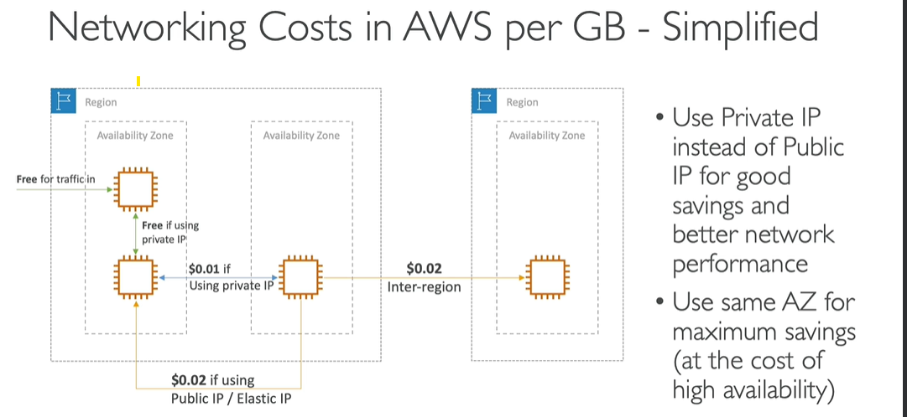
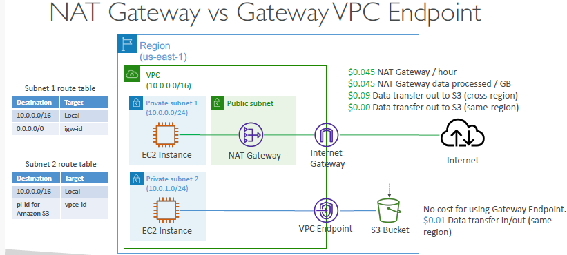

# VPC 4
```
  - network:0 - AWS VPC-1 (vpc)
  - network:1 - internet (public internet)
  - network:2 - Corporate Network (VPN)
  
  - vgw == `Vitual-private GateWay` 
  - cgw == `Customer gateway` / software+hardware, running on customer side / attached `NAT-device`(public-IP-1)
```
## Network topologies

### Scenario-0 : internet
```
network:0,AWS VPC-1 (`rtb-main`) --> `igw`  --> network:1 : 
```
- create igw-1
- update rtb-main with igw-1 entry.

### Scenario-1 : AWS Site-2-site VPN  
```
network:0,AWS VPC-1  (rtb-main) --> [ vgw <---internet---> cgw ] --> network:2(customer-1) 
- this connection are `encrypted` by default.
```
- Step-1: create `vgw-1`, and attached on AWS VPC-1 
- Step-2: create `cgw-1`, with customer details like - public-IP, etc
- Step-3: create `Site2Site VPN` - connect `cgw-1` with `vgw-1`. next create tunnel
  - `tunnel-1` forward
  - `tunnel-2` backward
  - tunnel1/2 == used for single connection
- Step-4: update `rtb-main` : for traffic forwarding between networks.
- optional steps :
  - update sg on ec2.
  - update ACL on subnet.
- 
- 

---
### Scenario-2 : AWS VPN cloudHub
```
- network:0,AWS VPC-1 --> multiple customer/s [ network:2(customer-1), network-3(customer-3),... ]
```
- Step-1: create `vgw-1`, and attached on AWS VPC-1
- Step-2: create `cgw-1,2,3..`, with customer details
- Step-3: create `AWS VPN cloudHub` - link `cgw-1,2,3,...` with `vgw-1`.
- rest of the step same as above.
- 

---
### Scenario-3 : DX (Direct Connect)
```
network:0,AWS VPC-1  (rtb-main) --> `[ vgw <--aws-direct-Location,DX  --> DX:endpoint ]` --> network:2(customer-1)
- no internet
```
- key term : `AWS-Direct-location` (physical loc)
  - AWS VPC -> connect to Dx-location
  - customer --> connect to Dx-location
  - thus, eliminate the use of internet. `NO INTERNET`
  - Provides a `dedicated private connection`
  - `DX:endpoint` : endpoint,to connect it. 
  - benefit: high bandwidth with large dataSet + consistent fast n/w.
  - Types:
    - `Dedicated` : wire ethernet, `1,10,100 Gbps`, fastest
    - `hosted`    : via DX partner `50 500 Mbps`, `1 2 5 10 Gbps`, slow
  - lead/wait time for `new connection `: `1 month` <<<< IMP
  - no encryption by default, can add but bit complex.
  - `resiliency`: 
    - notice : eg: 2 conn vs 4 conn
    - 

- 

---
### Scenario-4 : DX gateway
- shared with multiple aws account **
```
  - customer is connected to dx-1 via dx-1:endpoint
  - 2 or more different VPC are connecting to same DX
    - AWS `VPC-1` --> connect to AWS-Direct-location, `dx-1`
    - AWS `VPC-2` --> connect to AWS-Direct-location, `dx-1`
    - ...
    - ...
```
  - `way-1` : create 2+ vgw
    - AWS `VPC-1` --> `vgw-1` --> dx-1:endpoint
    - AWS `VPC-2` --> `vgw-2` --> dx-1:endpoint
    - ...
    - ...
    
  - `way-2` : create :  `dxg-1 --> vgw-1 --> dx-1:endpint` , on any region
    - AWS `VPC-1` --> `dxg-1` : update rtb-main of vpc-1 with dxg-1
    - AWS `VPC-2` --> `dxg-1` : update rtb-main of vpc-2 with dxg-1
    - ...
    - ...
    - 

---
### Scenario-4 :  DX with Site2SiteVPN(backup)
- create primary : DX
- create Secondary : Site2SiteVPN
- 

---
### Scenario-5.1 : VPC peering
```
 `Aws1::VPC-1` (subnet-11, subnet-22, ...) <---VPC peer---> `Aws1::VPC-2` (subnet-21, subnet-22)
```
- point-to-point connection between two VPCs.
- establishes a `direct` network connection between two VPCs, enabling traffic to be routed between them using `private IP` addresses.
- Ideal for connecting `two` distinct VPCs, either within the same account or across different accounts, regions, or even AWS Organizations.
- Limited by the number of peering connections per VPC (up to 125 by default).

---
### Scenario-5.2 : VPC `Sharing`
- allows multiple AWS accounts within the `same AWS Organization` to share the same VPC, managed by a central account.
- The owner account creates and manages the VPC, while participant accounts can provision resources in `shared subnets` of that VPC using AWS Resource Access Manager (`RAM`)
- `Resources` within the shared VPC can communicate with each other over `private IP` without additional configuration.
- Since all resources are within the same VPC, there are no additional data transfer costs. :)

---
##  transient Gateway (video:344)
- network topolgies can be complicated 
- transient Gateway, simplify above topologies
- define everything at single place : rtb of transient gateway
- supports `IP-multicast` ?
- 
- create multiple tunnels in `AWS Site-2-site VPN` : `ECMP routing`
  - 
- shared with multiple aws account **
- AWS Transit Gateway with `Resource Access Manager` (RAM)

---
## Traffic Mirroring:
- Steps/use-case:
  - capture traffic (from Specific `source ENIs`) 
  - route/send to `ELB/NLB` or `target ENI` 
  - ec2-i(security appliance) 
  - perform inspection (threat monitoring, etc)
- 

---
## Summary
- `CIDR` – IP Range
- `VPC` – Virtual Private Cloud => we define a list of IPv4 & IPv6 CIDR
- `Subnets` – tied to an AZ, we define a CIDR
- `Internet Gateway` – at the VPC level, provide IPv4 & IPv6 Internet Access
- `Route Tables` – must be edited to add routes from subnets to the IGW, VPC Peering Connections, VPC Endpoints, …
- `Bastion Host` – public EC2 instance to SSH into, that has SSH connectivity to EC2 instances in private subnets
- `NAT Instances` – gives Internet access to EC2 instances in private subnets. Old, must be setup in a public subnet, disable Source / Destination check flag
- `NAT Gateway` – managed by AWS, provides scalable Internet access to private EC2 instances, when the target is an IPv4 address
- `NACL` – stateless, subnet rules for inbound and outbound, don’t forget Ephemeral Ports
- `Security Groups` – stateful, operate at the EC2 instance level
- `VPC Peering `– connect two VPCs with non overlapping CIDR, non-transitive
- `VPC Endpoints` – provide private access to AWS Services (S3, DynamoDB, CloudFormation, SSM) within a VPC
- `VPC Flow Logs` – can be setup at the VPC / Subnet / ENI Level, for ACCEPT and REJECT traffic, helps identifying attacks, analyze using Athena or CloudWatch Logs Insights
- `Site-to-Site VPN` – setup a Customer Gateway on DC, a Virtual Private Gateway on VPC, and site-to-site VPN over public Internet
- `AWS VPN CloudHub` – hub-and-spoke VPN model to connect your sites Direct Connect – setup a Virtual Private Gateway on VPC, and establish a direct private connection to an AWS Direct Connect Location
- `Direct Connect Gateway` – setup a Direct Connect to many VPCs in different AWS regions
- `AWS PrivateLink` / VPC Endpoint Services:
  - Connect services privately from your service VPC to customers VPC
  - Doesn’t need VPC Peering, public Internet, NAT Gateway, Route Tables
  - Must be used with Network Load Balancer & ENI
- `ClassicLink` – connect EC2-Classic EC2 instances privately to your VPC
- `Transit Gateway` – transitive peering connections for VPC, VPN & DX
- `Traffic Mirroring` – copy network traffic from ENIs for further analysis
- `Egress-only Internet Gateway` – like a NAT Gateway, but for IPv6 targets

---
## Cost / pricing (per GB)
- if 2 DB are in same AZ, replication cost will be less, but availability will be less.
- 
- `egress` - $ : AWS --> outside | `ingress` - free : outside --> AWS
  - 
- choose AWS direct location, close/same as your location/region-AZ
- 
  - s3 --> Cloudfront `free`
  - s3 --> internet + internet(accelerated) `9 cent, 9+4=13cent`
  - s3 --> region1:region2 (replication) `2 cent`
- 
  - prefer VPC-endpoint(s3-gateway) `1 cent`


