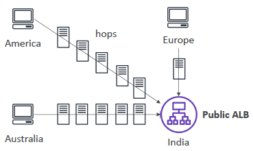
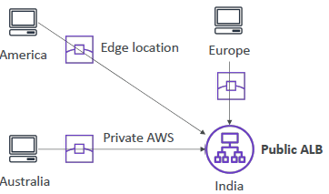

# AWS Global accelerator

## key term
- `Uni-cast IP` : one ip assigned to `one` server
- `Any-cast IP` : same ip assigned to `multiple` server
  - but, client req goes to geo close loc.

## problem statement - 1
- `apb-1(api-1)` is running on region-1 `mumbai`
  - client in `USA` --> hops overs multiple server/s s1 > s2 > s3 > s4 > s4 --> to reach `alb-1`
  - client in `europe` --> hops overs multiple server/s s1 > s2 > s3 --> to reach `alb-1`
  - client in `nepal` --> hops overs few server/s > s1 --> to reach `alb-1` 
- this creates `high latency` + `loss of n/w risk`.

## Solution - 1
- `apb-1(api-1)` is running on region-1 `mumbai`
- create ANY-cast ip for ALB-1, `ip-1`
- hit ip-1 --> send traffic to closet edge loc --> privateLink + intelligent routing --> alb-1

  - client in `USA` --> close-edge-loc-1  --> `ip-1` --> to reach alb-1
  - client in `europe` --> close-edge-loc-2 --> `ip-1` --> to reach alb-1
  - client in `nepal` --> close-edge-loc-3 --> `ip-1` --> to reach alb-1
  
- AWS `Global accelerator` help to do same.
  - create anycast for my alb/app
  - leverage aws `edge-location` + `privateLink` to reach out target server fast.
  - benefit:
    - low `latency`, consistent performance.
    - fast `failover`, 
    - integrated with AWS-sheild, thus provides `DDoS protection`
- demo:
```
- launch ec2-1 in region-1 (us-east-1)
- launch ec2-2 in region-2 (us-west-1)
- launch alb-1 in region-2 with ec2-3
- create accelerator-1 : dn-1
- create Listener/s :
    - listener-1 : 
        - TCP:80
        - endpoint-group: 
            - endpoint-1 : ec2-1 
            - endpoint-2 : ec2-2
            - endpoint-3 : alb-2
            - endpoint-4 : static-ip 
        - setup health as well, for each endpoint.
- hit dn-1 url:
    - goes to us-east-1,ec2-2 everytime, since iam in CA,USA

// failover
- make ec2-1 fail, update sg : deny traffic.
- -hit dn-1 url
    - goes to us-east-1,ec2-1 now
    
```
---
## Screenshots:


