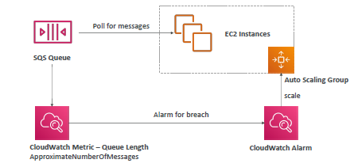
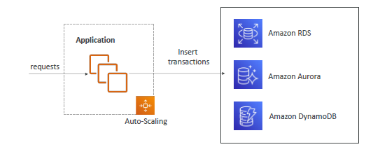

- coupled app (sync) , de-couple app (Async)

## de-couple Models :
  - `queue` :  SQS
  - `pub/sub` : SNS
  - `data-stream` : kinese Firehose

---
## use-case
1. `SQS:queue:logs` >> CW >> metric >> alarm --> ASG [ ... multiple consumers ec2-i... ]
    - 
2. ASG [ FE-1, FE-2, ... ] ---> stage all request in Queue --- > ASG [ BE-1, BE-2, ...]
    - 
3. Overloaded DB request:
- ASG [ FE-1,...] --> Queue-1(Stage client request) --> ASG [BE-1,...] --> store to DB
- ASG [ FE-1,...] --> Queue-1(Stage client request) --> ASG [BE-1,...] OVERR-LOADED --> store to DB (`lose some insert`)
- ASG [ FE-1,...] --> Queue-1(`Stage client request`) --> ASG [BE-1,...] --> Queue-1(`stage-DB-request`) -->  ASG [repo-1,...]
- 
- 

---
## SQS 
### Queue : Standard 
- > multiple p1,p2,p3, ...  ---> [queue] ---> multiple consumers in parallel (C1,C2,C3, lambda-Consumer, ... )
- oldest & Fully managed : scales auto
- unlimited throughput,  low latency (< 10ms), max-256KB
- duplicate msg : `at least once delivery`  : multiple consumer can receive same message. `UI : Notice - receive Count`
- no ordering : `best effect ordering`
- persisted until consumed for max `14 day retention`. default-4days
- consume has to delete message, this gaureentee no other consumer see the message.
- `visibility timeout, 0-12 hr` : 
- Long polling (message receive wait time : 1-20 sec)
  - poll-1 API -- wait 10 sec -- poll-1 API -- wait 10 sec ...
  - Consumer can optionally “wait” for messages to arrive, if there are none in the queue
  - long poll preferred : more gap in api calls, but `increase latency` :(
  
### Queue : FIFO
- name : has suffix `.fifo`
- keep single consumer
- order, no duplicate consume
- Limited throughput: `300 msg/s`

---
## SQS : Security
- Encryption
  - In-flight encryption using `HTTPS` API (SSL/TLS)
  - At-rest encryption using KMS keys (`sse-sqs`, `sse-kms`, `sse-c`)
  - `Client-side encryption` if the client wants to perform encryption/decryption itself
- `SQS bucket policy` : eg: cross queue access, allow other service, etc
- principle (attach `IAM policy`) --> access queue

## SQS : demo
```
- create queue : queue-1
- Type : standard ** + FIFO
- configuration:
  - `visibility timeout` : 30
  - `delivery delay`
  - `receive message weight time`
-  encrytion : sse-sqs
- policies:
    - SQS access policy : json
    - Redrive allow policy : pending
- Dead-letter queue
- tags

// READY
- send : hellow world
- receive : poll messages + delete
- purge : delete all message.
```
---
## Screenshot:
- 

