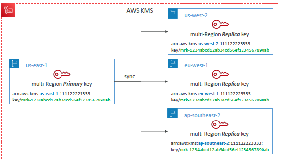

- encryption at `fly` (TLS / SSL certificate)

## A. KMS : Encryption(rest) 
- flows :
  - `a. server side`
    - eg:  
      - file --> upload --> public internet --> 
      - https(encryption) --> AWS-acct --> decrypted/TLS --> s3(file uploaded) --> 
      - S3 make KMS-api --> KMS:kms-key --> stored encrypted
  - `encryption outside AWS` : `b. client side encryption`, if:
    - Don't trust server
    - cant make KMS api call
  
- integrated with `IAM`. check more.
- Audit `AWS-key-usage`,  using `CloudTrail`
- use cases:
    - #1. encrypt password with kms-key --> then store to secret manager
*** 
### kms-keys : symmetric
-  single-key (private), user cant-see, aws use to encrypt/decrypt 
- Types:
  - `AWS owned` : kms-s3. kms-sns, etc FREE
  - `AWS managed key` :  FREE. request another key from aws
  - `Customer manged key` : customer upload it s own key. 
    - price : 1$/month + calls : `3 cent / 10,000 call`
- rotation:  yearly
***
### kms-keys : A-symmetric 
- for: client side encryption
- customer download public-key, use it for encryption.
- Scenario : 
  - ( `public-key` + data) --> uploaded `encrypted` data to s3-bucket-1.
  - Another bucket, s3-bucket-`2` need data, will make `KMS api call` to get `decrypted` data
  - and decryption will be done by it `private key`.

---
## B. KMS Policy
- like s3 policy
- define who can access key.
- default policy : allows everyone in account
- create custom policy : for cross account access
- eg-1: 
  - lambda-1 copy ebs snapshot from one region to another region
  - lambda-1 must have access to 
    - region-1-EBS-volume + region-1-key (to decrypt)
    - region-2-key (to re-encrypt)
  - update custom policy accordingly
- eg-2: cross account kms access
  - 

---
## C. Regionality:
- `single regional` : same key cannot be present in 2 diff regions.
    - Scenario: cross region ebs-snapshot copy
        - ebs-volume in region-1-`az1` --> region-1-key --> snapshot>encrypt(r1-k1) --> restored to region-1-`az2/3` : VALID
        - ebs-volume in region-1-`az1` --> region-1-key --> snapshot>encrypt(r1-k1) --> restored to `region-2`-az1  : `INVALID`
        - ebs-volume in region-1-`az1` --> region-1-key --> snapshot > encrypt(r1-k1) > decrypt(r1-k1) --> `re-encrpted with region-2-key` --> restored to region-2-az1 : valid

- `multi regional` : same key is replicated over regions.
    - looks simple, but not recommended
    - `primary` (policy-1) + `replicatedd key` (policy-2)
    - policy can not be modified for each region separately.
    - purspose :
        - encrypt in one region and use/decrypt in another region, seamlessly
        - don't need to re-encrypt again with another region key
    - use-case :
        - global Aurora DB,
        - global Dynamo DB
        - having client side encryption

- eg: S3 CRR replication with KMS : [here](./../02_storage/03_S3-1.md#security-while-crr-replication)

---
## D.Demo
```
- crate key-1
- choose : regionality : single region
- choose access permision : 
    - check boxes - check who can access
    - cross account access (optinal) : add another aws acct
    - this will auto create access policy
- rotation yearly : y/n
- review and done

// READY
- actin:
    - disable
    - schedule for deletion 
   
- use aws-cli : encypti failtext with above key-1    
```

---
## Z. Screenshot
flows
- 
- 
- 
---
cross region copy
- 
---
regional key with global dynao and aurora
- 
---
- 
---
- 