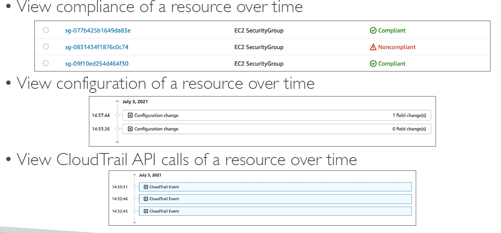
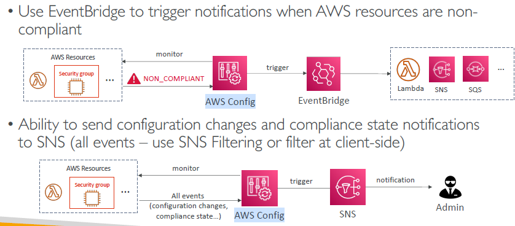

# AWS config (regional)

- on AWS resource => changes/modification happens / or scheduled =>  triggers  `config-Rule` evaluation 
- record resource `auditing and Compliance` using rules. 
- Also `does not deny`, stops from  happening <<<

- Example of rules:
  - Check unrestricted SSH access to sg 
  - Do we have publicly accessed s3 buckets ? 
  - Any changes made on ALB ?
  - etc
  
- on `console`, view :
  - for each resource : can see **configured rules** , Json : configuration
  - **compliance** status
  - **CloudTrail api call** for resource.
  - event table : timeline of changes and other event.
  
- can trigger `remediation actions` :
  - `SSM Automation Document`
  - `custom` Automation Document, eg:
    - 

- `Notification`
  - use Event-Bridge Event
  - or, use SNS -> filter -> subscriber
  
## Config Rule
  - `AWS managed` ( already defined, 75+)
  - `Custom rules` (define by L), eg:
    - evaluate if each EBS disk is of type gp2
    - evaluate if each EC2 instance is t2.micro

## Pricing: 
- no free tier, $0.003 per `configuration item` recorded per region,
- $0.001 per config rule `evaluation` per region

---
## demo

```
- AWS config, option:
    - Record for all resource **
    - Record for specfic resource
- create role-1
- choose delivery method: S3 bucket ** / cross acct bucket
- stream config change to SNS : T/F
- Rules (75 + ) : checkbox
    - approved amis by Id > enter parameter/s : ami id 
    - approved amis by tag
    - restricted-ssh > no parameter
        - play around > add/remove inbound rule for port 22/ssh
        - and check compliance status

```
---

## Screenshots



