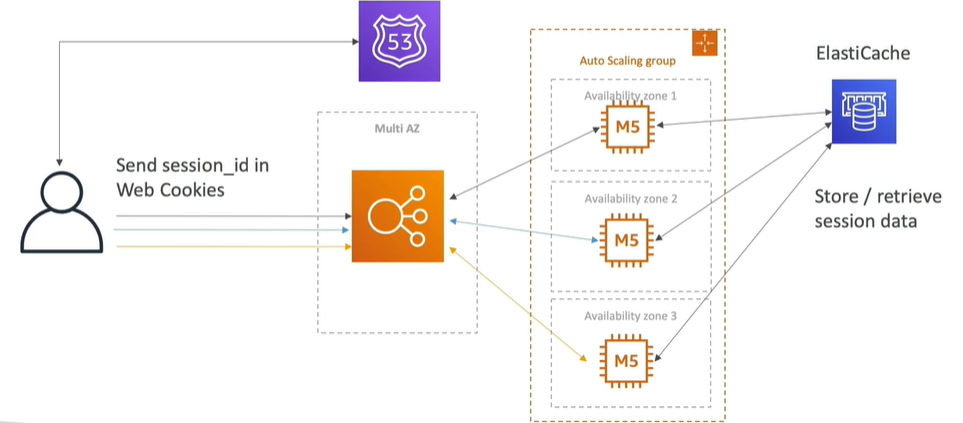
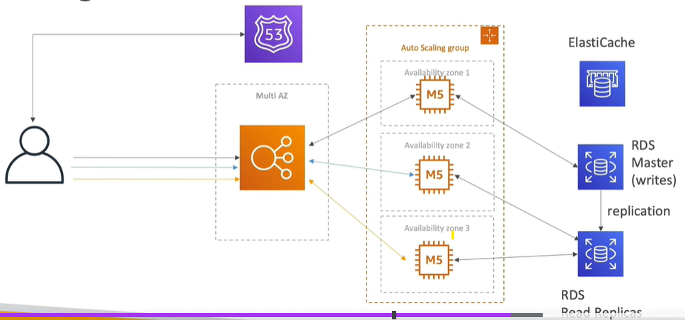
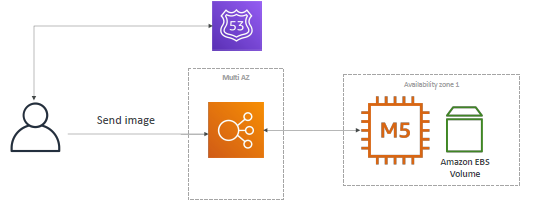
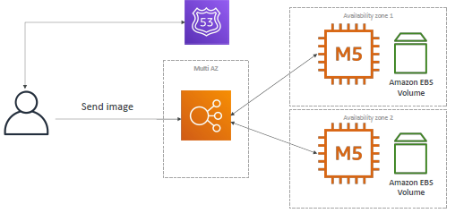
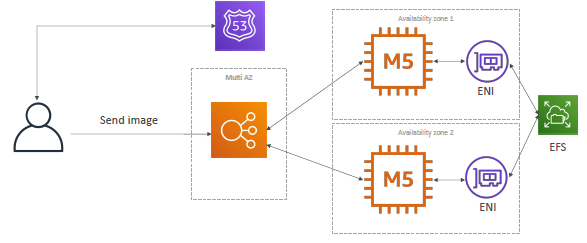

# SSA Discussion

## A. MyClothes.com (Stateful)
- has database for each user
- has user session data in shopping cart.
---
### `Problem-1`:  cart lost > user request goes to different ec2-i everytime. 
  - Solution-1 : use `ELB stickiness`.
  - Solution-2 : `client side cookies` to maintained cart. FE developer (make server stateless)
    - client side cookies can alter by hacker
    - cannot store large-dataset
---
### `Problem-2 `: client side cookies can alter by hacker.
  - Solution-1 : use ElasticCache (server side cache). 
  - solution-2 : can use dynamoDB as well for temp record with TTL.
  - 

### `problem-3` : Persist user data
  - use RDS
  - also,update sg to allow restricted traffic.
---
### `problem-4` : read performance issue
  - add RDS Read replicas
  - use elastiCache to cache frequently access use data.
  - 

---
### `problem-5` : RDS and Elasti-cache : Availability / DR
  - use multi-AZ

---
## B. wordpress (stateful)
- upload and store image on volumes.
- 
- 
---
### `Problem-1`:  multiple Volume, no track which image is which volume
- use EFS
- 

---
## C. more
### `problem-1 ` : Quickly instantiate App
- `Golden AMI pattern` : Install your applications, OS dependencies etc.. beforehand and launch your EC2 instance from the Golden AMI
- Bootstrap using `User Data`: For dynamic configuration, use User Data scripts.
- Hybrid: mix Golden AMI and User Data (Elastic Beanstalk).

### `problem-2 ` Quickly restore RDS Databases:
- Restore from a snapshot: the database will have schemas and data ready!

### `problem-3 ` Quickly restore EBS Volumes:
- Restore from a snapshot: the disk will already be formatted and have data!

---

use `BeanStalk` (managed srv), if dont want to deal with all above things, and have things already in place.

