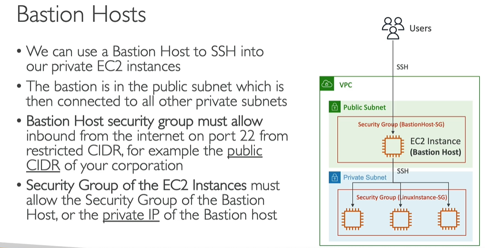

# VPC-2

## 1. access ec2-i in private subnet
### 1.1. bastion host : SSH
- access ec2-i in private subnet from  [ public subnet(igw-1) > public-ec2-i : bastion instance ]
- eg: allow `SSH` to ec2-i in private subnet.
  - just update SGs:
      - sg-bastion : inbound : source:selected client public, to port 22(SSH)
      - sg-ec2-i : inbound : cUSTOM >> source:sg-bastion, to port 22(SSH)
  - 
  - demo:
    - ssh to public bastion 
    - in bastion, add keypair for private ec2-i.
    - from bastion,  SSh to private ec2

### 1.2. NAT instance : https / http
- > outdated,after 2020 : use NAT-gateway 
- ec2-i1 (private subnet) --> http --> server(ccgg.com)
- ec2-i1 (private subnet) --> http --> ` NAT-i (public subnet) `--> http --> server(ccgg.com)

- `NAT-i` (PreConfigured Linux AMI, `amzn-ami-vpac-nat-<year>.xxxxxxx-<cpu-arch>` )
  - has elastic-IP
  - disable : `source/destination IP check`
  - basically, it re-writes `src` and `dest`.
  - Also, update rtb of your vpc/subnet to forward traffic to NAT-instance.
  - Also, update sg on your ec2-i, allow SSH and http/s traffic in/out.
    - inbound (restrict) : 
      - SSH,   source: Anywhere
      - HTTP,  source: VPC-CIDR - web
      - HTTPs, source: VPC-CIDR - web
      - ICMP,  source: CIDR-VPC - for ping request.
    - outbound : default : all outgoing allowed.
  - 

---
## Screenshots:
- 

