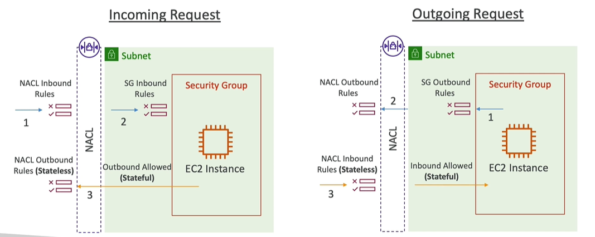
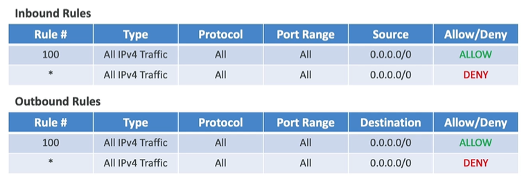

# VPC 3

## Network ACL ( NACLs )
- Network - Access control lst
- similar to SG/Firewall, another layer of traffic check at `subnet level`
- `stateless` :  
  - inbound rule is checked > req allowed > response came > outbound rule is checked.
  - return traffic is automatically allowed
  - 
- ACL : rules
  - 1-32766 (high to low precedence), use increment of 100.
  - first matching rule, dreive decision.
  - `*` last rule, denies a request.
- default NACL:
  - allows everything in/out.
  - don't change it, rather create new ACL and assiciate with your subnet.
    - subnet <--1 to 1--> ACL
  - 
- sg vs ACL
  - Operates at the instance level | subnet level
  - Stateful| Stateless: return traffic must be explicitly allowed by rules (think of ephemeral ports)
  - `allow` rules only |  `allow/deny` rules
  - `All` rules are evaluated | Rules are evaluated `in order` (lowest to highest) and `first match wins`.
- 
- demo: `sg + acl combination works`
``` 
  - ec2-i1-sg (webapp running) : allow http traffic
  - subnet-acl : 
    - inbound rule 
      - `100` allow http,`*`deny http : worked 
      - * allow http,`100`deny http : did not work
    - outbound rule
      - ...
      - try and check
```
---
## VPC peering
- connects 2 VPS
- eg: 
  - `Aws1::VPC-1` (subnet-11, subnet-22, ...) <---VPC peer---> `Aws1::VPC-2` (subnet-21, subnet-22)
  - `Aws1::VPC-1` (subnet-11, subnet-22, ...) <---VPC peer---> `Aws2::VPC-2` (subnet-21, subnet-22) : cross account
- `NOT Transitive` : 
  - VPC-1  <--> VPC-2  <--> VPC-3 :: this does not mean VPC-1 can connect VPC-3
  - create `dedicated` connection using VPC-peer.
- Also, `no overlapping CIDR`
- demo: 
```
#1. connecting ec2-i on vpc-1 to ==> ec2-i on default-vpc, in same AWS account
- having VPC-1 (cidr1) + default-VPC(cidr2) 
- create `VPC-peer-1` : select vpcs -> ( VPC-1 + default-VPC )
- update main-rtb of both VPC:
  - vpc-1-main-rtb       : [ destinition:cidr2 => VPC-peer-1 ]
  - default-vpc-main-rtb : [ destinition:cidr1 => VPC-peer-1 ]
- Now route going both ways :) 
```

---
## VPC Endpoint

---
## VPC Flow Logs


  
