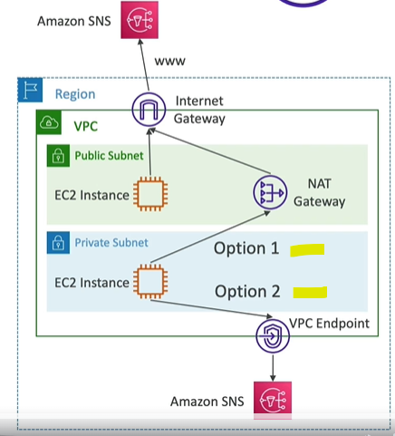
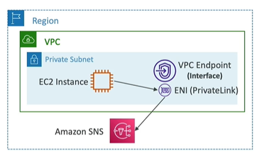

# VPC 3

## Network ACL ( NACLs )
- Network - Access control lst
- similar to SG/Firewall, another layer of traffic check at `subnet level`
- `stateless` :  
  - inbound rule is checked > req allowed > response came > outbound rule is checked.
  - return traffic is automatically allowed
  - 
- ACL : rules
  - 1-32766 (high to low precedence), use increment of 100.
  - first matching rule, dreive decision.
  - `*` last rule, denies a request.
- default NACL:
  - allows everything in/out.
  - don't change it, rather create new ACL and assiciate with your subnet.
    - subnet <--1 to 1--> ACL
  - 
- sg vs ACL
  - Operates at the instance level | subnet level
  - Stateful| Stateless: return traffic must be explicitly allowed by rules (think of ephemeral ports)
  - `allow` rules only |  `allow/deny` rules
  - `All` rules are evaluated | Rules are evaluated `in order` (lowest to highest) and `first match wins`.
- 
- demo: `sg + acl combination works`
``` 
  - ec2-i1-sg (webapp running) : allow http traffic
  - subnet-acl : 
    - inbound rule 
      - `100` allow http,`*`deny http : worked 
      - * allow http,`100`deny http : did not work
    - outbound rule
      - ...
      - try and check
```
---
## VPC peering
- connects 2 VPS in `same region`.
  - `Aws1::VPC-1` (subnet-11, subnet-22, ...) <---VPC peer---> `Aws1::VPC-2` (subnet-21, subnet-22)
- `NOT Transitive` : 
  - VPC-1  <--> VPC-2  <--> VPC-3 :: this does not mean VPC-1 can connect VPC-3
  - create `dedicated` connection using VPC-peer.
- Also, `no overlapping CIDR`
- demo: 
```
#1. connecting ec2-i on vpc-1 to ==> ec2-i on default-vpc, in same AWS account
- having VPC-1 (cidr1) + default-VPC(cidr2) 
- create `VPC-peer-1` : select vpcs -> ( VPC-1 + default-VPC )
- update main-rtb of both VPC:
  - vpc-1-main-rtb       : [ destinition:cidr2 => VPC-peer-1 ]
  - default-vpc-main-rtb : [ destinition:cidr1 => VPC-peer-1 ]
- Now route going both ways :) 
```

---
## VPC Endpoint
- check below connection/comm:
  - a. aws1:region-1:ec2-i -->    aws1: region-1:other-services(CloudWatch,s3, etc)
  - b. aws1:region-1:ec2-i -->    aws1: `region-2`:other-services
  - c. aws1:region-1:ec2-i -->   `aws2` : `region-X`:other-services
  - ...
  - ...
  - aws-?:region-?:service-? --> `some networking involved` -->  aws-?:region-?:service-?
    - public network / internet
    - AWS internal secure/fast network.
  
  
- eg: awsSDK(Java):running on `Lambda` ---> `options-?` --> accessing `sns` 
  - option-1 : `IWG`, since all aws service are publically exposed
    - left VPC > internet > VPC
    - > this is what happing in ccgg:mapss
    - 
  - option-2 : `VPC endpoint`
    - VPC > uses `aws-private-network/link` > VPC : `remains on VPC`
    - better: simplifying network to access internal resource
    - remove need of IGW + nate-gateway, also scales horizontally
    - Type:
      - `interface` : $
        - use with ALL services
        - AWS use PrivateLink to comm.
        - First, attach `ENI` to aws resource (sny). special ENI ?
        - update security group as per these ENI.
        - 
      - `Gateway` : free
        -  Avialble for  S3 and DynamoDB, only 
        - `s3-gateway` : aws create special gateway to access global s3 services.
        - `DynamoDB-gateway` :  aws create special gateway to access global Dynamo DB.
        - update rtb with these gateway/s, like wwe did for igw,nat,etc.
        - 

- demo:
```
- vpc-1 >  public-subnet-1 (ec2-i1) > rtb: igw-1 (was present)
- connect,SSh to ec2-i1 > aws ls s3 : works becuase of igw-1
- remove igw-1 from rtb
- aws ls s3 - no response
- Fix with VPC-endpoint:
  - a.  create interface : 
    - name: vpc-endpoint-interface-1
    - select service (to)
    - select vpc  (from)
    - select AZ + subnet, where these will be deployed.
    - add sg <<<<
  - b. s3 gateway:
    - select vpc
    - select rtb, to be updated.
- aws ls s3 : works now, because of s3-gateway (recommended to use) / s3-private-Link
```
---
## VPC Flow Logs


  
