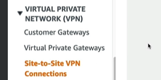
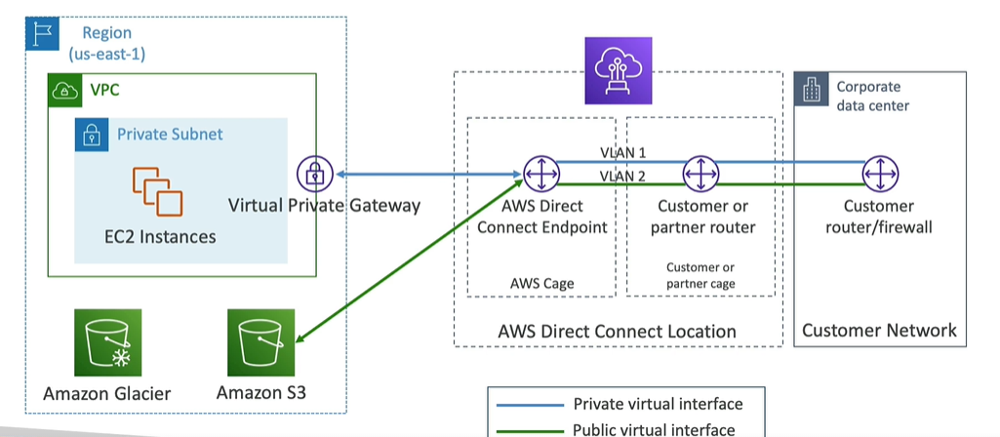

# VPC 4
```
  - network:0 - AWS VPC-1 (vpc)
  - network:1 - internet (public internet)
  - network:2 - Corporate Network (VPN)
  
  - vgw == `Vitual-private GateWay` 
  - cgw == `Customer gateway` / software+hardware, running on customer side / attached `NAT-device`(public-IP-1)
```
## Establish inter-connection

### Scenario-0 : internet
```
network:0,AWS VPC-1 (`rtb-main`) --> `igw`  --> network:1 : 
```
- create igw-1
- update rtb-main with igw-1 entry.

### Scenario-1 : AWS Site-2-site VPN  
```
network:0,AWS VPC-1  (rtb-main) --> [ vgw <---internet---> cgw ] --> network:2(customer-1) 
- this connection are `encrypted` by default.
```
- Step-1: create `vgw-1`, and attached on AWS VPC-1 
- Step-2: create `cgw-1`, with customer details like - public-IP, etc
- Step-3: create `Site2Site VPN` - connect `cgw-1` with `vgw-1`.
- Step-4: update `rtb-main` : for traffic forwarding between networks.
- optional steps :
  - update sg on ec2.
  - update ACL on subnet.
- 
- 

---
### Scenario-2 : AWS VPN cloudHub
```
- network:0,AWS VPC-1 --> multiple customer/s [ network:2(customer-1), network-3(customer-3),... ]
```
- Step-1: create `vgw-1`, and attached on AWS VPC-1
- Step-2: create `cgw-1,2,3..`, with customer details
- Step-3: create `AWS VPN cloudHub` - link `cgw-1,2,3,...` with `vgw-1`.
- rest of the step same as above.
- 

---
### Scenario-3 : DX (Direct Connect)
```
network:0,AWS VPC-1  (rtb-main) --> `[ vgw <--aws-direct-Location,DX  --> DX:endpoint ]` --> network:2(customer-1)
- no internet
```
- key term : `AWS-Direct-location` (physical loc)
  - AWS VPC                       --> connect to AWS-Direct-location
  - on-prem data-center, customer --> connect to AWS-Direct-location
  - thus, eliminate the use of internet. `NO INTERNET`
  - Provides a `dedicated private connection`
  - `DX:endpoint` : endpoint,to connect it. 
  - benefit: high bandwidth with large dataSet + consistent fast n/w.
  - Types:
    - `Dedicated` : wire ethernet, `1,10,100 Gbps`, fastest
    - `hosted`    : via DX partner `50 500 Mbps`, `1 2 5 10 Gbps`, slow
  - lead/wait time for `new connection `: `1 month` <<<< IMP
  - no encryption by default, can add but bit complex.
  - `resiliency`: 
    - notice : eg: 2 conn vs 4 conn
    - 

- 

---
### Scenario-4 : DX gateway
```
  - customer is already connected to dx-1
  - AWS `VPC-1` --> connect to AWS-Direct-location, `dx-1`
  - AWS `VPC-2` --> connect to AWS-Direct-location, `dx-1`
  - ...
  - ...
```
  - `way-1` : create 2+ vgw
    - AWS `VPC-1` --> `vgw-1` --> dx-1:endpoint
    - AWS `VPC-2` --> `vgw-2` --> dx-1:endpoint
    - ...
    - ...
    
  - `way-2` : create :  `dxg-1 --> vgw-1 --> dx-1:endpint` , on any region
    - AWS `VPC-1` --> `dxg-1`
    - AWS `VPC-2` --> `dxg-1`
    - ...
    - ...
    - 
