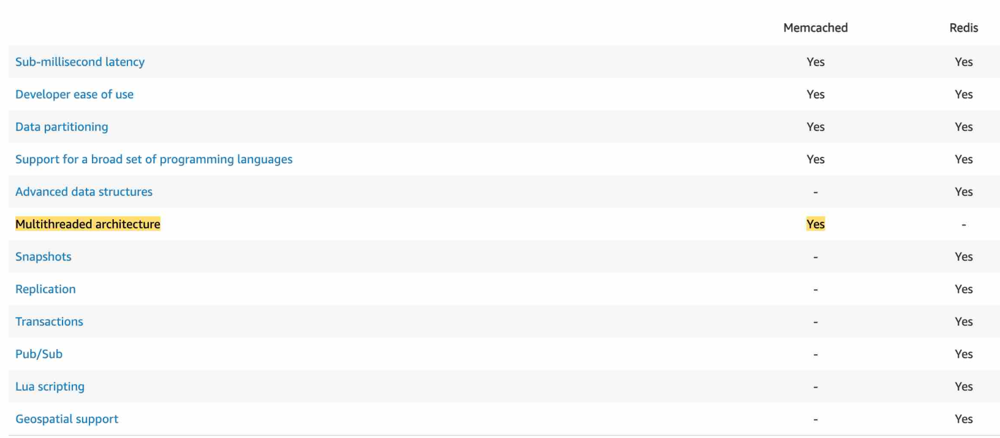
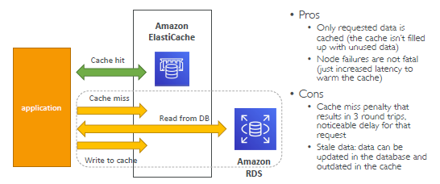
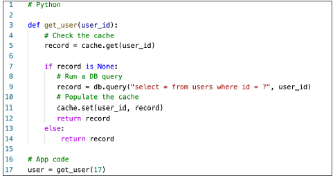
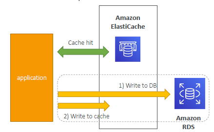
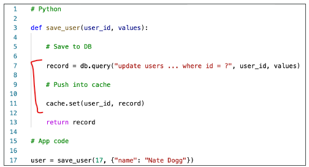

- https://aws.amazon.com/caching/implementationconsiderations/
---
# ElastiCache
- key-value
- if data changing slowly, then have it. eg:
  - `key-value` caching
  - `aggregations-results` caching
  - ...
- AWS offering :  
  - `Redis`,
  - `MemCache`
  - `MemoryDB` has Redis like api.
- **advantages**:
  - sub ms latency.
- **negative side**
  - need application code changes.
  - Data may be out of date, eventually consistent.
  - not suited for un-structured  data.
  
- **usecase**: to significantly improve latency and throughput for: :dart:
  -  **read-heavy application workloads** 
    - (such as social networking, gaming, media sharing, leaderboard, and Q&A portals) 
  - **compute-intensive workloads**
    
## A cache use-cases
### **Database Read**
  - prg <--- DB (state)
  - prg (`code` changes to use cache ) <--- `Cache` <--- DB(Data) : for stateless Application
    - `low latency`
    - `high performance`
    - `reduce load` off of databases for read intensive workloads
    - 
    - lazy loading(stale read) and write-through(sync cache with DB)
### **Maintain user Session**
  - 

---
## B Type
###  1 `Redis` 
- think of RDS, similar :point_left:
- supports advance data structure. :point_left:
- internal: 
  - uses `Sets`(uniqness) and `SortedSets` (uniqueness + ordering)
  - `cluster` > `shard`(node group) > `node`(cache)
  - One primary Node (choose: ec2 intance type)
  - select upto **5 Read Replicas** to scale reads and have high availability :point_left:
    - Read replica-1 --> az-1
    - Read replica-2 --> az-2, etc
    - ...
  - enable/disable: `Multi AZ` with Auto-Failover, more cost.
    - stand-by replica-1 --> az-1
    - stand-by replica-2 --> az-2, etc

- **use case**    
  - `millions of requests / second` for **real-time applications** 
    - in Gaming, Ad-Tech, Financial Services, Healthcare, and IoT. 
  - popular choice for :
    - caching, 
    - session management, 
    - gaming, leaderboards, 
    - real-time analytics, 
    - **geospatial**, :dart:
      - purpose-built commands for working with real-time geospatial data at scale.
      - operations like finding the distance between two elements (for example people or places)
      - **GEOADD, GEORADIUS, GEODIST**
    - chat/messaging, 
    - media streaming, 
    - and pub/sub apps.

#### Redis::Demo
```
- Create REDIS (.rdb file)
- Choose : Design youe own cache
    - method : Easy, cluster cache ** , restore(from .rdb)
    - cluster name, password, port
    - maintenece window
    - security : encryption (rest /fly)
    - enable logs
    - tags
    - VPC/subnet
    - redis Engine : vesrion, ec2 instance type, count of Read replica
    
    === READY ===
    
    - primary end point
    - reader end point
    - backup/restore
```
---
### 2 `MemCache`
- No high availability (replication)
- `Non persistent` 
- No backup/restore
- Security: `SASL` (more advance)
- Multi-threaded architecture ?
- Multi-node for partitioning of data (sharding) ?
- Memcached does NOT offer support for geospatial data. :x: :dart:

---
### Comparison


---
### 3 `Memory DB for redis` : intro

- Ultra-fast performance with over `160 millions requests/second` :point_left:
- **Durable in-memory data storage** 
  - with Multi-AZ, hundreds of nodes
  - Scale seamlessly from `10s GBs` >>> `100s TBs` of storage
- **Use cases**: 
  - web and mobile apps, 
  - online gaming, 
  - media streaming,
  - …

---
## C strategies ( **caching design pattern** )
### 1. **Lazy Loading** or Population / Cache-Aside

- flow for understanding:
  - **hit-1**: read from cache : found ok
  - not found, **hit-2**: read from db
  - **hit-3**: set cache
  - next:
    - `case:1`  Data update on some other api
      - cache will become stale / inconsistent.
      - this is drawback. 
      - **write-through strategy** solves it. next
    - `case:2 ` new data-1 wrote on DB, by some other api
      - read data-1 from cache will miss
      - since cache was updated after write.
      - **write-through strategy** solves it. next
      
- sample psuedo code for understanding:
  - 

---

### 2. **write-through**

- each write on DB, requires 2 hit:
  - hit-1: write on DB
  - hit-2: write on cache
  - pseudo code:
  - 
- drawback:
  - **cache churn**: writing lot n lot of data in cache, which will be never read.
  - **cache-eviction and TTL** resolves it. next

### 3. **cache-eviction**
- set eviction policy by
  - **LRU** (least recently used)
  - **TTL** (sec, min, hr, days)
