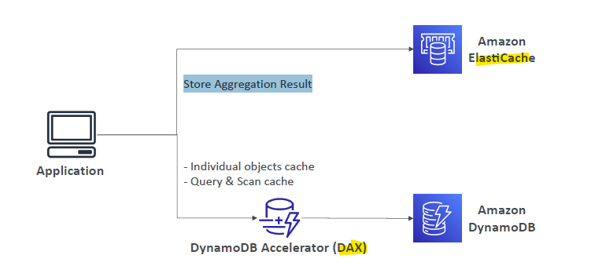

# DAX (DynamoDB Accelerator)

## Intro
- in memory **cache** for DynamoDB
  -  It caches the most frequently used data,
  - thus offloading the heavy reads on hot keys of your DynamoDB table, 
  - hence preventing the `ProvisionedThroughputExceededException` exception.
-  `10x performance` improvement.
- **micro sec latency** 
- fully **secured**
- DAX is compatible with DynamoDB API call
  - hence won't require an application refactoring

---
## provision DAX cluster
- [udemy reference](https://www.udemy.com/course/aws-certified-developer-associate-dva-c01/learn/lecture/28646592#overview)
- 
- **node size** : min `3 nodes` recommended in prod.
  - can add more later.
- **node family** : r-type / t-type
  - can't change later
- **network setup**
  - VPC-1
  - subnets-1/2/3
  - sg-1
    - allow inbound from port `9111` or `8111` in  the sg of application (elb, ec2, etc) :point_left:
  - spread nodes in multi-AZ
- **IAM role**
  - access to dynamoDB
  - ...
- setup **parameter group**
  - TTL (item)
- DONE, get **cluster URL** and use in app.

---
## use case
- to fix **hot key** problem
  - specific key read too many time, giving throttleError
  - then cache that item in DAX
  - cache has **TTL** (`5 min` default)
- millions of requests per second to DynamoDB, causing performance issue.
  - Add DAX on front.

---
## Architecture example
- 
- usinf DAX and ElasticCache, both.

