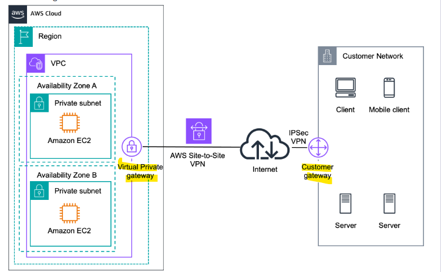
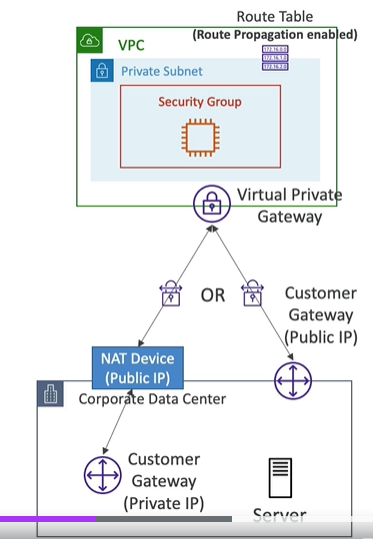
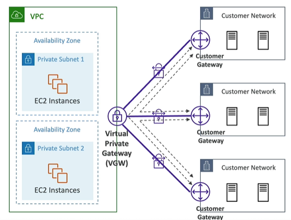
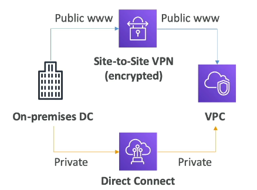
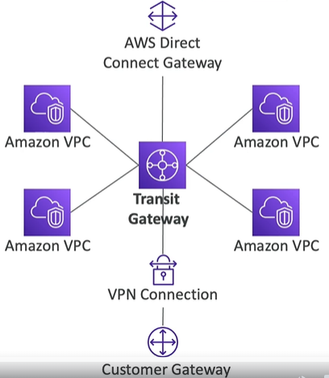
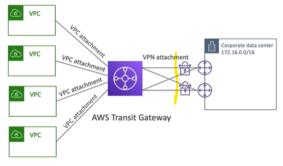
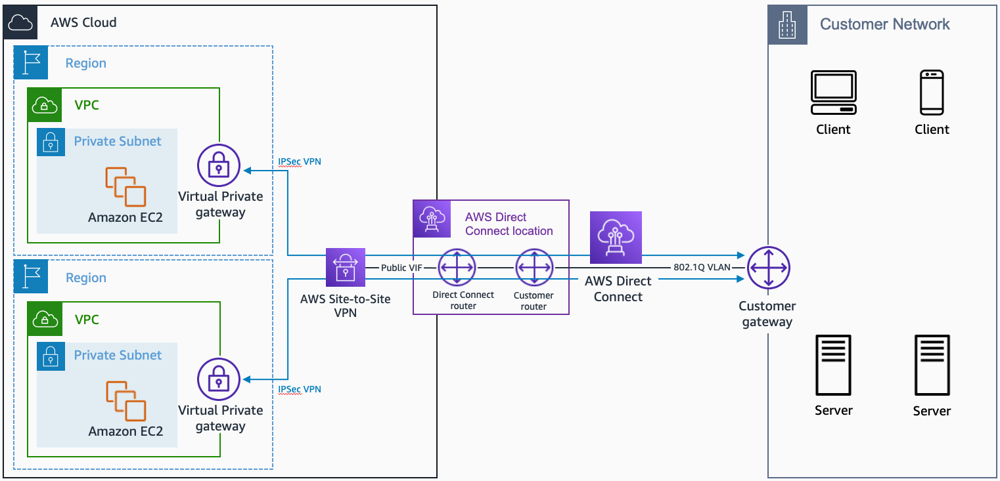
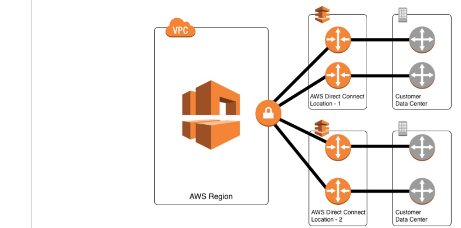
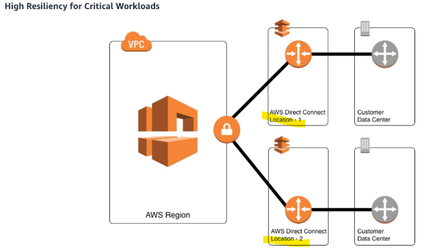
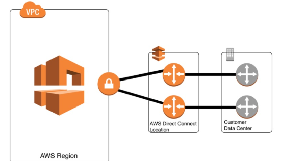

---
```
  - network:0 - AWS VPC-1 (vpc)
  - network:1 - internet (public internet)
  - network:2 - Corporate Network (VPN)
  
  - vgw == `Vitual-private GateWay` 
  - cgw == `Customer gateway` / software+hardware, running on customer side / attached `NAT-device`(public-IP-1)
```
# Network topologies
## A. AWS::VPC <==> AWS::VPC
### A.1. `AWS::VPC-1` to `internet`
```
network:0,AWS VPC-1 (`rtb-main`) --> `igw`  --> network:1 : 
```
- create igw-1
- update rtb-main with igw-1 entry.

---
### A.2. VPC peering :: `AWS::VPC-1` to `AWS::VPC-2`
- [03_VPC-3-vpcPeer+vpce.md](03_VPC-3-vpcPeer%2Bvpce.md)
```
all vpc in same/cross region <<<

eg : with same region: 
 `Aws1::VPC-1` (CIDR-1)  <--- VPC peer ---> `Aws1::VPC-2` 
 `Aws1::VPC-2` (CIDR-2)  <--- VPC peer ---> `Aws1::VPC-3` 
 `Aws1::VPC-3` (CIDR-3)  <--- VPC peer ---> `Aws1::VPC-1` 
 
 # No "overlapping" CIDR among them.
 # not transitive
```
---
## B AWS::VPC <==INTERNET==> client::VPN
### B.1. AWS Site-2-site VPN 
- `AWS::VPC-1` to `Client-VPN-1`
- also known as **IPsec VPN connection**
- 
```
- connect AWS::VPC-1 to Client-VPN-1

how:
AWS VPC-1 (rtb-main:vgw-1) <==> [ vgw-1 <---Site-2-site VPN(uses:internet)---> cgw-1 ] <==> network:2(customer-1) 
- this connection are `encrypted` by default.
- uses:internet
```
- Step-1: create **virtual gateway** `vgw-1`, and attached on AWS VPC-1 
  - does not Support **ECMP** :point_left:
- Step-2: create **client gateway** `cgw-1`, with customer details like - public-IP, etc
- Step-3: create **Site2Site VPN** to connect `cgw-1` with `vgw-1`.
  - **tunnels**
    - `tunnel-1` forward
    - `tunnel-2` backward
    - tunnel 1/2 == used for single connection
    - `1.25gbps`
- Step-4: update `rtb-main` with vgw-1 : for traffic forwarding between networks.
- optional steps :
  - update sg on ec2.
  - update ACL on subnet.
- 
- 
- slow, then :  Transit Gateway with equal cost multipath routing and add additional VPN tunnels

---
### B.2. AWS VPN cloudHub
- `AWS::VPC-1` to [ `Client-VPN-1`, `Client-VPN-2`, ... ]
```
- connect **AWS::VPC-1** to **many Client-VPN/s**
  - Client-VPN-1
  - Client-VPN-2
  - ...
 
 # solution-1 - create Site-2-site VPN for each client. not managable for 100 of cleint/s.
 # solution-2 - VPN cloudhub    
    - uses:internet
```
- Step-1: create `vgw-1`, and attached on AWS VPC-1
- Step-2: create `cgw-1,2,3..`, with customer details
- Step-3: create `AWS VPN cloudHub(uses:internet)` - link `cgw-1,2,3,...` with `vgw-1`.
- rest of the step same as above.
- 

---
## C AWS::VPC <==DX==> client::VPN
### C.1. DX (Direct Connect)

```
# scenario
 - customer-1 is connected to DX-1::endpoint
 - AWS:VPC-1 wants to connect to same DX-1::endpoint
 
 flow:
 AWS VPC-1  (rtb-main:vgw-1) --> [ vgw-1 <--aws-direct-Location,DX::endpoint --> cgw-1 ] --> network:2(customer-1)
```
- **AWS-Direct-location**, between on-premises and AWS, Bypasses the public internet.
  - **key-highlight**
    - dedicated physical connection
    - private 
    - high-bandwidth / fast
    - low-latency 
    - consistent/stable connection.
    - no encryption by default, can add but bit complex
    - fact:there is lead/wait time to setup new connection, around a month :point_left:
  - **Types**:
    - **Dedicated** : wire ethernet, `1,10,100 Gbps`, fastest
    - **hosted**    : via DX-partner `50 500 Mbps`, `1 2 5 10 Gbps`, slow
  - **resiliency** : 
    - add more connection/s.
    - 
    - or, create primary:DX + Secondary:Site2SiteVPN
    - 

- **Steps**:
  - Step-1: create `vgw-1`, and attached on AWS VPC-1
  - Step-2: create `cgw-1`, with customer details
  - Step-3: create `DX-1::endpoint`
    - connect vgw-1 to DX-1::endpoint
    - connect cgw-1 to DX-1::endpoint

- 

---
### C.2 DX gateway
```
# scenario
  - customer is connected to DX-1::endpoint
  - 2 or more AWS VPC wants to connect to same DX-1::endpoint
    - AWS::VPC-1 --> DX-1::endpoint
    - AWS::VPC-2 --> DX-1::endpoint
    - ...
    - ...
```
- **way-1** 
  - for AWS::VPC-1 
    - create `vgw-1` 
    - connect `vgw-1`to DX-1::endpoint
    - AWS::VPC-1 (update rtb:vgw-1) 
  - for AWS::VPC-2
    - create `vgw-1` for AWS::VPC-1
    - connect `vgw-1`to DX-1::endpoint
    - AWS::VPC-1 (update rtb:vgw-1)
  - ...
  - ...
    
- **way-2** : 
  - create DX-gateway  `dxg-1`
  - connect  `dxg-1` to DX-1::endpoint
  - AWS::VPC-1(update rtb:`dxg-1`) 
  - AWS::VPC-2(update rtb:`dxg-1`) 
  - ...
  - ...
  - 

---
##  transient Gateway
- NOT tied to a specific **VPC**, Account level services : point_left:
- network topologies can be complicated, transient Gateway, simplify above topologies
  - define everything at single place : rtb of transient gateway
  - supports `IP-multicast` ?
- 
- create multiple tunnels in `AWS Site-2-site VPN` : `ECMP routing`
  - 
- shared with multiple aws account **
- AWS Transit Gateway with `Resource Access Manager` (RAM)
- can scale the  **VPN throughput**  :dart:
  - with `equal cost multi-path` (ECMP) routing support over multiple VPN tunnels. 
  - A single VPN tunnel still has a maximum throughput of 1.25 Gbps. 
  - If you establish multiple VPN tunnels to an **ECMP-enabled** transit gateway, it can scale beyond the default maximum limit of 1.25 Gbps. 
  - You also must enable the **dynamic routing option** on your transit gateway to be able to take advantage of ECMP for scalability.
---
## Exam scenarios:

---
- critical production workloads that require **maximum resiliency**
- **AWS Direct Connect connections** with speeds greater than 1 Gbps.
- correct
  - 
- incorrect
  - 
  - 
---- 


