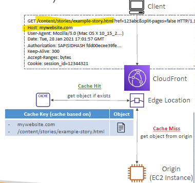
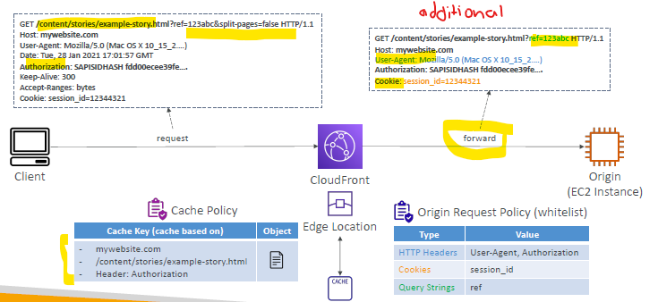
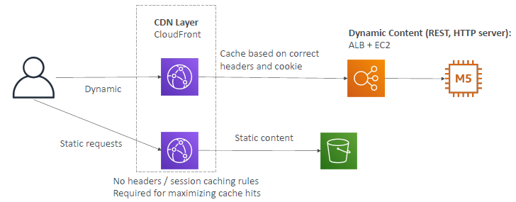

# CloudFront ( for DVA)
## A Cache
- Demo : https://www.udemy.com/course/aws-certified-developer-associate-dva-c01/learn/lecture/36528154#overview
- objects with **CacheKey**
- **default** cachekey 
  - 
  - hostname + resourcePortion
  - while hitting origin, it will drop query param as shown.
### 1. Cache Policy
- to set TTL
- to refine caching key and object. 
- while hitting origin, include below which are coming in request.
  - **HTTP Headers**: None – Whitelist
  - **Cookies**: None – Whitelist – Include All-Except – All
  - **Query Strings**: None – Whitelist – Include All-Except – All
- further enhance it before forwarding to origin.
  - use **Origin request policy**. next

### 2. Origin-request policy
- before hitting origin, can modify http request. 
- eg add **additional** : (not come as part of original req)
  - HTTP Headers
  - Cookies
  - Query Strings
- Note: but cacheKey will be remain as per Cache Policy, (NOt on Origin request policy) :point_left:

---

## B. Cache behavior
- **behaviour-1** for path pattern : /s3/*     ==> origin-1 (s3) : cache-policy-1, Origin-request-policy-1, ...
- **behaviour-2** for path pattern : /alb-1/*  ==> origin-2 (alb): cache-policy-2, Origin-request-policy-2, ...
- **behaviour-default** for path pattern : /*  ==> origin-1/2 (?): cache-policy-3, Origin-request-policy-3, ...
- ...
- 

## C. Invalidate cache
- distribution > invalidation tab
  - create invalidation
    - define key

---