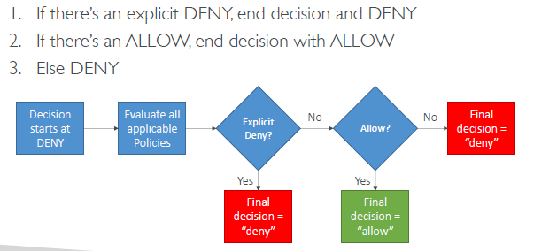
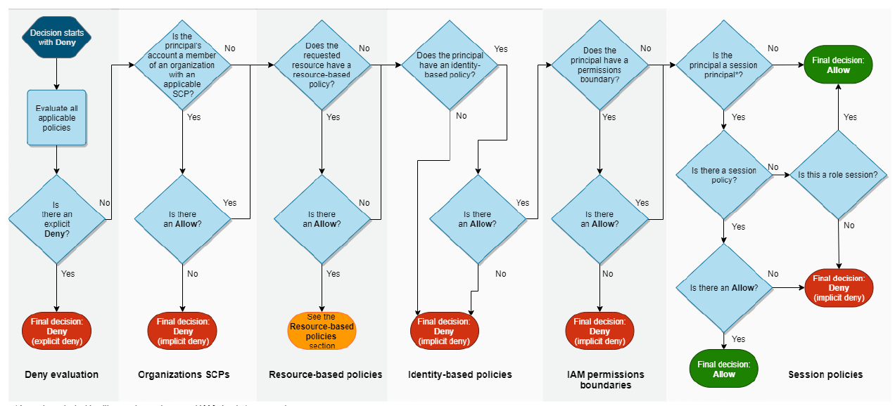
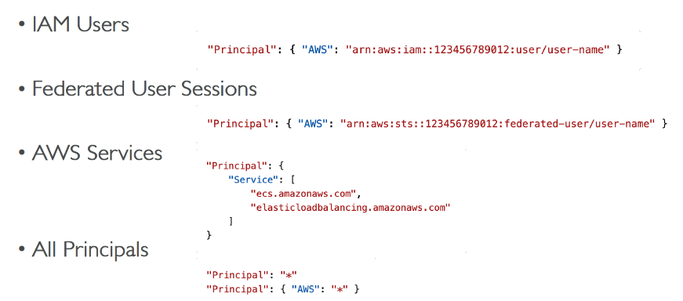

- IAM_01 https://chatgpt.com/c/3bfd592e-3ccc-403f-a61c-8e6ab72eacf5

---
# A. IAM
## 1. intro
- AWS CLI / SDK
  - signed API call with **SigV4**
  - Access keys ID + secret Access key
  
### User / group
- **IAM user** 
- **federated user** 
  - outside AWS user
  - authenticated by an external identity provider (okta,google,fb) using SAML,OIDC, OAUTH2.0
  - external identity provider, is register with AWS account
- **IAM Group**

### **policies** 
- permission, JSON document 
- leverage special **policy variable** eg: ${aws:username}
- attach to many principle: IAM user, IAM group, IAM role
- Type: 
  - `AWS managed policies` (fullSQSaccess, fulls3access, etc)
  - `customer managed polices`
    - Version Controlled 
    - rollback
    - attach to **many principle**: IAM user, IAM group, IAM role
  - `inline polices` **
    - attach to **single principle**: IAM user, IAM group, IAM role
    - 1-2-1
    - delete principle, also delete inline policy.

### Iam:PassRole and iam:GetRole      
- Broad-access-role / pipeline role has these action on all resource(role type)
- that's why Broad-access-role, able to add any-role on lambda,ecs,etc
  
### **Audit**
- check below Reports
  - user level : **access advisor**, etc
  - account level : **credential report**, etc
  
### **good practice**
  - Monitor API calls made by a user in CloudTrail
  - root user + MFA
  - Grant Least Privilege
  - don't store IAM key credentials on EC2
  - On premise server must call STS to obtain temporary security credentials.
  - dont reuse role, create separate.
---
## 2. IAM role :green_circle:
- **service role** is pre-defined for AWS services :dart: :point_left:
  - AWS Lambda execution role, EC2 Auto Scaling role, RDS service role
  - so, automatically add current-service as **trusted entity**. no need to add again.
  
- Designed to provide temporary security credentials by **trusted entities/principle** :
  - other aws-service - ec2, s3,etc
  - cross account service/user 
- has 2 things:
  - **permission policy**
    - [ effect, action, resource, condition ]
  - **trusted entities** (role trust policy)
    - which principals (trusted entities) are allowed to assume the role.
- **use case**
  - service to service communication.
  - lambda role --> s3,sqs,ec2,etc
  - ecs/eks --> s3,sqs,etc
  - federated user, assumes role - Broad-access-role
  - service account in k8s assumes role (IRSA)
  - cross account access
    - create role for other account-2 to assume role and access rsource on account-1

---
## 3. Resource Policy :green_circle:
- has **principle**
- who amd what are allowed to access :point_left:
- eg:
  - s3 policy
  - sqs policy
  - API gateway policy
  - ...

---
## 4. Permission Boundary :green_circle:
- principle-1
  - attach `IA-policy-1`
  - attach `Permission-Boundary-policy-1`
  - **intersection** of both will be effective
  - 

- apply on: :point_left:
  - IAM `roles` 
  - IAM `users`
  - IAM groups - N0 :o: :dart:

```json5
// example:
boundary-1 : allow  `ecs,lambda,s3` only
  - attach to iam-user-1
  - iam-user-1 --> attach iam-policy(`sqs` access) 
  - iam-user-1 cannot access sqs, since its outside boundary. 
```

---
## 5. STS : secure token service
### sts:`assumeRole`
- provides temporary security credentials(Access key + secret) + token(expiry)

### sts:`assumeRoleWithSAML`

### sts:`getSessionToken`
- equivalent to gimme-aws-creds
- get aws accessID,key,token,etc with MFA token
- add condition -> `aws:MultiFactorAuthPresent:true`

---
## 6. scenarios
### 6.1. cross account access
- `AWS-1(user-11)` --> has to access -->  `AWS-2(resource : R1)` 

- **option-1** : `ResourceBasedPolicy`)
  - R1:Policy > update/add > allow AWS-1(user-11) 
  - :point_right: For S3,SQS,SNS,Lambda - use resource-based-Policy
  
- **option-2** : `IAM policy`
  - First, inside AWS-2 
    - create `role-1` >  allow AWS-1(user-11) to R1.
    - create `policy-1` : allow user-11 to assume `role-1`
  - Next, user-11 `assume role-1` and access it, but
    - user-11 will first `give up` all the original permission.
    - then assume/get role-1 permissions.
  - :point_right:for Kinesis Db - use iam role  
  


---
## 7. Evaluation logic :yellow_circle:
- 
- 
  - order: :point_left:
    - explicit deny
    - allow
      - **SCP**
      - **resource policy**
      - principal's **IAM policy**
      - **permission boundary**
      - AWS CloudFormation a global service (temp access)

---
## 8. Advance Polices example
### Conditions
- eg-1 Allow Access Based on IP Address
```json5
        {
            "Effect": "Allow",
            "Action": "s3:*",
            "Resource": "arn:aws:s3:::example-bucket/*",
            "Condition": {
                "IpAddress": {
                    "aws:SourceIp": "203.0.113.0/24"
                },
                // always AND
                "StringEquals": {
                        "aws:SourceVpc": "vpc-12345678"
                }
            }
        }
```

- eg-2 Allow Access During Specific Time Period
```json5
            "Condition": {
                "DateGreaterThan": {
                    "aws:CurrentTime": "2024-07-19T09:00:00Z"
                },
                "DateLessThan": {
                    "aws:CurrentTime": "2024-07-19T17:00:00Z"
                }
            }
```

- eg-3 Allow Access Based on MFA Authentication
```json5
            "Condition": {
                "Bool" / "BoolIfExist": {
                    "aws:MultiFactorAuthPresent": "true"
                }
            }
```

- eg-4 tag
```json5
"Condition": {
                "StringNotEquals" / "StringEquals": {
                    "ec2:ResourceTag/Environment": "Production",
                    "aws:principleTag/Departmnet": "d1"
                }
            }
```
- eg-5
```yaml
#  Users belonging to the IAM user group can terminate an Amazon EC2 instance in the **us-west-1** region 
#  when the user's source IP in 10.200.200.0/24
{
    "Version":"2012-10-17",
    "Id":"EC2TerminationPolicy",
    "Statement":[
        {
            "Effect":"Deny",
            "Action":"ec2:*",
            "Resource":"*",
            "Condition":{
                "StringNotEquals":{
                    "ec2:Region":"us-west-1"
                }
            }
        },
        {
            "Effect":"Allow",
            "Action":"ec2:TerminateInstances",
            "Resource":"*",
            "Condition":{
                "IpAddress":{
                    "aws:SourceIp":"10.200.200.0/24"
                }
            }
        }
    ]
}
```
- more eg :
  -  "aws:RequestedRegion": "eu-west-1" :  allow running Amazon EC2 instances only in the eu-west-1 region :dart:
  - "aws:priciplaOrgId": "0-xxxxxxxxx"
  - 
---

## 9. principals





