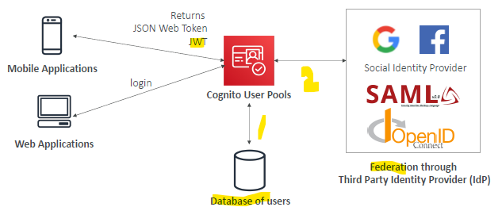
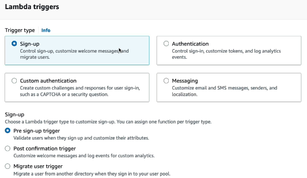
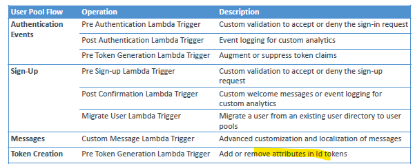
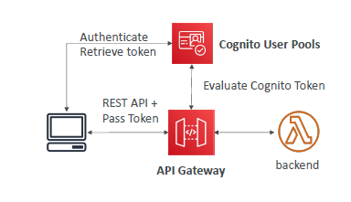
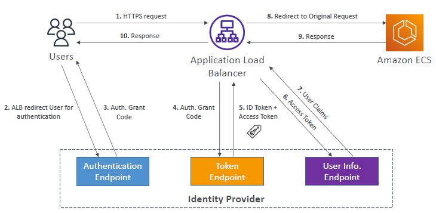
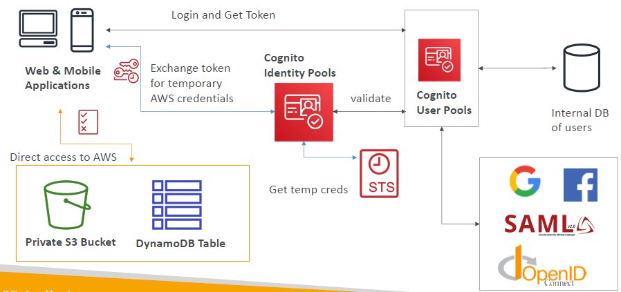
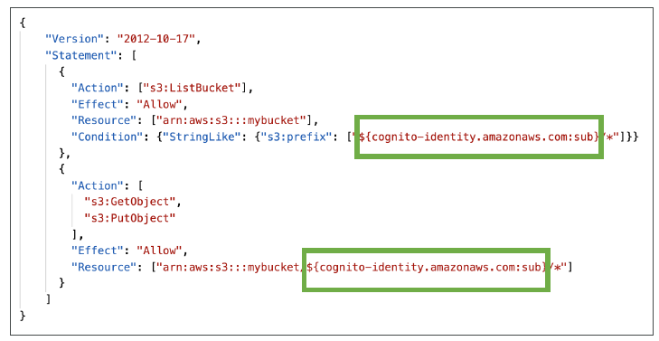
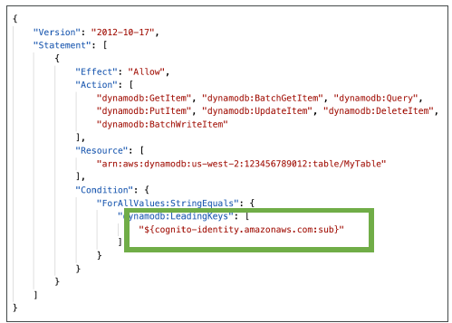
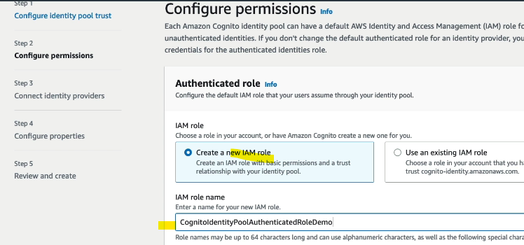
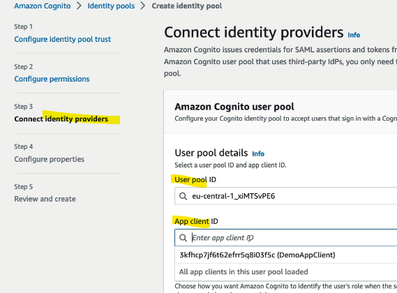

# A. CUP : Cognito user pool (Serverless)
- https://www.udemy.com/course/aws-certified-developer-associate-dva-c01/learn/lecture/19731934#notes
- Complicated service, Need to have high level idea for SAA/DVA
- https://chatgpt.com/c/676b51a6-3388-800d-a754-f5872af7a68a

## 1. Intro
- 
- **sign-in functionality for global user** (web/mobile)
  - simple login:
    - userid, password, custom feild, email/phone verification.
    - password-reset, acct recovery
    - enable MFA
    - send email to user. SES
    - **JWT** token
    - Authenticate through:
      - integration with **federated Identity provide** - Okta,fb,google (social login)
      - SAML (corporate login)
      - OIDC
      - Microsoft AD , LDAP
      - own serverless database of user/s
      
## 2. **hosted UI** :point_left:
- set domain
  - aws provided
  - **custom**
    - must create ACM cert in us-east-1 :point_left:
- customize UI 
  - CSS 
  - logo

## 3. lambda trigger :books:
- on user pool event
- 
- 

## 4. Adaptive Authentication
- **risk score** for every login activity
- if it looks suspicious, then prompted for MFA
- in case of compromised credential, takeover to email/phone confirmation

## 5. Integration example

### 1 **API-gateway**


### 2.1 **ALB** (high level)


### 2.2 **ALB** (with OIDC)
- 
- 

---
# B. Cognito Identity pool
- authorization.
## 1 Intro
- **once user is authenticated** with any of these,
- then can get temp **AWS credential** by assuming **IAM role**, to access aws resource.
  - role has trust policy.
```yaml
• Public Providers (Login with Amazon, Facebook, Google, Apple)
• Users in an Amazon Cognito user pool
• OpenID Connect Providers & SAML Identity Providers
• Developer Authenticated Identities (custom login server)
• Cognito Identity Pools allow for unauthenticated (guest) access
```
- 

---
## 2 IAM policy example
### access s3


### access dynamoDB


---
## 3 hands on
- **configure permission** (create IAM role/s - 1, 2,3 ...)
  - 
- connect to **user pool** (ID provider)
  - 
- **create rule** to choose role, based on :
  - claims in token 
  - user-attribute set is user pool
- next, use SDK check doc.


