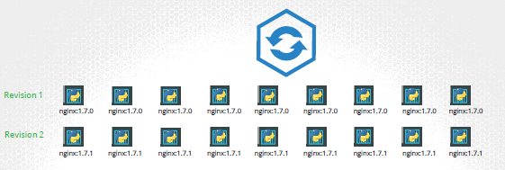
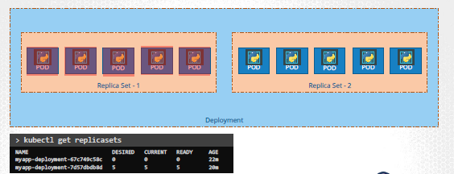
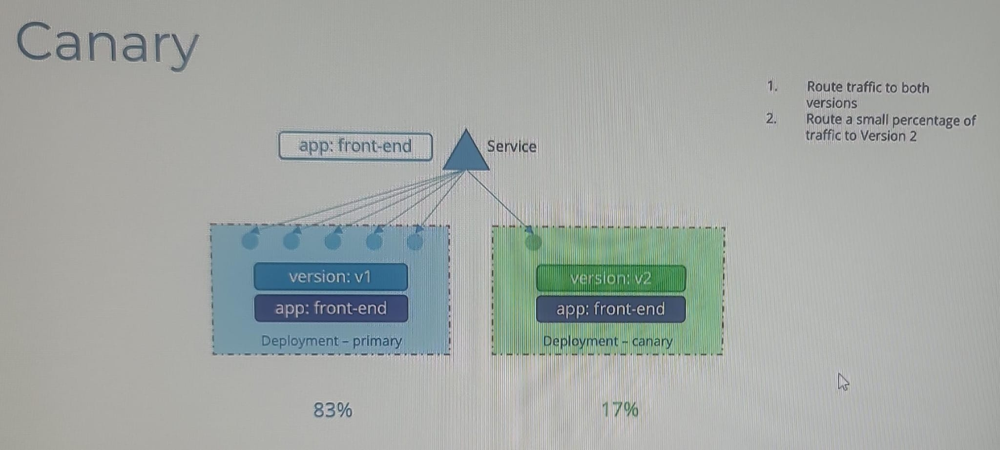
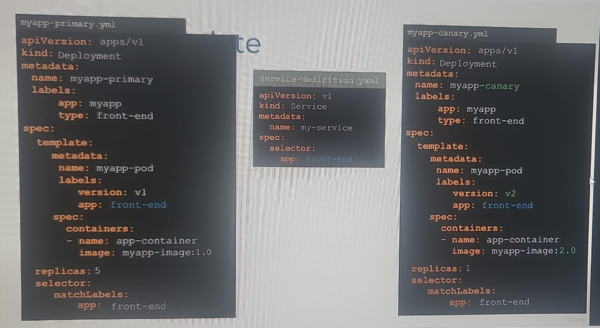

# Deployment

## rollout
- 
- when we first create deployment, it performs a rollout with **revision=1**  === replicaSet-1
- next, if deployment object is **upgraded**, new rollout happens with **revision=2** === replicaSet-2
  - eg: updating label, image,etc
  - **k set image deployment-1 c1=image:version  --record=true** 
  -  or, **k edit deployment deployment-1 --record=true**
    - `--record` flag to save the command used to create/update a deployment against the revision number.
  - 

- check rollout status
  - **k rollout status deployment deployment-1** --> status for deployment, status of each replica/pod
  - **k rollout history deployment deployment-1 --revision=1** --> show revision history
- Also run : k decribe deploymnet and  check `events`

### rollout strategies :
  - `Recreate`
    - 
    - scaling down replicas = 0, then scale up to replicas-count (eg: 5)
  
  - `Rolling update` (default)
    - 
    - scale down replicas by 1, and scale up by 1.
    - if there is error with while deployment, it won't scale down further to maintain app availability.
  
  - `Blue green`
    - service (select pod by label `L1`)  --> Deployment-object-1, `blue`>> RS >> POD/s (all has L1)
    - Deployment-object-2, `green` >> RS >> POD/s (all has L2)
    - once all pod in L2 are healthy
    - update service to select pod by `L2`
    - 

  - `canary`
    - 
    - route small traffic to deployment-canary's pod, usinf common label selector on service
    - once looks ok, the delete canary
    - rollout changes to primary-deploymnet object.
    - 
    
## rollback:
- **k rollout undo deployment/deployment-1 --to-revision=1**
  - destroys the pod in replicaSet-2 (current)
  - bring back pod in replicaSet-1 (previous)

